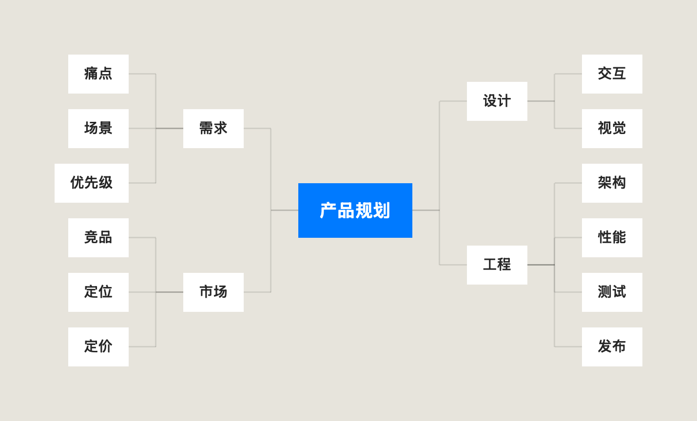
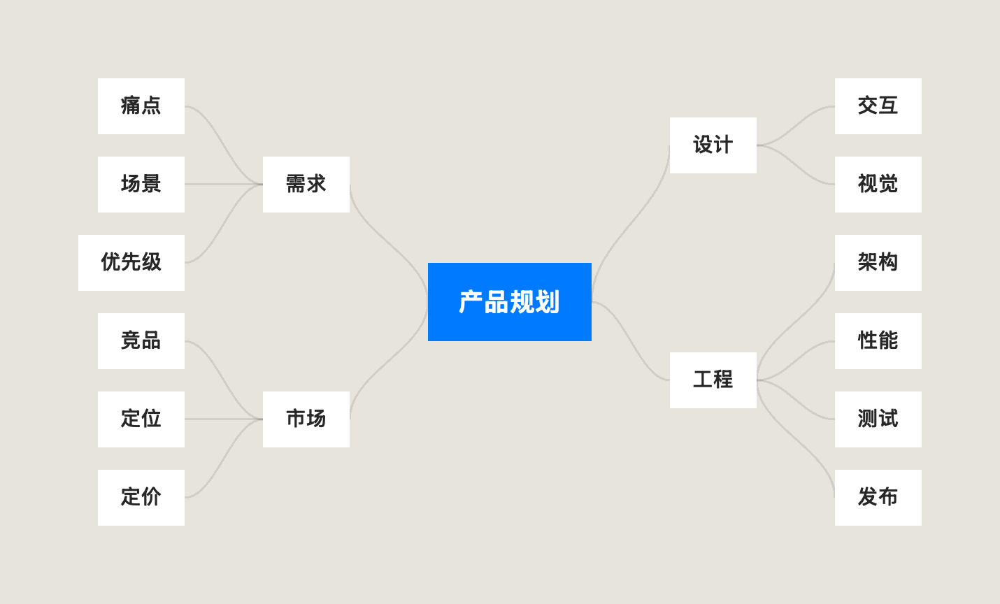
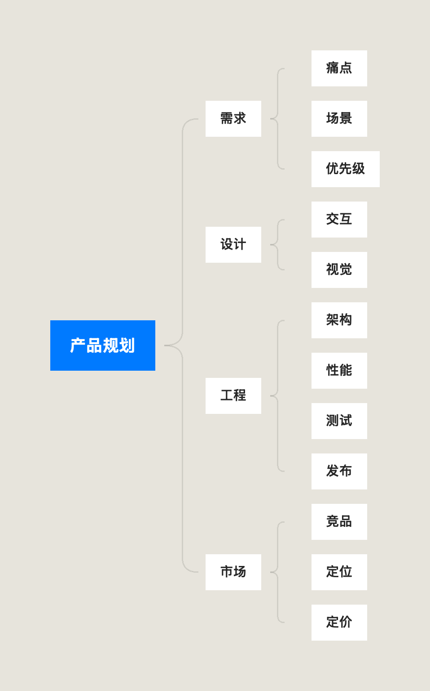
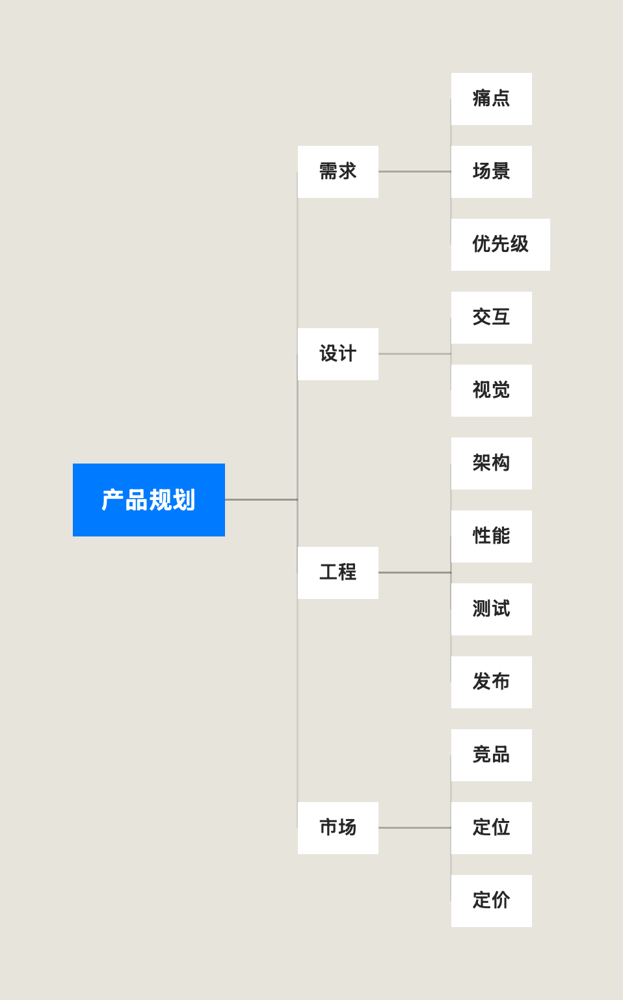
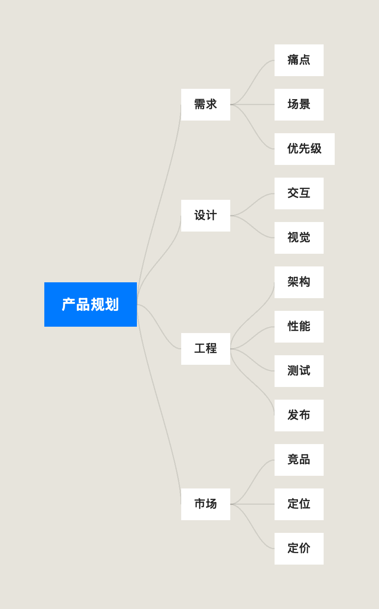
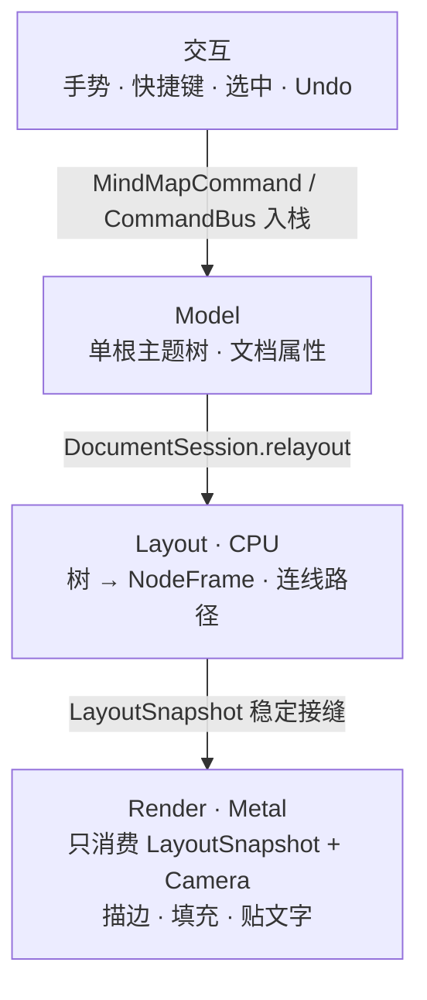
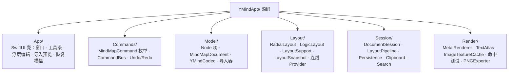
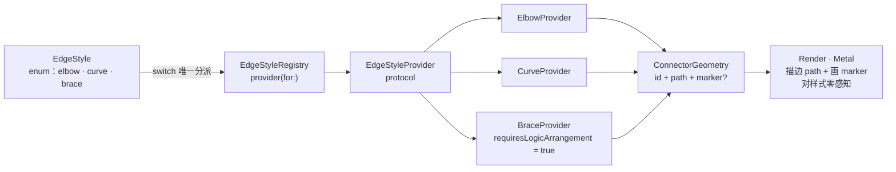
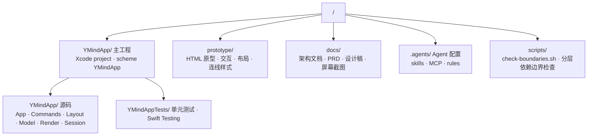

<div align="center">

# YMind

**原生 macOS 思维导图 · Swift + SwiftUI 壳 + Metal 画布**

单窗口工具，中心辐射 / 逻辑树两种布局，正交折线 / 曲线 / 大括号三种连线样式，可扩展。无第三方依赖。



</div>

---

## 目录

- [简介](#简介)
- [特性](#特性)
- [屏幕截图](#屏幕截图)
- [技术栈](#技术栈)
- [架构](#架构)
- [关键技术实现](#关键技术实现)
- [文件格式 `.ymind`](#文件格式-ymind)
- [项目结构](#项目结构)
- [构建与运行](#构建与运行)
- [测试](#测试)
- [文档](#文档)
- [开源许可](#开源许可)

---

## 简介

YMind 是一款 **macOS 原生**的思维导图应用：用 **SwiftUI** 做窗口 / 工具条 / 浮层编辑等 UI 壳，用 **Metal** 绘制整张画布（节点、连线、文字），把「几何与业务放在 CPU、像素放在 GPU」。单窗口、单文档、命令栈 Undo，专注把一棵主题树画得快、画得干净、改得顺。

它诞生于对同类型商业产品的技术好奇：不追求功能大而全，而是把「树 → 布局 → 渲染」这条主链路做扎实，并留出干净的扩展点（新增一种连线样式，只需加一个枚举值 + 一个 Provider 文件，引擎 / 渲染 / 编解码零改动）。

## 特性

**布局**
- 中心辐射：根居中，一级分支左右对称向外展开。
- 逻辑图（总分树）：根在最左、层级向右层层展开。
- 一键切换，切回自动适配画布。

**连线样式**（全局切换，随文档持久化、可 ⌘Z 撤销）
- 正交折线（默认）。
- 曲线：水平切向 S 曲线。
- 大括号：父→子组的开口 `}` 连接器，嘴对齐父节点，子节点不单独连边。
- 样式可扩展：`EdgeStyle` 枚举 + `EdgeStyleProvider` + 注册表即插即用（详见[架构](#架构)）。

**节点**
- 填色（5 个具名色板 + 清除）。
- 图文混排：一节点多段内容（文字 / 图片）。
- 折叠 / 展开（根左右侧独立折叠）、搬枝、增删改、同级排序。

**交互**
- 双击浮层编辑（AppKit 输入，不做 Metal IME）。
- 多选 + 框选；剪贴板（节点 / 图片）。
- ⌘Z / ⇧⌘Z 撤销重做（命令栈，覆盖所有树变更）。
- 搜索（⌘F，命中自动展开祖先）。

**导入 / 导出**
- 导出 Markdown（纯文本或含图片的文件夹包）。
- 导出 PNG（离屏 Metal 渲染整图，与实时画布像素一致）。
- 导入 Markdown / OPML / FreeMind（注册表，导入前预览确认）。

**工程**
- 自动保存（2s 防抖副本）+ 崩溃恢复横幅。
- 暗色 / 亮色模式。
- 沙盒、安全作用域文件读写、未保存确认。
- 单测覆盖内核（模型、命令、布局、渲染冒烟、编解码）。

## 屏幕截图

**布局 × 连线样式**（离屏 Metal 渲染，与实时画布同一套绘制代码）：

| 布局 | 正交折线 | 曲线 | 大括号 |
|------|----------|------|--------|
| **中心辐射** |  |  |  |
| **逻辑图** |  |  |  |

> 注：大括号样式强制逻辑树排布，因此「辐射·大括号」与「逻辑·大括号」渲染相同。

## 技术栈

| 层 | 技术 |
|----|------|
| 语言 | Swift 5 |
| UI 壳 | SwiftUI（窗口、工具条、浮层编辑、导入预览、恢复横幅） |
| 画布 | Metal / `MTKView`（薄 2D 渲染器，非游戏引擎） |
| 文本 | Core Text 量字 + 纹理缓存、离屏栅格化 |
| 几何 / 布局 | CoreGraphics / Foundation |
| 平台 | macOS（最低 26.4） |
| 依赖 | **零第三方依赖**（纯系统框架） |
| 测试 | Swift Testing（`XCTest` 兼容层），内核单测 |

## 架构

核心是一条单向数据流主链路，四条纪律贯穿始终：



**四条纪律**

1. **Metal 不理解树**：渲染层只读 `LayoutSnapshot`（frames / connectors / branchToggles / imagePayloads）+ `Camera`，不访问 `MindMapModel` / `Node`。
2. **几何与业务在 CPU，像素在 GPU**：布局引擎算好每个节点的矩形与每条连线的路径，Metal 只负责描边、填充、贴文字。
3. **一切树变更走命令栈**：增删改、搬枝、折叠、填色、布局、连线样式全部经 `CommandBus`，天然获得 Undo / Redo / 自动保存。
4. **`LayoutSnapshot` 是稳定接缝**：换布局算法或换渲染后端，只要契约不变，Render 无需改动。

### 分层目录



### 连线样式扩展点（核心设计之一）

连线被抽象为**统一契约 + 可插拔 Provider**：

```swift
// 统一输出契约：任何样式产一个可描边的连接器
struct ConnectorGeometry { let id: UUID; let path: [CGPoint]; let marker: ConnectorMarker? }

// 扩展点：每种样式 = 一个 Provider
protocol EdgeStyleProvider {
    var requiresLogicArrangement: Bool { get }   // 大括号=true（强制逻辑树）
    func connectors(document:frames:root:measure:) -> [ConnectorGeometry]
}

// 注册表：唯一 switch 处
enum EdgeStyleRegistry {
    static func provider(for style: EdgeStyle) -> EdgeStyleProvider { … }
}
```



**新增一种连线样式**：`EdgeStyle` 加一个枚举值 + 新建一个 Provider 文件 + 注册表登记一行。**引擎 / 渲染 / 编解码零改动**（已用 `straight` 直线样式做了回归验证）。

## 关键技术实现

**命令总线 + Undo**
`MindMapCommand` 是枚举（`addChild` / `delete` / `moveToParent` / `setLayout` / `setEdgeStyle` / …，共 17 个）。`CommandBus.execute` 先求前向副作用并捕获旧值，生成 undo / redo 闭包入栈；no-op（目标同当前）不入栈。

**编解码 `.ymind`（versioned JSON，当前 v7）**
`YMindCodec` 维护 v1→v2→…→v7 迁移链。老文件缺字段一律 `decodeIfPresent` 兜底缺省，**零拒绝打开**（例如 `layout` 缺省 `.radial`、`edgeStyle` 缺省 `.elbow`、未知未来样式 token 容错为 `.elbow`）。`sanitize` 强制深层约束（如 `side` 只存根下一层）。

**布局引擎**
`RadialLayout` / `LogicLayout` 共享 `LayoutSupport`（测高、块居中、toggle、图片载荷）。引擎拆为 `place(document:measure:)`（只产排布 `frames` / toggles / 图片载荷）＋ 连线由 `EdgeStyleProvider` 产 `ConnectorGeometry`——排布与连线解耦。

**Metal 渲染**
`MTKView` + 薄渲染器。逐帧把可见的文本、图片、分叉控件、连线顶点批量合并进少量 buffer（1921 节点大文档每帧 `makeBuffer` 从 1921 次降到 3 次）；视口剔除（`FrameDrawList`）只处理可见帧；相机是普通属性、手势零发布，避免 SwiftUI 逐帧整树重布局。文字按块 `id` 缓存栅格并驱逐未用。

**离屏 PNG 导出**
`PNGExporter` 复制文档并全展开 → `LayoutPipeline().relayout` → `MetalRenderer.renderImage` 离屏光栅化。与实时画布共用 `encodeContent`，导出与屏幕所见一致（含连线样式与大括号）。

**自动保存 / 崩溃恢复**
`AutosaveStore` 把文档写进 `Application Support/Unsaved/`（2s 防抖），启动扫描最新副本弹出恢复横幅，可恢复或忽略。

## 文件格式 `.ymind`

`.ymind` 是 **versioned JSON**：`MindMapDocument.currentVersion == 7`。核心结构：

```jsonc
{
  "version": 7,
  "layout": "radial",        // "radial" | "logic"
  "edgeStyle": "elbow",      // "elbow" | "curve" | "brace"（缺省 .elbow）
  "root": {
    "id": "…UUID…",
    "blocks": [ { "id": "…", "kind": { "text": "产品规划" } } ],
    "children": [ … ]
  }
}
```

- `blocks` 承载一节点的多段内容（文字 / 图片）；旧版单 `text` / `image` 字段解码时自动合成。
- 根的直接子节点可存 `side: "left" | "right"`；更深节点不存（`sanitize` 强制）。
- 版本迁移链向后兼容：老文件能开，新文件不会被旧版拒收（零拒绝）。

## 项目结构



## 构建与运行

环境：macOS 26.4+、Xcode（Swift 5）。

```bash
# 用 Xcode 打开工程，选 scheme「YMindApp」，⌘R 运行
open YMindApp/YMindApp.xcodeproj

# 或命令行构建
xcodebuild build -project YMindApp/YMindApp.xcodeproj -scheme YMindApp

# 分层依赖边界检查（新增 import 须在白名单内）
scripts/check-boundaries.sh
```

## 测试

```bash
xcodebuild test -project YMindApp/YMindApp.xcodeproj -scheme YMindApp -only-testing:YMindAppTests
```

测试覆盖：编解码（含迁移链 / 零拒绝）、命令栈 Undo/Redo、布局引擎、连线 Provider 几何、`LayoutSnapshot` 契约、渲染（真 Metal 冒烟 + 像素级断言）、PNG 导出、自动保存 / 崩溃恢复、导入器。

## 文档

- [`docs/架构现状.md`](docs/架构现状.md) — 当前工程架构（模块地图、核心契约、扩展性评估）。
- [`docs/关键技术点.md`](docs/关键技术点.md) — 早期技术方向纪要。
- [`docs/代码阅读指南.md`](docs/代码阅读指南.md) — 代码阅读入口。
- [`docs/prds/`](docs/prds/) — PRD 与实现细则（含连线样式）。

## 开源许可

许可证待定（仓库暂未包含 `LICENSE` 文件）。开源前请先选择并补充许可协议（如 MIT / Apache-2.0 等），否则代码默认保留所有权利。

---

<sub>YMind 是个人学习与产品实验项目：macOS 原生思维导图，把「树 → 布局 → 渲染」主链路做到极致并保持可扩展。如侵权，请联系删除。</sub>
