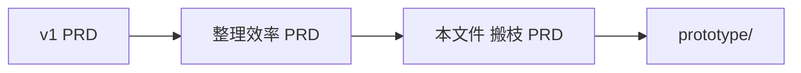

# PRD：YMind — 搬枝（拖拽成子与剪贴板）

## 0. 文档目的

本文档描述整理效率主线的下一增量：**改层级（reparent）**——用拖拽或剪贴板把枝挪到另一主题下。

- **上游：** [v1 PRD](../prd-ymind-2026-09-24/prd.md)、[整理效率 PRD](../prd-ymind-organize-2026-09-25/prd.md)（多选、顶层选中集、严格工具条仍有效）
- **体验真源：** `prototype/`（标签 Move）
- **明确不在本增量：** 跨文档剪贴板、系统级剪贴板互操作、撤销栈细化（沿用 v1 命令总线方向，本文件只定产品语义）
- **同级排序：** 见 [同级排序 PRD](../prd-ymind-reorder-2026-09-25/prd.md)（分区命中：中部成子 · 上下边插同级）

文档语言：中文优先。

---

## 1. 愿景与要完成的工作

多选解决了「一次动多枝」；用户仍缺**改父子关系**的手段。本增量目标：

1. **拖：** 把选中枝拖到另一节点上，松手后一律成为该节点的子。  
2. **剪贴板：** ⌘C 复制 / ⌘X 剪切 / ⌘V 粘贴；粘贴一律成为**当前选中**的子。

同级顺序调整：见 [同级排序 PRD](../prd-ymind-reorder-2026-09-25/prd.md)（拖拽分区命中）。剪贴板粘贴仍固定为成子（末尾）。

---

## 2. 关键用户旅程

**UJ-M1. 阿哲把「命中测试」拖到「问题定义」下。**

1. 选中「命中测试」，拖到「问题定义」上；目标高亮。  
2. 松手后该枝成为「问题定义」的子；原位置连线消失；选中仍在被搬节点上。

**UJ-M2. 阿哲剪切一枝，点到另一主题后粘贴。**

1. 选中枝，⌘X；源呈剪切态（弱化/虚线）。  
2. 单击目标主题，⌘V；枝成为目标的子，剪切态清除。  
3. 若在粘贴前按 Esc，取消剪切态，树不变。

**UJ-M3. 阿哲复制一枝到多处。**

1. ⌘C 后，依次选不同父节点并 ⌘V；每次得到独立副本（新 ID），源枝保留。

---

## 3. 术语表（增量）

| 术语 | 定义 |
|------|------|
| **搬枝（Move / Reparent）** | 改变节点的父节点；子树整体跟随。 |
| **放置目标（Drop Target）** | 拖拽松手时命中的节点；合法时接收为父。 |
| **剪贴板载荷** | 复制：子树快照列表；剪切：源 ID + 快照（粘贴时优先搬活节点）。 |
| **成子规则** | 拖放与粘贴的结果均为「成为目标/选中节点的子」，插入其 `children` 末尾。 |
| **可搬顶层** | 选中集中排除中心主题后的顶层节点（祖先已在选中集中则不再单独搬），语义对齐整理效率批量删除。 |

---

## 4. 功能需求

### 4.1 拖拽成子

#### FR-M1：拖动手势

在非编辑态，对可搬节点按下并移动超过小阈值后进入拖拽：被搬节点呈拖拽态；画布为抓取光标。  
⌘ / Shift 修饰的点选不启动拖拽（仍只做多选）。

#### FR-M2：多选整组拖

若按下时该节点已在多选中，拖拽搬的是选中集的**可搬顶层**；松手未形成拖拽时，收成单击单选该节点。

#### FR-M3：放置高亮与成子

指针下合法节点显示放置高亮；松手后被搬节点成为该节点的**子**（末尾）。  
目标若处于折叠，放置后展开以露出新子。

#### FR-M4：非法放置

不可放到自身或自身后代上；不可搬中心主题；松手在空白或非法目标上则取消搬移，树不变。

#### FR-M5：贴到中心主题

成为中心主题的子时，按 v1「侧」规则自动分配 left/right（与新增子主题一致）。

### 4.2 剪贴板

#### FR-M6：复制 ⌘C

对可搬顶层深拷贝子树快照进入剪贴板（模式=copy）。中心主题不可作为复制顶层。工具条「复制」等同。

#### FR-M7：剪切 ⌘X

对可搬顶层进入剪切态（模式=cut，源弱化显示）。中心主题不可剪切。Esc 取消剪切态。工具条「剪切」等同。

#### FR-M8：粘贴 ⌘V 成子

粘贴目标为**当前选中的主节点**（锚点优先，否则选中集中一员）：

- **copy：** 插入快照副本为子；可多次粘贴。  
- **cut：** 将仍存在的源节点搬到目标下（保留 ID）；成功后清空剪贴板与剪切态。  

无选中或剪贴板空时粘贴无效。非法目标（含贴到剪切源自身/后代）时无操作。

#### FR-M9：工具条

提供剪切 / 复制 / 粘贴按钮；可用性与选中、剪贴板状态一致。多选时仍可剪切/复制可搬顶层；粘贴目标取主选中节点。

### 4.3 与既有行为的关系

#### FR-M10：同级顺序手势

拖拽同级排序见 [同级排序 PRD](../prd-ymind-reorder-2026-09-25/prd.md)。本文件的拖放成子规则在「中部成子区」仍然有效；剪贴板粘贴不提供同级插入。

#### FR-M11：与删除/折叠共存

批量删除、分叉折叠、框选等多选手势保持整理效率 PRD 定义；拖拽与框选不冲突（节点上拖=搬枝，空白拖=框选，空格+拖=平移）。

---

## 5. 非目标（本增量）

- 跨文档或系统剪贴板互操作  
- 粘贴为同级（曾讨论方案；本增量固定为成子）  
- 原生 App 实现细节（命令名、Undo 粒度）— 另见架构文档  

（同级拖排序已拆至同级排序 PRD，不再列为本文件非目标。）

---

## 6. 验收要点

| # | 场景 | 期望 |
|---|------|------|
| 1 | 单节点拖到另一节点 | 成为其子；布局更新 |
| 2 | 多选拖到目标 | 仅可搬顶层搬过去；选中保持在搬后节点 |
| 3 | 拖到自身子树 | 不搬 |
| 4 | ⌘X → 选目标 → ⌘V | 源搬走；剪切态消失 |
| 5 | ⌘C → 两处 ⌘V | 两处各有副本；源仍在 |
| 6 | 剪切后 Esc | 树不变；弱化消失 |
| 7 | 贴到中心主题 | 自动分侧 |

---

## 7. 原型对照

| 原型 | 需求 |
|------|------|
| 节点拖放到高亮目标 | FR-M1～M5 |
| 工具条剪切/复制/粘贴 + ⌘C/X/V | FR-M6～M9 |
| 剪切虚线弱化 + Esc 取消 | FR-M7 |
| 标签 Move；hint 含拖成子 / 剪贴板 | 体验真源 |

路径：`prototype/`。

---

## 8. 文档关系

实现原生时：先具备整理效率选中模型，再落地本增量命令（MoveToParent / Copy / Cut / PasteAsChild）。
