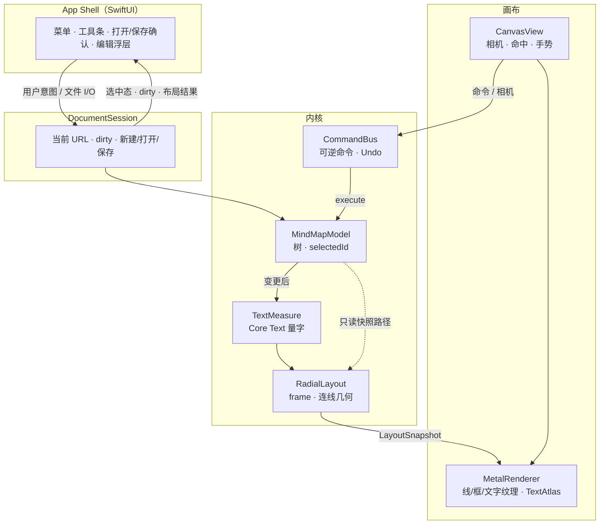
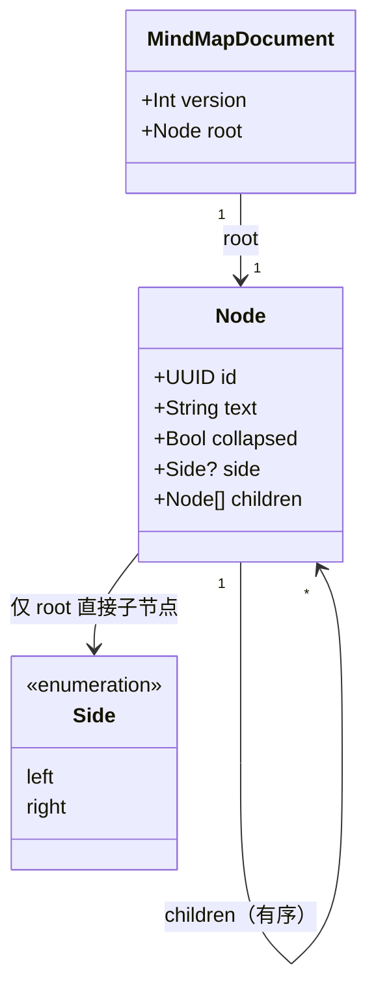
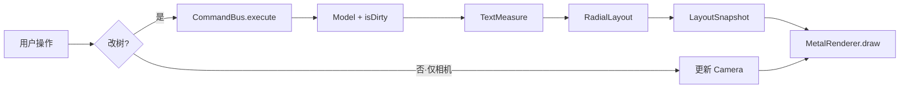
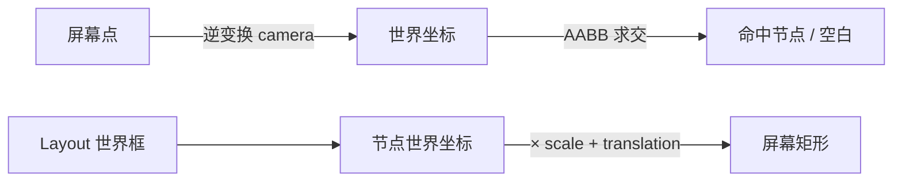
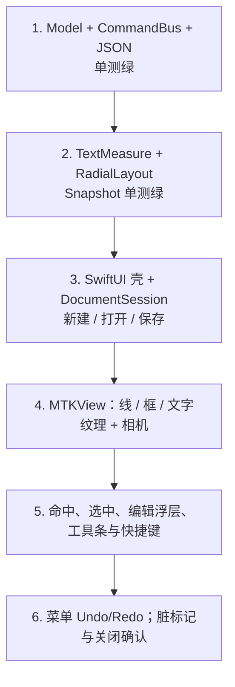

# YMind v1 架构设计

**状态：** 已评审（对话确认）  
**日期：** 2026-09-24  
**需求真源：** `docs/prds/prd-ymind-2026-09-24/prd.md`  
**依据：** 同目录附录、`docs/关键技术点.md`、`prototype/`、Brainstorming 决议

本文描述 v1（覆盖 FR-1～16）的模块边界、数据流与实现顺序。不替代 PRD；实现计划见后续 `writing-plans` 产出。

**绘图约定：** 架构与数据流图统一使用 [Mermaid](https://mermaid.js.org/)。

---

## 1. 目标与约束

### 1.1 目标

在 macOS 上交付可证伪的思维导图工具：单窗口、中心辐射树、SwiftUI 壳 + Metal 画布，交互对齐 HTML 原型。

### 1.2 Brainstorming 已拍板

| 项 | 决议 |
|----|------|
| 本设计范围 | 整份 v1 架构总览（非单一切片） |
| 总体方案 | **分层内核 + 薄壳**（方案 1） |
| 持久化 | 系统打开/保存；扩展名 `.ymind`（UTF-8 JSON） |
| 文件内容 | 树 + `collapsed`；**不存**相机与选中 |
| 窗口/文档 | `WindowGroup` + 自管单份内存文档；打开替换；新建重置；未保存先确认 |
| 文案 | 允许多行；编辑态 ⌥Enter / ⌘Enter 换行；Enter 提交结束编辑 |
| 文字渲染 | Core Text 量字 + 离屏纹理缓存；Metal 贴图；编辑用浮层 |
| Undo | 自研命令栈；⌘Z / ⇧⌘Z |
| 一级「侧」 | 仅自动左右均衡；v1 **不**手动改侧 |

### 1.3 v1 明确不做

多文档 / `DocumentGroup`、手动改侧、PNG 导出、VoiceOver 画布深通达、多选/框选、跨枝关联线、多种布局、富文本、相机入文件、XMind 格式兼容。

---

## 2. 总体架构与模块边界



### 2.1 依赖规则（硬约束）

| 层 | 可以依赖 | 禁止 |
|----|----------|------|
| Model / Command | 仅 Foundation | SwiftUI / AppKit / Metal |
| Layout / TextMeasure | Model + Core Text | Metal、SwiftUI |
| MetalRenderer | `LayoutSnapshot` + Metal/纹理 API | 修改 Model；理解父子业务语义 |
| Shell / DocumentSession | 上述全部 | 在 View 内实现布局算法 |

### 2.2 工程落点

- 基于现有 `YMindApp/` Xcode 工程与 target。
- 源码按目录分区（如 `Model/`、`Commands/`、`Layout/`、`Render/`、`Session/`、`App/`）；v1 可同 target，不强制多 SPM package。
- HTML `prototype/` 仅作交互与布局对照；原生实现后以 Swift 为准。

---

## 3. 数据模型与 `.ymind` 格式

### 3.1 运行时



说明：`text` 可含 `\n`；`side` 仅中心主题的直接子节点有效，更深层级为 `nil`。

### 3.2 会话态（不进文件）

- `selectedId`
- `camera`（translation + scale）
- `editingId`（可选）
- `fileURL`、`isDirty`（`DocumentSession`）

### 3.3 文件格式

- 扩展名：`.ymind`
- 内容：UTF-8 JSON，字段与运行时树对应；含顶层 `version`（从 1 起）。
- 持久化：树结构、文案、`side`（仅一层）、`collapsed`。
- 不持久化：相机、选中、窗口几何。
- 读入：深层节点若带 `side` → **忽略并告警**（宽容）；未知 `version` → **拒绝打开**，当前文档不变。
- 新建默认：单节点「中心主题」，`selectedId = root.id`。

示例：

```json
{
  "version": 1,
  "root": {
    "id": "…",
    "text": "中心主题",
    "collapsed": false,
    "children": [
      {
        "id": "…",
        "text": "分支",
        "collapsed": false,
        "side": "left",
        "children": []
      }
    ]
  }
}
```

---

## 4. 命令栈

### 4.1 入栈命令

| 命令 | 可逆要点 |
|------|----------|
| `AddChild` | 插入位置 + 新 id；undo = 删除该节点 |
| `AddSibling` | 同上；根不可加同级 |
| `Delete` | 父、下标、子树快照；根不可删 |
| `SetText` | old / new |
| `ToggleCollapse` | 目标 id |

一级子节点的 `side`：在对 root 执行 `AddChild` 时按左右数量大致均衡自动写入。

### 4.2 不入栈

相机平移 / 缩放 / 适应、选中切换、进入/退出编辑 UI。  
编辑**提交**时产生的 `SetText` 入栈。

### 4.3 Undo / Redo

- 自研 undo / redo 双栈。
- 菜单与 ⌘Z / ⇧⌘Z 接到 `CommandBus`。
- 打开文件或新建文档时清空两栈。

---

## 5. 布局与渲染数据流

### 5.1 主链路



### 5.2 Layout

- 算法对齐 `prototype/app.js`：`layoutTree` / 分侧堆叠 / 水平外推。
- 输入：树 + 每节点测量尺寸（多行按行累加高度 + padding）。
- 输出：`LayoutSnapshot`：节点 `CGRect`、边几何、折叠徽章计数。
- 折叠：后代不参与占位。
- Metal 只消费 Snapshot，不回写 Model。

### 5.3 文字与 Metal

- `TextAtlas`：键含节点 id、文案、字体、缩放分桶；改字或跨桶变缩放则失效重绘。
- 编辑：浮层输入控件对准节点屏幕矩形；不做 Metal IME。

绘制 Pass 顺序：


### 5.4 相机与命中



- 滚轮缩放以指针为锚点（与原型一致）。

---

## 6. App Shell 与交互

| 区域 | 行为 |
|------|------|
| 工具条 | 子主题 / 同级 / 折叠 / 删除；缩放与适应；随选中启用（根不可删、不可同级） |
| 菜单 | 文件：新建 / 打开 / 保存 / 另存为；编辑：撤销 / 重做 |
| 快捷键 | Tab = 子主题；⌫ = 删除；非编辑 Enter = 同级；编辑态 Enter = 提交，⌥Enter/⌘Enter = 换行 |
| 画布 | 拖空白平移、滚轮缩放、单击选中、双击编辑、点空白取消选中 |
| 窗口标题 | 文件名 + 脏标记 |

删除后选中：优先父节点，否则根（与原型语义一致）。

---

## 7. 错误处理

| 场景 | 处理 |
|------|------|
| JSON 损坏 / 未知 version | 告警；保留当前文档 |
| 保存失败 | 告警；保持 dirty |
| 未保存时新建 / 打开 / 关闭 | 确认：保存 / 不保存 / 取消 |
| Metal 不可用 | 启动失败提示，不静默空白 |

---

## 8. 测试策略

| 层级 | 内容 |
|------|------|
| 单测（优先） | 树操作、侧分配、命令可逆、Layout 对固定样例的 frame 回归、JSON 编解码 |
| 集成 / UI（可后置） | 打开→保存一轮；Undo 一轮 |
| 手测 | UJ-1 / UJ-2；约百节点平移缩放主观可交互（SM-2） |

---

## 9. 实现顺序



---

## 10. 与 PRD / 开放问题对照

| PRD 开放问题 | 本设计决议 |
|--------------|------------|
| 1. 持久化形态 | 系统文件关联 + `.ymind` |
| 2. 折叠 / 相机是否入文件 | 折叠是；相机否 |
| 3. 多行文案 | 是；⌥/⌘Enter 换行 |
| 4. 手动改侧 | v1 否 |
| 5. 导出 PNG | v1 否 |
| 6. VoiceOver 深度 | v1 不做深通达 |
| 7. 与原型视觉差 | 允许；信息架构与交互对齐即可 |

FR 覆盖：壳 FR-1～2；树与布局 FR-3～11；相机 FR-12～13；快捷键 FR-14；存盘 FR-15；撤销 FR-16。

---

## 修订记录

| 日期 | 说明 |
|------|------|
| 2026-09-24 | 初稿：Brainstorming 确认后落盘 |
| 2026-09-24 | 架构 / 模型 / 数据流 / Pass / 实现顺序改为 Mermaid |
