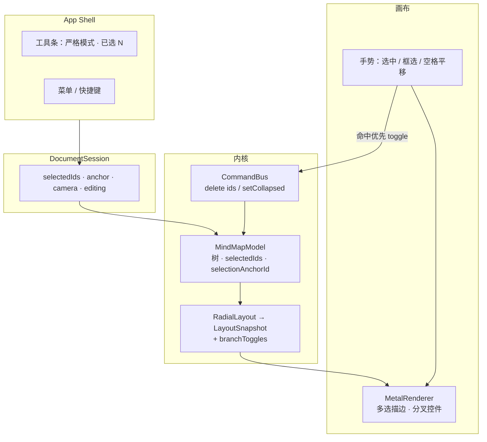

# Linva — 整理效率（多选与画布折叠）设计

**状态：** 已评审（对话确认）  
**日期：** 2026-09-25  
**需求真源：** `docs/prds/prd-linva-organize-2026-09-25/prd.md`  
**上游架构：** `docs/superpowers/specs/2026-09-24-linva-v1-architecture-design.md`  
**体验真源：** `prototype/`（多选 / 框选 / 分叉折叠）  
**依据：** Brainstorming 决议（本对话）

本文描述整理效率增量（FR-O1～O13）在原生 macOS 上的模块改动与数据流。不替代 PRD；实现计划见后续 `writing-plans` 产出。

**绘图约定：** 架构图使用 Mermaid。

---

## 1. 目标与拍板

### 1.1 目标

在现有 v1 原生实现上交付：多选（单击 / ⌘ / Shift / 框选）、严格工具条与批量删除、折叠入口迁至画布连线分叉处（Metal 同层绘制与命中）。行为对齐 PRD 与 HTML 原型。

### 1.2 Brainstorming 已拍板

| 项 | 决议 |
|----|------|
| 范围 | **整份**整理增量一次做完（FR-O1～O13），非拆两刀 |
| 总体方案 | **方案 1**：Model 升格选中集 + Snapshot 增 Toggle + 画布手势状态机 |
| 空白拖 | 默认空白拖 = **框选**；空格 + 拖 = **平移**（不提供偏好切换） |
| 分叉控件 | **Metal 同层绘制 + 命中测试**（非 SwiftUI 浮层） |
| 代码幅度 | **最小开刀**：不拆 DocumentSession、不抽独立 SelectionController |
| 工具条折叠 | **移除**；折叠仅分叉控件 + 可选键盘批量 |
| 多选点分叉 | 只作用于**被点节点**；批量靠 `/` 或 `⌘.` |
| Shift 连选 | **仅同父**兄弟区间；异父退化为单选目标 |

### 1.3 明确不做（本增量）

- 拖拽改层级 / 改同级顺序  
- 复制 / 剪切 / 粘贴  
- Session 内部大拆（Editing / LayoutPipeline）  
- 框选/平移可配置偏好  
- 按「侧」分别折叠中心主题左右子树（左右控件共享同一 `collapsed`）  
- 多文档、导出、样式系统  

---

## 2. 架构与边界

在 v1「分层内核 + 薄壳」上演进，不新建模块边界。



### 2.1 层职责

| 层 | 本增量职责 | 禁止 |
|----|------------|------|
| Model | 选中集 API；批量删子树；设折叠 | 持久化选中；理解 Metal |
| Command | `delete(ids:)` / `setCollapsed` 各为 Undo **一步** | 把选中变更入栈 |
| Layout | 输出 `branchToggles`（世界坐标） | 处理指针事件 |
| Metal | 画多选 / 锚点 / 控件；命中顺序见 §4 | 修改 Model |
| Shell / Session | 严格工具条；去掉折叠按钮；发布 `selectedIds` | 在 View 内实现布局算法 |

### 2.2 依赖规则

沿用 v1：Model/Command 仅 Foundation；Layout 可用 Core Graphics；Metal 只消费 Snapshot；选中与相机仍为会话态，**不进** `.linva`。

---

## 3. 选中模型与手势

### 3.1 会话态字段

| 字段 | 含义 |
|------|------|
| `selectedIds: Set<UUID>` | 当前选中集；可为 0、1 或多个 |
| `selectionAnchorId: UUID?` | Shift 连选锚点；普通单击或 ⌘ 加入时更新 |
| `primarySelectedId` | 派生：锚点若仍在集内则用之，否则取 `selectedIds` 中 `uuidString` 最小者；供「加完就编辑」等单目标路径 |

Model 与 Session 同步方式与现 `selectedId` 相同：Model 为源，Session `@Published` 镜像。把 `selectedId: UUID?` **替换**为上述字段（调用点一并改，不长期双轨）。

### 3.2 选中规则（FR-O1～O6）

| 输入 | 结果 |
|------|------|
| 单击节点 | 集 = {该节点}，锚点 = 它 |
| ⌘ / Ctrl 单击 | 在集内则移除，否则加入并更新锚点；可减到空 |
| Shift 单击 | 同父：集 = 锚点↔目标的连续兄弟（含端点）；异父：单选目标并更新锚点 |
| 空白拖框选 | 选中与选框相交的**可见**节点；⌘ 框选在现有集上**追加**；按下后位移小于原型同级阈值（约 4pt）视为点空白 → **清空**（追加模式不强制清空） |
| Esc | 清空选中 |
| ⌘A | 选中当前 Snapshot 中全部可见节点（折叠隐藏的不可选） |
| 双击进入编辑 | 集收敛为该节点；编辑态不响应多选快捷键与框选 |

### 3.3 指针手势优先级

按下时按序判定：

1. 命中分叉控件 → 切换该节点折叠（不改选中，除非产品后续另定；本增量：**不改选中**）  
2. 命中节点 → 按修饰键更新选中（单击语义在松手且未拖时提交，与现有点击逻辑一致）  
3. 空白 + 空格（或中键）→ 平移相机  
4. 空白默认 → 开始框选  

框选矩形可用 SwiftUI/AppKit **薄 overlay**（视图坐标）；松手时将矩形逆变换到世界坐标，与 `NodeFrame.rect` 求交。过程态不入命令栈。

### 3.4 视觉

- 多选成员：实线选中描边（现单选高亮扩展为集合）  
- 锚点：额外虚线描边（对齐原型）  
- 节点角标折叠数量：**不再使用**；数量仅出现在分叉控件的 **−N**  

---

## 4. 布局、渲染与命中

### 4.1 `BranchToggle`（进 Snapshot）

建议字段：

```text
nodeId: UUID
side: Side          // left / right，用于根两侧各一
center: CGPoint     // 世界坐标
collapsed: Bool
hiddenCount: Int
```

`LayoutSnapshot` 增加 `branchToggles: [BranchToggle]`。

生成规则：

- 仅**有子节点**的可见节点生成控件  
- 非根：朝子树一侧一个控件  
- 根：左右可各一（有该侧子树，或整树已折叠仍需入口）；左右控件读写**同一** `root.collapsed`  
- 位置对齐原型：节点朝子树一侧出口中心，沿水平方向外推固定 gap（原型约 18pt 量级，原生用同一常量并手测微调）

### 4.2 Metal

- 绘制：展开态圆形 **＋**；折叠态 **−N**（N=0 可仅 −）；折叠态可用强调底色（对齐原型 `.is-collapsed`）  
- `draw(..., selectedIds: Set<UUID>, selectionAnchorId: UUID?)` 替代原单一 `selectedId`  
- 命中顺序（世界坐标点）：**branch toggle → 节点 → 空白**  
- 命中半径略大于视觉圆，避免难点  

### 4.3 折叠语义

- 与 v1 一致：折叠后后代不可见、不占布局；`hiddenCount` 为隐藏后代数  
- 对已折叠父节点「添加子主题」：先展开再插入（继承 v1 FR-4）  
- 极性（产品拍板）：**＋ = 折叠，−N = 展开**  

---

## 5. 命令与工具条

### 5.1 命令

| 命令 | 行为 | Undo |
|------|------|------|
| `delete(ids: [UUID])` | 对选中集中**非根**节点删除子树；单节点删即 `[id]`；父子同选时只删较顶层（子随父去） | **一步**恢复全部被删顶层子树 |
| `toggleCollapse(id:)` | 保留；分叉单击走此路径（或内部调 `setCollapsed`） | 一步 |
| `setCollapsed(ids:collapsed:)` | 批量设折叠；供 `/` · `⌘.` | **一步**；记下各 id 旧值 |

不入栈：选中变更、框选过程、相机。

删除后选中：优先选中被删顶层节点中仍存在的父；否则清空。Undo 批量删后：选中恢复为被恢复的顶层 ids（与「操作对象可见」对称）。

### 5.2 严格工具条（FR-O7）

| 选中状态 | 子主题 | 同级 | 删除 | 折叠按钮 |
|----------|--------|------|------|----------|
| 无选中 | 禁用 | 禁用 | 禁用 | **已移除** |
| 单选 · 中心主题 | 可用 | 禁用 | 禁用 | 已移除 |
| 单选 · 非中心 | 可用 | 可用 | 可用 | 已移除 |
| 多选 | **禁用** | **禁用** | 有可删非根则可用 | 已移除 |

多选（N≥2）时展示「已选 N」。Tab / Enter 与按钮启用规则一致，防止误增节点。

### 5.3 键盘批量折叠（FR-O12）

非编辑态，`/` 或 `⌘.`：对当前选中集中所有「有子节点」的节点——若存在任一展开则全部折叠，否则全部展开。经 `setCollapsed` 入栈为一步。

---

## 6. 边界与错误行为

| 情况 | 行为 |
|------|------|
| 选中含中心主题并删除 | 跳过根，删除其余顶层选中 |
| 框选区域仅覆盖已折叠隐藏节点 | 不可见 → 不选中 |
| 分叉命中但节点已无子（竞态） | no-op |
| 编辑态 | 忽略 ⌘/Shift 选中、框选、`/`、⌘A；结束编辑规则不无故偏离 v1 |
| 空选中集上删除 / 批量折叠 | no-op |

---

## 7. 测试与验收

### 7.1 自动化（优先）

- **Model：** 单击/⌘/Shift 同父与异父；批量删顶层去重；根不可删；选中集与锚点更新  
- **CommandBus：** `delete(ids:)` 与 `setCollapsed` 一步 undo/redo；UUID 稳定  
- **Layout：** 有子才出 toggle；根左右共享 `collapsed`；折叠后 `hiddenCount`  

框选求交可抽纯函数（世界矩形 × frames）单测。

### 7.2 手测对照（SM-O1～O3）

1. 框选 ≥3 分散节点 + ⌫ 一次删掉  
2. 仅用分叉 ＋/−N 完成折叠/展开，无需工具条  
3. 多选时 Tab/Enter /「子主题」「同级」不增节点  
4. 空格 + 拖仍可平移；默认空白拖为框选  
5. Esc、⌘A、`/` 与选中集一致  

---

## 8. 建议实现顺序

1. Model：`selectedIds` + `selectionAnchorId` API；Session / 工具条严格模式；单删路径仍通  
2. `delete(ids:)` + ⌫ / 工具条批量删除 + Undo  
3. Layout `branchToggles` + Metal 绘制与命中；移除工具条折叠按钮与角标路径  
4. 框选 overlay + 空格平移分工；⌘ 框选追加  
5. `/` · `⌘.` 批量折叠；锚点虚线等多选视觉收尾  

每步保持可编译、可测；不引入拖拽或剪贴板。

---

## 9. 与 PRD / 原型对照

| PRD | 本设计 |
|-----|--------|
| FR-O1～O6 选中手势 | §3 |
| FR-O5 框选/平移分工 | §1.2、§3.3 |
| FR-O7～O8 工具条与批量删 | §5 |
| FR-O9～O12 分叉折叠 | §4、§5.3 |
| FR-O13 编辑排他 | §3.2、§6 |
| 原型分叉极性 ＋/ −N | §4.3 |

开放问题（PRD §8）在本设计中的闭合见 §1.2。

---

## 修订记录

| 日期 | 说明 |
|------|------|
| 2026-09-25 | 初稿：Brainstorming 确认方案 1 与四节设计后落盘 |
