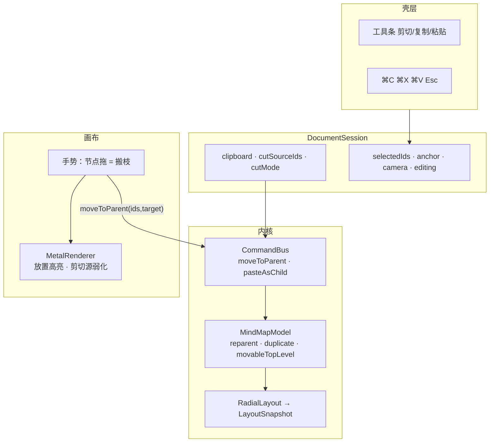

# Linva — 搬枝（拖拽成子与剪贴板）设计

**状态：** 已评审（对话确认）
**日期：** 2026-09-26
**需求真源：** `docs/prds/prd-linva-move-2026-09-25/prd.md`
**上游架构：** `docs/superpowers/specs/2026-09-25-linva-organize-multiselect-collapse-design.md`
**体验真源：** `prototype/`（标签 Move）
**依据：** Brainstorming 决议（本对话）

本文描述「搬枝」增量（FR-M1～M11）在原生 macOS 上的模块改动与数据流。不替代 PRD；实现计划见后续 `writing-plans` 产出。

**绘图约定：** 架构图使用 Mermaid。

---

## 1. 目标与拍板

### 1.1 目标

在已具备多选 / 框选 / 命令总线 / 画布手势状态机的 v1 原生实现上，交付**改层级**：拖拽成子 + 应用内剪贴板（⌘C / ⌘X / ⌘V）。行为对齐 PRD 与 HTML 原型。

### 1.2 Brainstorming 已拍板

| 项 | 决议 |
|----|------|
| 总体方案 | **方案 1**：扩展既有手势状态机 + 单层 Metal 渲染；不做独立 SwiftUI 拖拽幽灵层 |
| 拖放分区 | **整节点成子**（任意位置松手即成子）；上下边插同级完全留给「同级排序」PRD（FR-M10） |
| 粘贴到折叠父 | **展开**被粘贴/搬入的折叠父节点，露出新子（与 FR-M3 一致） |
| 粘贴后选中 | **收敛到**刚粘贴（/搬入）的节点 |
| 剪贴板 | **应用内会话态**：不入 `.linva`、不入系统剪贴板、不入 Undo 栈（copy/cut 无树变更）；仅粘贴/搬移进命令栈 |

### 1.3 明确不做（本增量）

- 跨文档 / 系统剪贴板互操作
- 粘贴为同级（固定成子）
- 拖拽同级排序（拆至「同级排序」PRD）
- 拖拽自滚动 / 幽灵层复刻节点外观（本增量用目标高亮 + 剪切源弱化表达）
- Session 大拆、样式系统

---

## 2. 架构与边界

沿用「分层内核 + 薄壳」演进，不新建模块边界。



### 2.1 层职责

| 层 | 本增量职责 | 禁止 |
|----|------------|------|
| Model | `movableTopLevel` / `reparent` / `duplicate` | 持久化剪贴板；理解 Metal |
| Command | `moveToParent` / `pasteAsChild` 各为 Undo **一步** | 把剪贴板态入栈 |
| Session | 持有剪贴板与会话态；派生 canCopy/canCut/canPaste | 在 View 内实现树变更 |
| Metal | 画放置高亮与剪切源弱化 | 修改 Model |
| Shell | 工具条按钮 + 快捷键；粘贴目标=primarySelectedId | 在 View 内实现布局 |

### 2.2 依赖规则

沿用 v1：Model/Command 仅 Foundation；Metal 只消费 Snapshot + 会话态字段；剪贴板为会话态，**不进** `.linva`。

---

## 3. 数据与命令

### 3.1 剪贴板载荷

```swift
enum ClipboardMode: Equatable { case copy, cut }

struct ClipboardPayload: Equatable {
    let mode: ClipboardMode
    let nodes: [Node]      // 深拷贝快照
    let sourceIds: [UUID]  // cut 模式：源 ID（粘贴时优先搬活节点）
}
```

- `copy`：深拷贝可搬顶层快照入剪贴板；可多次粘贴；源保留。
- `cut`：**不改树、不删源**；仅记源 ID + 快照，进入剪切态（弱化显示）。粘贴时才把仍存在的源 `moveToParent` 到目标下（保留 ID），成功后**清空剪贴板与剪切态**。
- `cancelCut()`（Esc）：清空剪贴板与剪切态，树不变。
- 空剪贴板 / 无选中 / 非法目标时粘贴为 no-op。

### 3.2 命令

| 命令 | 行为 | Undo |
|------|------|------|
| `moveToParent(ids: [UUID], parentId: UUID)` | 把可搬顶层搬到 `parentId` 下末尾；目标折叠则展开；剪贴板剪切粘贴与拖放共用 | **一步**：按原父/下标/顺序恢复，并还原目标折叠态 |
| `pasteAsChild(payload: [Node], parentId: UUID)` | 深拷贝（新 UUID）插入为子；首次执行记录已插入 `[Node]` | **一步**：移除这些副本；Redo 以同一批 ID 重插（UUID 稳定） |

### 3.3 选中收敛

搬移/粘贴成功后 `replaceSelection(搬后节点集, anchor: 锚点)`；目标折叠随命令一并展开（同一 Undo 步）。

---

## 4. Model 接口

```swift
/// 排除中心主题、祖先已在集内则不再单列的可搬顶层（对齐 topLevelDeletableIds 语义）。
func movableTopLevel(ids: Set<UUID>) -> [UUID]

/// 把可搬顶层整体搬到 targetId 下（末尾）；守卫 targetId 不为被搬节点自身/后代。
/// 目标为中心主题时按 v1「侧」均衡规则分配 left/right（与新增子主题一致）。
/// 成功后 target.collapsed = false。返回搬移记录供 Undo。
@discardableResult
func reparent(ids: [UUID], to targetId: UUID) -> [ReparentRecord]

/// 深拷贝子树并递归换新 UUID。
func duplicate(_ node: Node) -> Node

struct ReparentRecord {
    let parentId: UUID       // 原父
    let index: Int           // 原下标
    let node: Node           // 快照
}
```

约束：Model 仅 import Foundation。

> **中心主题分侧**：`reparent` 与 `pasteAsChild` 的目标为中心主题时，均复用既有 `insertChild` 的均衡分侧（`nextSide()`），与「新增子主题」一致（FR-M5）。`pasteAsChild` 内部即复用插入路径，天然继承该规则。

---

## 5. Session 剪贴板态

```swift
@Published private(set) var clipboard: ClipboardPayload?
@Published private(set) var cutSourceIds: Set<UUID> = []  // 仅 cut 模式非空

func copySelection()      // 深拷贝可搬顶层快照；mode=.copy
func cutSelection()       // 不改树；记源 ID+快照；mode=.cut
func pasteToPrimary()     // 目标=primarySelectedId；copy→pasteAsChild；cut→moveToParent
func cancelCut()          // 清空剪贴板与剪切态
var canCopy: Bool
var canCut: Bool
var canPaste: Bool        // 剪贴板非空 && 有选中 && 目标合法
```

---

## 6. 画布手势

### 6.1 手势状态机

扩展 `CanvasPointerGesture`：

```swift
case drag(movingIds: Set<UUID>, dropTarget: UUID?, lastPoint: CGPoint)
```

### 6.2 交互规则

| 输入 | 结果 |
|------|------|
| 非编辑态、单击、无 ⌘/Shift 修饰的节点按下 | 记拖拽起点 |
| 位移 > 阈值（约 4pt，与框选阈值一致） | 进入 `.drag`；按下节点已在多选中 → `movingIds`=选中集可搬顶层；否则=按下节点 |
| 拖拽中 | `hitTestCanvas` → `dropTarget`=合法节点（不在 `movingIds`、非任一被搬节点后代；空白/非法=nil） |
| 松手·已超阈值·目标合法 | `moveToParent(movingIds, target)` |
| 松手·已超阈值·目标非法/空白 | 取消搬移，树不变 |
| 松手·未超阈值 | 收成单击单选该节点（FR-M2） |
| ⌘/Shift 点选 | 不启动拖拽，只做多选 |
| 编辑态 | 不启动节点拖拽 |

空白拖 = 框选、空格+拖 = 平移、节点拖 = 搬枝，三者互不冲突（FR-M11）。

---

## 7. 渲染

- `draw(...)` 增加可选参数 `cutSourceIds: Set<UUID>`、`dropTargetId: UUID?`。
- **放置高亮**：目标节点外圈强调色描边（与选中描边区分：加粗或换色）。
- **剪切弱化**：`cutSourceIds` 中节点降低填充/文字 alpha 并画虚线边框。
- 绘制顺序不变：边 → 填充 → 文字 → 分叉 → 多选描边 → 放置高亮/框选。

---

## 8. 壳层

- 快捷键（非编辑态）：`⌘C` copy、`⌘X` cut、`⌘V` paste；`Esc` 若剪切态则 `cancelCut()`，否则清空选中。
- 工具条：删除旁新增 剪切/复制/粘贴；`canCut`/`canCopy`=可搬顶层非空；`canPaste`=剪贴板非空且有选中且目标合法。
- 粘贴目标 = `primarySelectedId`。
- 经 `CanvasActions` 收敛回调新增 `copy` / `cut` / `paste` / `cancelCut`。

---

## 9. 边界与错误行为

| 情况 | 行为 |
|------|------|
| 拖到自身 / 自身后代 | 非法，不搬 |
| 拖到中心主题 | 合法（成为其子，按侧分配）|
| 搬中心主题 | 不可（被 movableTopLevel 排除）|
| 拖到空白 / 非法 | 取消，树不变 |
| 粘贴目标=剪切源自身/后代 | 非法，no-op |
| 无选中 / 空剪贴板粘贴 | no-op |
| 剪切后 Esc | 树不变，弱化消失 |
| 粘贴/搬入折叠父 | 展开父露出新子 |
| 编辑态 | 不启动拖拽、不响应 ⌘C/X/V |

---

## 10. 测试与验收

### 10.1 自动化

- **Model**：reparent 守卫（中心主题/自身/后代）；多选只搬可搬顶层（祖先去重）；目标折叠则展开；duplicate 深拷贝换新 UUID。
- **CommandBus**：moveToParent 一步 Undo（原父/下标/顺序 + 折叠态还原）；pasteAsChild 一步 Undo/Redo（UUID 稳定）。
- **Session**：copy 快照可多次粘贴、源保留；cut 不改树、cancelCut 清空且树不变；canPaste 空剪贴板/无选中/非法目标为假。
- **手势**：拖拽阈值与目标合法性纯函数（命中自身子树判非法、空白判非法、可搬顶层去重）；框选/空格平移/修饰键点选回归。

### 10.2 手测（对齐 PRD §6 验收表）

1. 单节点拖到另一节点 → 成为其子，布局更新
2. 多选拖到目标 → 仅可搬顶层搬过去，选中保持在搬后节点
3. 拖到自身子树 → 不搬
4. ⌘X → 选目标 → ⌘V → 源搬走，剪切态消失
5. ⌘C → 两处 ⌘V → 两处各有副本，源仍在
6. 剪切后 Esc → 树不变，弱化消失
7. 贴到中心主题 → 自动分侧

---

## 11. 与 PRD / 原型对照

| PRD | 本设计 |
|-----|--------|
| FR-M1～M5 拖拽成子 | §6 |
| FR-M6～M9 剪贴板与工具条 | §5、§8 |
| FR-M10 同级排序范围 | §1.2（整节点成子，分区留给排序 PRD）|
| FR-M11 与删除/折叠共存 | §6.2、§9 |
| 原型剪切虚线弱化 / 放置高亮 | §7 |

开放问题（PRD §5 非目标）在本设计中的闭合见 §1.2。

---

## 修订记录

| 日期 | 说明 |
|------|------|
| 2026-09-26 | 初稿：Brainstorming 确认方案 1、整节点成子、粘贴展开与选中收敛后落盘 |
