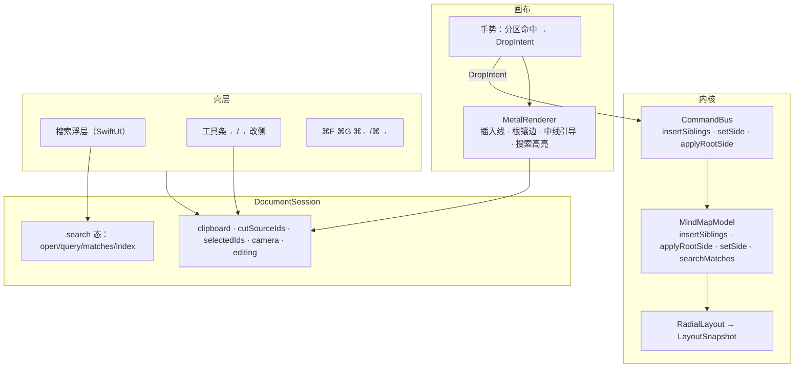

# YMind — 同级排序 + 搜索定位 + 手动改侧（合并）设计

**状态：** 已评审（对话确认）
**日期：** 2026-09-26
**需求真源：**
- `docs/prds/prd-ymind-reorder-2026-09-25/prd.md`
- `docs/prds/prd-ymind-search-2026-09-25/prd.md`
- `docs/prds/prd-ymind-side-2026-09-25/prd.md`
**上游架构：** `docs/superpowers/specs/2026-09-26-ymind-move-reparent-clipboard-design.md`、`docs/superpowers/specs/2026-09-25-ymind-organize-multiselect-collapse-design.md`
**体验真源：** `prototype/`（标签 Reorder / Search / Side）
**依据：** Brainstorming 决议（本对话）

三个 PRD 都是对导图树节点的操作增量，且在「拖拽放置意图」上深度咬合，故**合并为一份设计、一份计划、一次实现**。本文描述其原生 macOS 上的模块改动与数据流。不替代各 PRD；实现计划见后续 `writing-plans` 产出。

**绘图约定：** 架构图使用 Mermaid。

---

## 1. 目标与拍板

### 1.1 目标

在已具备拖拽成子 / 剪贴板 / 多选 / 命令栈 / 画布手势状态机的原生实现上，一次交付三份增量：

1. **同级排序**：拖拽同手势内用分区命中区分「成子 / 插到兄弟前 / 插到兄弟后」。
2. **搜索定位**：⌘F 浮层，整树文案匹配，展开路径、居中、选中、搜索高亮。
3. **手动改侧**：命令入口（⌘←/⌘→、工具条）与拖拽手势（中心左右半、空白过中线）指定一级枝左右侧。

行为对齐三份 PRD 与 HTML 原型（Reorder / Search / Side）。

### 1.2 Brainstorming 已拍板

| 项 | 决议 |
|----|------|
| 总体方案 | **方案 1**：扩展既有手势状态机 + 命令栈 + 单层 Metal 渲染；`DropIntent` 统一三类放置意图 |
| 统一底座 | `DropIntent` 取代 `dropTarget: UUID?`；`resolveDropIntent` 纯函数对齐原型 |
| 排序分区 | 非中心节点上下 **28%** → `before`/`after`，中部 → `child`；中心无插入带 |
| 中心主题 | 无同级插入带；中部成子区 + 左右 1/3 改侧带（FR-L2） |
| 改侧命令 | 工具条/⌘←→ 用 `setSide`（仅一级枝）；拖拽落中心半用 `applyRootSide`（提升或改侧） |
| 搜索展开 | 复用 `setCollapsed(ids:false)`，一步 Undo；全已展开则 no-op 不入栈 |
| ⌘G | 提供 ⌘G / ⇧⌘G 上一项 / 下一项（对齐 macOS 惯例，PRD 可选） |
| 渲染 | 全部在单层 Metal 同层绘制（插入线 / 根镶边 / 中线引导 / 搜索高亮） |

### 1.3 明确不做（本增量）

- 修饰键切换模式、仅认缝的宽空隙方案、水平方向插入带（排序非目标）
- 搜索替换 / 正则 / 大小写开关 / 结果侧栏 / 搜索历史（搜索非目标）
- 为非一级节点存储独立 `side`、导出、深色主题（改侧非目标）
- Session 大拆、样式系统、多文档

---

## 2. 架构与边界

沿用「分层内核 + 薄壳」演进，不新建模块边界。



### 2.1 层职责

| 层 | 本增量职责 | 禁止 |
|----|------------|------|
| Model | 排序/改侧树操作、`searchMatches` 纯收集 | 持久化搜索/放置意图；理解 Metal |
| Command | `insertSiblings` / `setSide` / `applyRootSide` 各为 Undo **一步** | 把搜索/相机/意图态入栈 |
| Session | 持有搜索态、`revealSearchMatch`、相机居中入口 | 在 View 内实现树变更 |
| Metal | 画插入线 / 根镶边 / 中线引导 / 搜索高亮 | 修改 Model |
| Shell | 搜索浮层 UI、改侧工具条、菜单快捷键 | 在 View 内实现布局 |

### 2.2 依赖规则

沿用 v1：Model/Command 仅 Foundation；Metal 只消费 Snapshot + 会话态字段；搜索与放置意图为会话态，**不进** `.ymind`；相机不入命令栈。

---

## 3. 统一底座：DropIntent

### 3.1 意图模型

```swift
enum DropIntent: Equatable {
    case child(targetId: UUID)                    // 成子（沿用搬枝）
    case before(targetId: UUID)                   // 插到该节点前
    case after(targetId: UUID)                    // 插到该节点后
    case sideLeft(targetId: UUID, viaEmpty: Bool) // 改左；viaEmpty=空白过中线
    case sideRight(targetId: UUID, viaEmpty: Bool)
}
```

- 手势 `.drag(movingIds: Set<UUID>, dropTarget: UUID?, lastPoint:)` → `.drag(movingIds:, intent: DropIntent?, lastPoint:)`；`currentDropTargetId` → `currentDropIntent`。
- 渲染入参 `dropTargetId: UUID?` → `intent: DropIntent?`。

### 3.2 意图解析（纯函数）

```swift
func resolveDropIntent(
    screenPoint: CGPoint,
    movingIds: Set<UUID>,
    snapshot: LayoutSnapshot,
    camera: Camera,
    model: MindMapModel
) -> DropIntent?
```

- 节点命中（非分叉控件）→ 按目标节点分区：
  - **中心主题**：水平 1/3 带 → `sideLeft`/`sideRight`；中部 → `child`（守卫 `canMoveOnto`）。
  - **非中心**：垂直上/下 **28%**（`DROP_EDGE_RATIO = 0.28`）→ `before`/`after`（守卫 `canInsertSibling`）；中部 → `child`（守卫 `canMoveOnto`）。
- 无节点命中（或命中分叉控件）→ `resolveEmptySideIntent`：仅当被拖可搬顶层**全部已是中心直接子**才产生改侧意图；世界 x < 0 → `sideLeft`(viaEmpty)，≥ 0 → `sideRight`(viaEmpty)；否则 nil。
- 非法意图一律返回 nil，无放置反馈、松手无操作。

合法性守卫（对齐原型）：

```swift
func canMoveOnto(_ target: UUID, movingIds: Set<UUID>) -> Bool   // 存在、不在集内、非任一被搬节点后代
func canInsertSibling(_ movingIds: [UUID], anchorId: UUID) -> Bool // 锚点有父；被搬集非空；锚点不在被搬集；被搬集不含锚点祖先
```

### 3.3 意图 → 命令映射（松手）

| 意图 | 命令 | 说明 |
|------|------|------|
| `child` | `moveToParent(ids, targetId)` | 既有搬枝命令 |
| `before` / `after` | `insertSiblings(ids, anchorId, position)` | 新命令 |
| `sideLeft`/`sideRight` (viaEmpty) | `setSide(ids, side)` | 只改已是中心直接子的枝 |
| `sideLeft`/`sideRight` (非 viaEmpty) | `applyRootSide(ids, side)` | 提升或改侧 |

成功后 `replaceSelection(movingIds, anchor: 锚点)`（与搬枝一致，收敛到被操作集）。

---

## 4. 命令与 Model

### 4.1 命令

| 命令 | 行为 | Undo |
|------|------|------|
| `insertSiblings(ids:[UUID], anchorId:UUID, position: before/after)` | 可搬顶层卸下 → **连续块**插到锚点前/后，保持相对序；可跨原父；新父为中心时 side 继承锚点（否则 nextSide）；锚点须仍有父 | **一步**：按原父/下标/顺序恢复 |
| `setSide(ids:[UUID], side:Side)` | 仅作用选中集中**已是中心直接子**的节点，设 side；非一级枝忽略 | **一步**：恢复各节点原 side |
| `applyRootSide(ids:[UUID], side:Side)` | 已是中心直接子只改 side；更深节点提升为中心直接子并设 side | **一步**：改侧者恢复原 side；提升者按原父/下标恢复 |

守卫：`applyRootSide` 目标不能是中心主题（可搬顶层已排除）；`setSide` 不改变父节点。

### 4.2 Model 接口

```swift
/// 可搬顶层卸下后按锚点前后插入为连续块（FR-R2）；跨父、中心下继承锚点 side。
@discardableResult
func insertSiblings(ids: [UUID], anchorId: UUID, position: BeforeAfter) -> [ReparentRecord]

/// 仅作用中心直接子，设 side；返回被改节点快照供 Undo。
@discardableResult
func setSide(ids: [UUID], side: Side) -> [(id: UUID, oldSide: Side?)]

/// 中心直接子只改 side；更深提升为一级并设 side；返回撤销记录。
@discardableResult
func applyRootSide(ids: [UUID], side: Side) -> RootSideChange

enum BeforeAfter { case before, after }

struct RootSideChange {
    let sideChanges: [(id: UUID, oldSide: Side?)]   // 一级枝改侧
    let promotions: [ReparentRecord]                // 提升者：原父/下标/节点快照
}
```

`insertSiblings` 排序细节（对齐原型 `insertAsSiblings`）：先按原父/下标倒序 detach，再反转，保持多选相对序；anchor 重新定位后按 position 计算插入位，连续插入并递增。

### 4.3 搜索收集

```swift
/// DFS 先序、大小写不敏感子串包含；含折叠子树；空查询返回空。
func searchMatches(query: String) -> [UUID]
```

`MindMapModel` 持有 `document`，可直接遍历。大小写不敏感用 `localizedCaseInsensitiveContains`（或 `lowercased().contains`，对齐原型，实现时选一并在测试固定）。

---

## 5. Session 搜索态

```swift
struct SearchState: Equatable {
    var isOpen = false
    var query = ""
    var matches: [UUID] = []
    var index: Int = -1
    var currentMatchId: UUID? { index >= 0 && index < matches.count ? matches[index] : nil }
}

@Published private(set) var search = SearchState()

func openSearch()                       // 编辑态先 commitEditingIfNeeded；isOpen=true；已打开则聚焦并全选
func closeSearch()                      // 仅 isOpen=false；保留 query/matches/index 供重开续查，选中不变
func runSearch(query: String, preferId: UUID? = nil)  // 重算 matches；尽量停留在仍匹配的同一节点，否则第一项
func revealSearchMatch(index: Int)      // 循环；展开祖先；selectOnly；居中
```

`revealSearchMatch` 流程（对齐原型 `revealSearchMatch`）：

1. 祖先链 `setCollapsed(ids: 祖先链, collapsed: false)`（复用既有命令；全已展开时 no-op，不入栈）。
2. `model.selectOnly(id)` + `syncSelectionFromModel()`。
3. 通知壳层把相机中心移到该节点（保持 scale）——经 `centerCamera(on:viewport:)`（见 §6）。

上/下一项：Enter / ↓ / ⌘G（下一项），⇧Enter / ↑ / ⇧⌘G（上一项）；匹配列表内循环。查询变更重算时保持仍匹配的当前节点，否则回第一项。

搜索高亮：当前命中节点以区别于选中态的样式渲染（对齐原型 `.is-search-hit` 琥珀色描边），可与普通选中并存。

---

## 6. 画布手势

### 6.1 手势状态机

`CanvasPointerGesture.drag` 的 `dropTarget: UUID?` 改为 `intent: DropIntent?`；`continuePointerGesture` 中每帧用 `resolveDropIntent` 重算意图并 `setNeedsDisplay`。

### 6.2 命中优先级

节点命中但落在**分叉控件**上 → 视为无节点（走 `resolveEmptySideIntent`，与原型 `hitNodeIdAtClient` 对 branch-toggle 返回 null 一致）。其余沿用现有：分叉 → 节点 → 空白。

### 6.3 相机居中

`Camera` 增方法：

```swift
/// 保持当前 scale，平移使给定世界矩形的中心落入视口中心。
mutating func center(on rect: CGRect, viewport: CGSize)
```

Session 提供 `func centerCamera(on id: UUID, viewport: CGSize)`，内部用 `snapshot.frames[id]?.rect`。壳层在 `revealSearchMatch` 后以当前视口调用。

---

## 7. 渲染

- `draw(...)` 入参 `dropTargetId: UUID?` → `intent: DropIntent?`，新增 `searchHitId: UUID?`。
- **绘制顺序**：边 → 填充 → 文字 → 分叉 → 多选描边 → 剪切弱化 → **放置反馈**（按意图类型）→ **搜索高亮** → 框选。
- 放置反馈：
  - `child`：目标整节点强调色加粗描边（沿用现有 `drawDropHighlight`）。
  - `before`/`after`：目标弱边框 + **插入线**于目标顶/底边（原型 `.insert-line`，宽度 ≥ 节点宽下限如 48pt）。
  - `sideLeft`/`sideRight`（非 viaEmpty）：中心主题左/右**镶边**高亮（原型 `.is-drop-side-left/right`）。
  - `sideLeft`/`sideRight`（viaEmpty）：**中线引导**（垂直贯穿线，原型 `#side-guide`）。
- 搜索高亮：当前命中节点琥珀色描边（原型 `.is-search-hit`），可覆盖普通选中。

新增辅助顶点生成：水平插入线 `horizontalLineQuad`、根镶边 `edgeInsetQuad`、中线 `verticalLineQuad`。全部走既有 `drawSolid` 管线，无新 shader。

---

## 8. 壳层

### 8.1 搜索浮层

ContentView ZStack 顶部（与 `NodeEditorOverlay` 同层）SwiftUI 栏：输入框 + 计数 `n / m` + ↑/↓ + 关闭，对齐原型 `#search-bar`。绑定 `session.search`。

- ⌘F（菜单项，全局）：编辑态先 `commitEditingIfNeeded`；打开并聚焦输入框；已打开则聚焦并全选查询。
- ⌘G / ⇧⌘G（菜单项）：下一项 / 上一项。
- 输入框聚焦时 Enter = 下一项（⇧Enter = 上一项），Esc = 关闭；输入框获焦时画布快捷键不触发（SwiftUI TextField 天然拦截，`onSubmit` / `onKeyPress` / `onExitCommand` 处理）。

### 8.2 工具条与快捷键

- 工具条：剪贴板组旁新增「← 左侧」「右侧 →」按钮；可用 = 选中集含 ≥1 中心直接子（`canSetSide`）。命令 `setSide` 只作用一级枝（FR-L1）。
- 快捷键：非编辑态画布 keyDown 增加 `⌘←` / `⌘→`（`setSide`）；菜单项亦绑定（对齐 macOS 菜单惯例，见 PRD §5）。

---

## 9. 边界与错误行为

| 情况 | 行为 |
|------|------|
| 排序：锚点=中心主题 / 被搬集含锚点 / 含锚点祖先 | 非法，无反馈，不搬 |
| 排序：跨父插入 | 改父 + 顺序正确；新父为中心则 side 继承锚点 |
| 排序：多选连续块 | 相对序保持 |
| 改侧：非一级枝拖到空白 | 无改侧意图（仍取消放置） |
| 改侧：多选含一级+深层，点右侧 | 仅一级改侧 |
| 拖到中心主题 | 中部成子；左右 1/3 改侧 |
| 搜索：无匹配 | 计数 `0 / 0`，无跳转 |
| 搜索：折叠内命中 | 祖先展开、节点可见并居中选中 |
| 搜索：Esc | 浮层关闭（选中可保留） |
| 搜索框聚焦 | 不触发画布 Tab/Enter 增删同级 |
| 编辑态 | ⌘F 先提交编辑再打开搜索 |

---

## 10. 测试与验收

### 10.1 自动化（优先）

- **意图解析（纯函数）**：分区命中（中部成子 / 上下 28% 插同级 / 中心左右 1/3 改侧 / 中心中部成子 / 中心无插入带）；`canInsertSibling` 非法三态（锚点=中心、含锚点自身、含锚点祖先）；`resolveEmptySideIntent` 全一级枝条件与世界 x 判侧；命中分叉控件视为无节点。
- **Model**：`insertSiblings` 跨父 + 相对序 + 中心侧继承 + 锚点重定位；`applyRootSide` 提升/改侧/守卫；`setSide` 仅一级枝；`searchMatches` DFS 序、大小写、折叠子树、空查询。
- **CommandBus**：`insertSiblings` / `setSide` / `applyRootSide` 各一步 undo/redo，UUID 稳定，选中收敛。
- **Session**：`revealSearchMatch` 展开祖先 + 选中收敛 + 循环 index；无匹配 `0/0`；`openSearch` 编辑态先提交；相机居中保持 scale。
- **Camera**：`center(on:viewport:)` 保持 scale 且使矩形中心入视口中心。

### 10.2 手测（对齐三份 PRD §6 验收表）

**Reorder（7 条）：** 中部成子 / 上边插前同父 / 下边插后同父 / 中心边缘仍成子 / 自身上下边无意图 / 跨父插前改父+顺序+侧继承 / 多选连续块相对序。

**Search（6 条）：** ⌘F 聚焦 / 折叠内命中展开+居中选中 / 多项 Enter 循环 / 无匹配 0/0 / Esc 关闭 / 搜索框 Enter 不新增同级。

**Side（7 条）：** 选一级枝 ⌘→ 移右 / 工具条「← 左侧」/ 一级枝拖过中线空白改侧仍一级 / 拖中心左半一级+left / 中心中部成子 / 深层拖空白不改侧 / 多选含一级+深层点右侧仅一级改侧。

---

## 11. 与 PRD / 原型对照

| PRD | 本设计 |
|-----|--------|
| reorder FR-R1～R6 | §3、§4、§7 |
| search FR-S1～S5 | §5、§8.1 |
| side FR-L1～L5 | §3、§4、§8.2 |
| 原型 `resolveDropIntent` / `insertAsSiblings` / `resolveEmptySideIntent` | §3、§4 |
| 原型 `collectSearchMatches` / `expandPathTo` / `centerCameraOnNode` | §4.3、§5、§6.3 |
| 原型 `.insert-line` / `.is-drop-edge` / `#side-guide` / `.is-search-hit` | §7 |

开放问题（各 PRD §5 非目标）在本设计中的闭合见 §1.3。

---

## 修订记录

| 日期 | 说明 |
|------|------|
| 2026-09-26 | 初稿：Brainstorming 确认方案 1 + DropIntent 统一底座后落盘 |