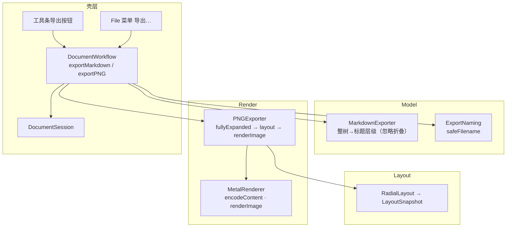

# Linva — 导出（PNG / Markdown）（设计）

**状态：** 待评审
**日期：** 2026-09-27
**需求真源：** `docs/prds/prd-linva-export-2026-09-25/prd.md`
**上游架构：** `docs/superpowers/specs/2026-09-24-linva-v1-architecture-design.md`、`docs/架构现状.md`
**体验真源：** `prototype/`（标签 Export：`exportMarkdown` / `treeToMarkdown` / `exportPng` / `withFullyExpanded` / `paintExportCanvas`）
**依据：** Brainstorming 决议（本对话）

本增量把结果带出 App：导出 **PNG 整图**（全展开）与**结构化 Markdown**（标题层级）。本文描述原生 macOS 上的模块改动与数据流，不替代 PRD；实现计划见后续 `writing-plans` 产出。

**绘图约定：** 架构图使用 Mermaid。

---

## 1. 目标与拍板

### 1.1 目标

画布内能力已齐；用户需把图发到聊天/文档，或把结构拷进笔记。本增量提供两种导出，语义固定：

- **PNG：** 导出前**临时展开全部折叠**，按全树布局绘制整图包围盒（非当前视口截图）。图含原先折叠枝内全部节点；导回后画布折叠态不变。
- **Markdown：** 按树深度生成标题层级（`#`/`##`/…），**忽略折叠**，始终导出整棵逻辑树。

对齐 PRD 五条验收（FR-E1～E4）。

### 1.2 Brainstorming 已拍板

| 项 | 决议 |
|----|------|
| 落地方式 | **NSSavePanel 选位置**（默认名取中心主题，经 `ExportNaming` 规整）；非浏览器式自动进 Downloads |
| 入口 | **工具条按钮 + File 菜单「导出…」双入口**（FR-E1 原文） |
| Markdown | **Model 层纯函数**生成（`MarkdownExporter`），与渲染无关 |
| PNG | **离屏 Metal 光栅化**（复用 MetalRenderer，视觉与画布一致：节点圆角块/连线/文案/填色）；不 CPU 重绘、不加新 shader |
| PNG 尺寸 | `scale = min(2, 2400 / 长边)`，长边 ≤2400px；纸面背景 `#e7e4dc`（对齐原型）；固定 `.aqua` 外观解析动态色，导出结果与系统外观无关 |
| PNG 内容 | **不画**分叉 ± 控件、选中/搜索/框选/放置等交互 UI（FR-E3「不必画分叉 ± 控件与相机 UI」） |
| 不改文档 | 导出**不经过命令栈、不入 Undo、不写 `.linva`、不动折叠态**（FR-E4） |
| 渲染重构 | 把 `MetalRenderer.draw(in:)` 的绘制体抽成 `encodeContent(...)`，在线/离屏共用；`drawText`/`drawBranchToggles` 改收 `displayScale`（不再读 `view`） |

### 1.3 明确不做（本增量）

- 导出 PDF（已移除：产品拍板 PDF 导出不做）/ SVG / PPT / XMind / OPML
- 仅视口截图、水印、按枝拆图
- Markdown 双向导入、自定义模板
- 打印对话框精调（PRD §0）

---

## 2. 架构与边界

沿用「分层内核 + 薄壳」演进，不新建模块目录；新增两个**纯函数导出器**（Model 的 Markdown、Render 的 PNG），不改命令栈、不改序列化。



### 2.1 层职责

| 层 | 本增量职责 | 禁止 |
|----|------------|------|
| Model | `MarkdownExporter`（纯函数）、`ExportNaming`（纯字符串） | 理解渲染/UI；引 Metal |
| Layout | `RadialLayout.layout` 复用于全展开文档（无改动） | — |
| Render | `PNGExporter`（全展开+布局+离屏渲染）、`MetalRenderer.encodeContent/renderImage` | 读 Model / 改树 |
| Shell | `DocumentWorkflow.exportMarkdown/exportPNG`（生成数据 + NSSavePanel 落地）；工具条 + 菜单入口 | 在 View 内实现树变更 |

### 2.2 依赖规则

- `MarkdownExporter` / `ExportNaming` 放 **Model**：仅 `import Foundation`，在白名单内。
- `PNGExporter` 放 **Render**：`import AppKit CoreGraphics Foundation MetalKit`（全在 Render 白名单）；同模块内部引用 `MetalRenderer`/`RadialLayout`/`TextMeasure`/`Node`。
- 导出不新增命令 → 不动 `CommandBus`/`MindMapCommand`（FR-E4）。
- 新增文件经 Xcode 同步组（`PBXFileSystemSynchronizedRootGroup`）自动纳入，不改 `project.pbxproj`。

---

## 3. Model：Markdown 导出（FR-E2）

### 3.1 MarkdownExporter

```swift
/// Model/MarkdownExporter.swift —— 整棵逻辑树 → Markdown 标题层级。
enum MarkdownExporter {
    static func markdown(from document: MindMapDocument) -> String
}
```

- **先序遍历**整棵树（含折叠子树内节点，FR-E2「忽略折叠」）。
- 根深度 1 → `#`；子 +1；`level = min(depth, 6)`，超过 6 仍 `######`（FR-E2）。
- 文案对齐原型 `treeToMarkdown`：`\r\n→\n`，按行 trim、去空行、join 空格（多行压成一行）；最终为空用「未命名」。
- 不输出填色 / 侧 / 折叠元数据（纯结构文档，FR-E2）。
- 行间以空行分隔（对齐原型 `\n\n`），末尾单换行。

### 3.2 ExportNaming

```swift
/// Model/ExportNaming.swift —— 对齐原型 safeFilename。
enum ExportNaming {
    static func safeFilename(base: String?, ext: String) -> String
}
```

- 非法字符 `\ / : * ? " < > |` → `_`；空白 run → 单空格；trim；48 字符截断；兜底 `linva`。
- 供 MD 与 PNG 的 SavePanel 默认名共用。

---

## 4. Render：PNG 导出（FR-E3）

### 4.1 流程

```swift
/// Render/PNGExporter.swift
enum PNGExporter {
    static func data(document: MindMapDocument, maxDimension: CGFloat = 2400, padding: CGFloat = 48) -> Data?
    static func fullyExpanded(_ document: MindMapDocument) -> MindMapDocument
}
```

1. `fullyExpanded`：**复制**文档并把所有 `collapsed` 清为 false（不改原文档）。
2. `RadialLayout.layout` 布局展开文档 → 全树 Snapshot（含隐藏枝节点）。
3. 求全部 `frame.rect` 并集的包围盒。
4. `MetalRenderer.renderImage` 离屏光栅化 → `CGImage` → `NSBitmapImageRep` → PNG `Data`。

### 4.2 MetalRenderer 重构（Render）

- 把 `draw(in:)` 的绘制体抽成 `encodeContent(into:viewportSize:snapshot:camera:displayScale:selectedIds:selectionAnchorId:cutSourceIds:intent:searchHitId:marquee:)`；`draw(in:)` 调用它。绘制顺序与现状一致。
- `drawText` / `drawBranchToggles` 签名由 `view: MTKView` 改为 `displayScale: CGFloat`（不再读 `view.window?.backingScaleFactor`）。
- 新增 `renderImage(snapshot:contentBounds:maxDimension:padding:paper:) -> CGImage?`：
  - `scale = min(max(2400 / 长边, 0.35), 2)`，`pixelW/H = ceil((contentW/H + padding*2) * scale)`。
  - 构造导出相机：`camera.scale = scale`，`translation = (padding - minX*scale, padding - minY*scale)`，把内容包围盒映射进带 padding 的像素区。
  - 建离屏 `MTLTexture`（`.bgra8Unorm`，usage `[.renderTarget, .shaderRead]`）→ `MTLRenderPassDescriptor`（clear = 纸色）→ `encodeContent`（**仅边/节点块/文字/填色**；`selectedIds=[]`、`cutSourceIds=[]`、`intent=nil`、`searchHitId=nil`、`marquee=nil`；分叉 ± 由空 `branchToggles` 天然不画）。
  - 用 `NSAppearance(named: .aqua)` 包住 encode，动态语义色按浅色纸面解析，结果与系统外观无关。
  - `getBytes` 读回 → `CGImage`（`byteOrder32Little | premultipliedFirst`，与 bgra8Unorm 内存布局一致）。
  - `commandBuffer.waitUntilCompleted()` 保证读回前渲染完成。

---

## 5. Shell：入口与落地（FR-E1）

### 5.1 DocumentWorkflow（LinvaAppApp.swift）

```swift
static func exportMarkdown(_ session: DocumentSession)
static func exportPNG(_ session: DocumentSession)
```

- 先 `session.commitEditingIfNeeded()`（FR-E4 不破坏编辑态）。
- 生成数据 → `NSSavePanel`（MD `allowedContentTypes=[.plainText]`、PNG `[.png]`）→ 默认名 `ExportNaming.safeFilename(base: root.text, ext:)` → 写入；失败置 `session.errorMessage`。

### 5.2 File 菜单

`DocumentCommands` 在 `CommandGroup(after: .saveItem)` 增「导出 Markdown…」「导出 PNG…」。

### 5.3 工具条

- `MainToolbar` 增 `exportMarkdown` / `exportPNG` 两个闭包参数，`secondaryAction` 组内加两个按钮（`doc.plaintext` / `square.and.arrow.up`）。
- `ContentView` 把闭包接到 `DocumentWorkflow.exportMarkdown(session)` / `exportPNG(session)`。

---

## 6. 边界与错误行为

| 情况 | 行为 |
|------|------|
| 空文档（仅根） | PNG 仍可导出（根单节点图）；MD 输出 `# 根` |
| Metal 初始化失败 | `PNGExporter.data` 返回 nil → `errorMessage = "导出 PNG 失败：无法生成图像"` |
| SavePanel 取消 | 无副作用，不报错 |
| 写入失败 | `errorMessage = error.localizedDescription` |
| 深树 >6 层 | MD 最深仍 `######`（FR-E2 验收 3） |
| 折叠枝 | PNG 含隐藏子树且导后折叠态不变；MD 始终整树（验收 1、2） |
| 节点有填色 | PNG 画对应填色（验收 4） |
| 文件名 | 含中心主题可读名（验收 5） |

导出全程**不经过命令栈、不入 Undo、不写 `.linva`、不改折叠态**（FR-E4）。

---

## 7. 测试与验收

### 7.1 自动化（优先）

- **MarkdownExporterTests**：根单 `#`；嵌套深度 `#`/`##`/`###`；深度 >6 封顶 h6；折叠枝仍全出；多行文案压成单行；空文案「未命名」；不输出 fill/side 元数据。
- **ExportNamingTests**：非法字符替换；空白折叠；空 base 兜底 `linva`；48 字符截断。
- **RadialLayoutTests**：既有测试覆盖布局；全展开文档复用现有布局，不需新测试。

### 7.2 手测 / 冒烟（对齐 PRD §6 验收表 1–5）

一次性脚本生成 PNG：验证能出图、含折叠枝、导后折叠态不变；再经 SavePanel 手测两个入口落盘。

---

## 8. 与 PRD / 原型对照

| PRD | 本设计 |
|-----|--------|
| FR-E1 入口（工具条 + 文件→导出菜单） | §5.2、§5.3 |
| FR-E2 Markdown（先序 / 深度→标题 / >6 封顶 / 多行压行 / 未命名 / 无元数据 / UTF-8 `.md`） | §3.1 |
| FR-E3 PNG（全展开 → 布局 → 包围盒光栅化 → 恢复折叠态 / 节点块连线文案填色 / 不画分叉与相机 UI / 纸色 / ≤2400px / `.png` 名取中心主题） | §4 |
| FR-E4 不改文档（不入 Undo / 不写 `.linva`） | §6 |
| 原型 `treeToMarkdown` / `exportMarkdown` / `withFullyExpanded` / `paintExportCanvas` / `safeFilename` | §3、§4、§5 |

---

## 修订记录

| 日期 | 说明 |
|------|------|
| 2026-09-27 | 初稿：Brainstorming 确认（NSSavePanel 落地、工具条+菜单双入口）后落盘 |
