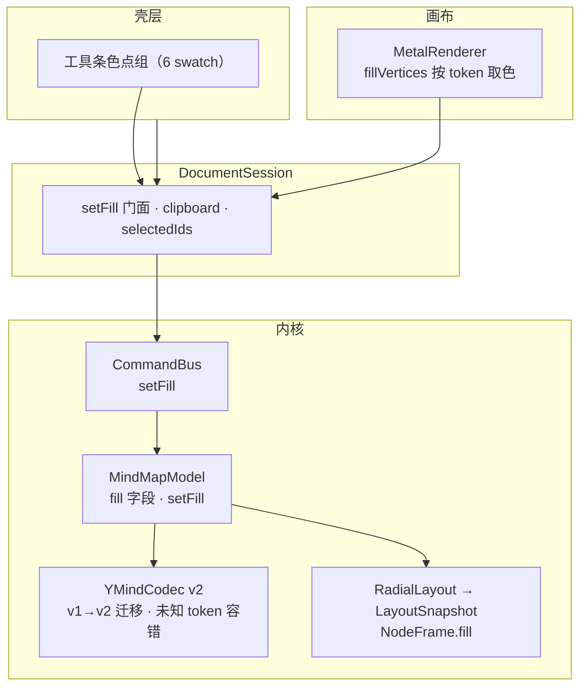

# YMind — 节点轻填色（设计）

**状态：** 已评审（对话确认）
**日期：** 2026-09-27
**需求真源：** `docs/prds/prd-ymind-style-2026-09-25/prd.md`
**上游架构：** `docs/superpowers/specs/2026-09-24-ymind-v1-architecture-design.md`、`docs/架构现状.md`（§7.3「节点样式（颜色、图标）」扩展路径）
**体验真源：** `prototype/`（标签 Style：`.fill-swatches` / `node.fill` + `data-fill` / `cloneSubtree`）
**依据：** Brainstorming 决议（本对话）

本增量给节点提供**少量预设填色**（5 token + 默认），实现「低成本视觉分类」。不引入主题商店或富文本样式系统。本文描述原生 macOS 上的模块改动与数据流，不替代 PRD；实现计划见后续 `writing-plans` 产出。

**绘图约定：** 架构图使用 Mermaid。

---

## 1. 目标与拍板

### 1.1 目标

结构操作（整理 / 搬枝 / 改侧 / 搜索）已齐；用户缺低成本视觉分类。本增量在工具条提供色点组，对选中节点（含多选、含中心主题）套用或清除预设填色。

行为对齐 PRD 六条验收（FR-C1～C5）与 HTML 原型（标签 Style）。

### 1.2 Brainstorming 已拍板

| 项 | 决议 |
|----|------|
| 总体方案 | 扩既有命令栈 + Snapshot + 单层 Metal 填充；不加新 shader、不加新子系统 |
| 填色存储 | `Node.fill: NodeFill?`（typed enum，5 token）；未知/缺失 token 解码为 nil（PRD §7） |
| 序列化 | `.ymind` `currentVersion` 1 → 2；v1 → v2 迁移（fill 缺省 nil，仅版本升迁） |
| 调色板 | 单一来源 `NodeFillStyle`（纯 hex 数据，取自 prototype），Render 与工具条共用 |
| 命令 | `.setFill(ids:fill:)` 为一步 Undo；全无变化不入栈；不改选中 |
| 视觉 | 普通填色节点 = 浅底 + 协调边框；根 = 深色变体；无填色维持现状（**不新增边框**） |
| 文字 | 填色不改文字色（节点 labelColor / 根 white），保证可读 |
| 覆盖层 | 选中 / 搜索 / 剪切弱化等绘制顺序不变 → 高亮叠在填色之上（FR-C4） |
| 复制粘贴 | `Node` 值类型深拷贝天然携带 fill，剪贴板不另改（FR-C3） |

### 1.3 明确不做（本增量）

- 自定义取色器、渐变、字号档、粗体、主题包切换、按侧自动配色、从图片取色（PRD §4 FR-C5）
- 深色模式专档（可随系统外观另案，PRD §0）
- 导出时色差精调（PRD §0）
- 未填色节点加边框 / 视觉重设计（超出「填色」增量范围，见 §1.2）

---

## 2. 架构与边界

沿用「分层内核 + 薄壳」演进，不新建模块边界；`NodeFrame` 是 Render 与 Layout 的唯一接缝。



### 2.1 层职责

| 层 | 本增量职责 | 禁止 |
|----|------------|------|
| Model | `NodeFill` token、`Node.fill`、`setFill`、`NodeFillStyle` 纯数据调色板 | 理解 Metal；引 UI 框架 |
| Command | `setFill` 一步 Undo/Redo | 把选中/相机态入栈 |
| Session | `setFill(_:)` 门面（先 commitEditing） | 在 View 内实现树变更 |
| Layout | `NodeFrame.fill` 从 `node.fill` 带入，只传递不参与几何 | 理解渲染 |
| Metal | 按 `frame.fill` 取底色/边框/根深色 | 读 Model / 改树 |
| Shell | 工具条色点组 UI、激活态 | 在 View 内实现树变更 |

### 2.2 依赖规则

沿用 v1：Model/Command 仅 Foundation；Metal 只消费 Snapshot；Layout 不依赖 Metal；Shell 经 Session。`NodeFillStyle` 放 Model 层（纯 hex 数据、仅 Foundation import），供 Render 与工具条共同取色——Model 不引 UI 框架，不违反边界；单一来源避免 Render/App 两处 hex 漂移。

---

## 3. Model：填色 token 与存储

### 3.1 填色枚举

```swift
/// 5 个具名预设；nil = 默认外观（FR-C1）。
enum NodeFill: String, Codable, CaseIterable, Sendable, Equatable, Hashable {
    case sage, sky, sand, rose, lilac
}
```

`Node` 增可选字段（`init` 增参，默认 nil）：

```swift
var fill: NodeFill?
```

`Node` 需**自定义 `init(from:)`**：`fill` 用 `decodeIfPresent(String.self)` 再 `NodeFill(rawValue:)`，未知 token → nil（PRD §7「未知 token 读入时视为默认」）；`encode(to:)` 仍由编译器合成（`encodeIfPresent` → nil 时省略字段，对齐 PRD §7「可选字段 fill（string token | 省略）」）。其余字段解码与现状一致。

### 3.2 调色板（单一来源）

```swift
/// 纯数据（hex）调色板，取自 prototype；Model 层仅 Foundation。
struct NodeFillStyle {
    let swatch: UInt32      // 工具条色点
    let background: UInt32  // 普通节点浅底
    let border: UInt32      // 普通节点协调边框
    let rootBackground: UInt32 // 中心主题深色变体
    static let values: [NodeFill: NodeFillStyle]
}
```

| token | swatch | 普通 bg | 普通 border | 根 bg |
|-------|--------|---------|-------------|-------|
| sage  | `#C5D5C0` | `#DFEADF` | `#8FA88A` | `#3D5C48` |
| sky   | `#BFD4E6` | `#D7E5F0` | `#7A9BB5` | `#355A78` |
| sand  | `#E6D3A8` | `#F0E4C4` | `#C4A86A` | `#7A6230` |
| rose  | `#E6C0BC` | `#F0D8D5` | `#C48984` | `#7A4040` |
| lilac | `#D2C4E0` | `#E5DCED` | `#9E8BB3` | `#554868` |

消费者各自把 hex 转成所用色空间：Render 经 `rgba(NSColor)`、工具条经 SwiftUI `Color`，转换逻辑不落 Model。

---

## 4. Codec：v1 → v2 版本升迁

### 4.1 版本与迁移

- `MindMapDocument.currentVersion` **1 → 2**。
- `decode` 重构为：先解出文档 → **若 `version == 1` 迁移为 v2**（fill 缺省 nil，仅版本号升迁；Node 自定义解码器对缺失 fill 天然容错）→ 仍非 2 则抛 `unsupportedVersion` → `sanitize`。
- `encode` 前 `sanitize` 不变；nil fill 自动省略，写出稳定 JSON（`[.prettyPrinted, .sortedKeys]`）。

### 4.2 消毒

`fill` **无层级约束**（可含中心主题与任意深度，FR-C3），`sanitize` 不处理 fill；未知 token 已在解码层降级为 nil，不进 warnings（属预期兼容而非数据降级）。

---

## 5. 命令：setFill

### 5.1 命令定义

```swift
case setFill(ids: [UUID], fill: NodeFill?)
```

### 5.2 Model

```swift
/// 对选中集每个节点写同一 fill（含根）；返回被改节点旧值供 Undo。
@discardableResult
func setFill(ids: [UUID], fill: NodeFill?) -> [(id: UUID, oldFill: NodeFill?)]
```

- 遍历 `ids`（去重），跳过 `fill` 已为目标值的节点。
- 不移动节点、不改选中 → 无需 `replaceSelection`。

### 5.3 CommandBus

- `applyForward` 新增分支：调用 `model.setFill`；**返回空（全无变化）→ 返回 nil 不入栈**（skill 铁律 5）。
- `Entry(undo:redo:)`：逐节点 `mutate { $0.fill = old }` / 重设目标值。

### 5.4 Session 门面

```swift
func setFill(_ fill: NodeFill?) {
    commitEditingIfNeeded()
    commandBus.execute(.setFill(ids: Array(model.selectedIds), fill: fill))
}
```

---

## 6. Layout：NodeFrame.fill

- `NodeFrame` 增 `let fill: NodeFill?`（Equatable 合成 → 参与 dirty 判断，无副作用）。
- `RadialLayout` 两处构造（根 + 普通分支）带入 `node.fill`。
- `fill` 不参与几何计算与 `TextMeasure` 尺寸，纯传递。

---

## 7. Render：填色取色

`MetalRenderer.fillVertices` 按 `frame.fill` 分派：

| frame | fill 为 nil（现状） | 有 fill |
|-------|--------------------|---------|
| 普通节点 | `controlBackgroundColor` 填充，无边框 | 浅底 `background` + 协调边框 `border`（描边走既有 `strokeVertices`，厚度 ~1.5·scale） |
| 中心主题 | `controlAccentColor` 填充 | 深色变体 `rootBackground` 填充 |

- 文字色不变：普通节点 `labelColor`、根 `white`（深浅变体均可读，FR-C4）。
- 绘制顺序不变（边 → 填充 → 文字 → 分叉 → 多选描边 → 剪切弱化 → 放置反馈 → 搜索高亮 → 框选）→ 选中/搜索高亮天然叠在填色之上。
- 无新 shader；hex → `NSColor` 经既有 `rgba(_:)`。

---

## 8. Shell：工具条色点组

### 8.1 状态

ContentView 计算并传给 `MainToolbar`：

```swift
let canSetFill: Bool          // 选中非空
let activeFill: NodeFill?     // 单选/全一致时的公共 fill；多选不一致或选中空 → nil
let fillActive: Bool          // 是否为确定激活态（单选或全一致）
let setFill: (NodeFill?) -> Void
```

- `fillActive`：选中非空且所有选中节点 `fill` 一致（含全 nil）→ true；多选不一致 → false。
- 「默认」色点在 `fillActive && activeFill == nil` 时激活。

### 8.2 色点组 UI

`MainToolbar` 新增一组 6 个圆形 swatch（放改侧按钮之后）：

- 5 个填色点（`NodeFillStyle.values[token].swatch`）+ 1 个「默认」清除点（圆形底 + 对角斜线，对齐 prototype `.swatch-none`）。
- **无选中（`!canSetFill`）全部禁用**（FR-C2）。
- 激活态：色点外圈强调色环（对齐 prototype `.is-active`）。
- 点击 → `setFill(token)` / `setFill(nil)`（默认）。

---

## 9. 边界与错误行为

| 情况 | 行为 |
|------|------|
| 无选中 | 全部色点禁用 |
| 单选已 sage，点 sage | 无变化，命令不入栈，色点保持激活 |
| 多选 fill 不一致，点某色 | 全部套该色，命令一步入栈；激活态收敛 |
| 点「默认」 | 全部清为 nil，恢复无填色 |
| 中心主题上色 | 深色变体，字色保持可读 |
| 复制 / 剪切 / 粘贴 | 子树值类型深拷贝携带 fill，副本保留（FR-C3 验收 5） |
| 未知 token 旧文件 | 解码降级为 nil，不崩溃、不写坏 |
| Undo / Redo | 逐节点精确还原 fill，一步 |

---

## 10. 测试与验收

### 10.1 自动化（优先）

- **CodecTests**：v1 → v2 迁移（`{"version":1,...}` 解码后 version=2 且 fill=nil）；未知 token（`"fill":"neon"`）容错为 nil；fill 往返一致（encode→decode）；既有 `stripsDeepSide` 测试 JSON 版本 1 → 2 同步。
- **CommandBusTests**：`setFill` 一步 undo/redo 逐节点还原；全无变化 no-op 不入栈；多选统一填色 + undo 还原各旧值。
- **ClipboardTests**：给节点设 fill → 复制 → 粘贴 → 副本 `fill` 保留。
- **RadialLayoutTests**：`NodeFrame.fill` 与 `node.fill` 一致传递（根与普通分支）。

### 10.2 手测（对齐 PRD §5 验收表 1–6）

单选点色 / 多选点色全同 / 点默认恢复 / 无选中禁用 / 复制粘贴保留 / 中心主题上色深色可读；另目测选中、搜索高亮叠于填色之上，缩放清晰。

---

## 11. 与 PRD / 原型对照

| PRD | 本设计 |
|-----|--------|
| FR-C1 预设集合 | §3.1 |
| FR-C2 工具条入口 / 激活态 | §8 |
| FR-C3 作用范围 / 复制粘贴 | §3、§5.4、§9 |
| FR-C4 视觉（浅底+边框 / 根深色 / 高亮叠加） | §7 |
| FR-C5 非目标边界 | §1.3 |
| §7 持久化（fill 可选字段 / 未知 token → 默认） | §4 |
| 原型 `.fill-swatches` / `.swatch-none` / `node.fill` / `cloneSubtree` | §3、§8 |

---

## 修订记录

| 日期 | 说明 |
|------|------|
| 2026-09-27 | 初稿：Brainstorming 确认方案 1 后落盘 |
