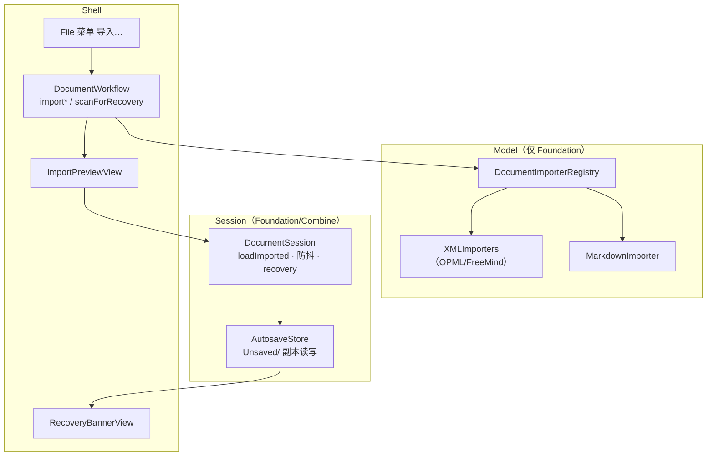

# Linva — 迁移闭环（导入 + 自动保存 / 崩溃恢复）（设计）

**状态：** 已批准（Brainstorming 四节逐节确认）
**日期：** 2026-09-30
**需求真源：** `docs/prds/prd-linva-import-export-2026-09-30/prd.md` + `addendum.md`
**上游架构：** `docs/superpowers/specs/2026-09-24-linva-v1-architecture-design.md`、`docs/架构现状.md`、`2026-09-27-linva-export-design.md`（复用其导出语义）
**体验真源：** `prototype/import-export.html`（导入 / 崩溃恢复 交互，浏览器已实测）
**依据：** Brainstorming 决议（本对话）；实施计划见后续 `writing-plans`。

**绘图约定：** 架构图使用 Mermaid。

---

## 1. 目标与拍板

### 1.1 目标

把 Linva 从「能画图」打磨到「能正经用」的三条链路：

- **导入（进得来）：** Markdown 大纲为第一路径，OPML / FreeMind 顺带；文件 → 导入 →（格式）→ 预览确认 → 新文档。
- **导出（出得去）：** 保持既有 Markdown / PNG 两入口并列（PDF 导出已移除，不再做）。
- **防丢（不白费）：** 脏后 2s 防抖写临时副本；崩溃后下次启动提示恢复。

### 1.2 Brainstorming 已拍板

| 项 | 决议 |
|----|------|
| 导入交互 | **预览 + 确认导入**（对齐原型两步流程与 UJ-I1）：选文件 → 纯函数解析出树 → `importPreview` 展示 → 点「确认导入」才载入；确认载入时 **Undo 栈重置**（PRD §9.1 假设不变） |
| 导入撤销 | 不做文档级快照撤销；导入 = 载入新文档，Undo 栈重置（§9.1 假设，v1.1 再评估） |
| 导入器结构 | **`DocumentImporter` 注册表**（`MarkdownImporter` / `OPMLImporter` / `FreeMindImporter`），XMind 后续注册进同一张表 |
| 自动保存防抖 | **Combine `debounce` 2s**（Session 已 `import Combine`；`commandBus.onChange` 为脏信号，不接触模型/命令栈） |
| 副本保留 | **只留最新，忽略清全部**：启动只对最新副本弹横幅；「恢复」载入并删该副本；「忽略」清空 `Unsaved/` 全部（无 7 天过期） |

### 1.3 明确不做（本增量）

- **PDF 导出已移除**（产品拍板：大树 PDF 画面效果差，仅保留 PNG / Markdown / .linva）
- XMind 格式导入（.xmind，v1.1）、SVG 导出、打印排版引擎（纸张/边距/页眉页脚精调）
- 有序列表、代码块/引用/图片、列表多级缩进（v1.1）
- iCloud / 多文档 / 文件库 / 版本历史；AI 集成；大纲视图
- 商业化（定价 / 付费 / 内购 / 账号）

---

## 2. 架构与边界

沿用「分层内核 + 薄壳」；新增 6 个文件，全部落在既有层白名单内，**无新 import、`currentVersion` 保持 2**。



### 2.1 层职责

| 层 | 本增量职责 | 禁止 |
|----|------------|------|
| Model | 三类导入器纯函数（`parse(data)->MindMapDocument`）+ 注册表 | 理解渲染/UI；引 Metal/AppKit |
| Session | `AutosaveStore` + `DocumentSession` 导入载入/防抖/恢复态 | 在 Store 内造命令 |
| Shell | 预览浮层、恢复横幅、File 菜单「导入…」、`DocumentWorkflow` 工作流 | 在 View 内改树 |

### 2.2 依赖与白名单

- `DocumentImporter` / `MarkdownImporter` / `XMLImporters` → Model，仅 `Foundation`（`XMLParser` 属 Foundation，安全）。
- `AutosaveStore` → Session，`Foundation Combine`。
- `ImportPreviewView` / `RecoveryBannerView` → App/Shell，`SwiftUI AppKit`。
- `scripts/check-boundaries.sh` **无需新增 import 白名单**；若实现时发现需要（如 Model 碰 XML 需别的模块），先改脚本白名单再动代码。

---

## 3. Model：导入器（FR-I1 / FR-I2）

### 3.1 协议与注册表（`Model/DocumentImporter.swift`）

```swift
enum ImportError: Error, Equatable {
    case unrecognizedOutline   // 「未识别为导图大纲」
    case invalidXML            // 非法 XML / 空树
}

protocol DocumentImporter {
    func parse(_ data: Data) throws -> MindMapDocument
}

enum DocumentImporterRegistry {
    static let markdown = MarkdownImporter()
    static let opml     = OPMLImporter()
    static let freeMind = FreeMindImporter()
    static func importer(for pathExtension: String) -> DocumentImporter?
    // "md"|"markdown"→markdown；"opml"→opml；"mm"→freeMind；其他→nil
}
```

### 3.2 Markdown（`Model/MarkdownImporter.swift`）

与 `MarkdownExporter` 对称：导出先序→标题，导入标题→树。

- **标题行** `^#{1,6}\s+(.*)$` → 深度 = `#` 数（>6 收敛为 6）；首个标题 = 根。
- **列表行** `^\s*[-*•]\s+(.*)$` → 最近标题的子节点；连续列表项互为同级。
- 首个标题之前碎片（非标题非列表）忽略；空行忽略。
- 标题层级跳变（`#`→`###`）不报错：按实际深度挂树（缺层直连）。
- 行内 Markdown（`**` / `[链接]` / `` ` ``）不解析，原文保留。
- 空标题 / 空列表项 → 文案「未命名」。
- **无任何标题 → `unrecognizedOutline`**（中止导入，不改当前文档）。
- 根直接子 side 交替分配（对齐 `MindMapModel.nextSide` 语义：先 left 后 right 均衡）。

**Out of Scope：** 有序列表、代码块/引用/图片、列表多级缩进（v1.1）、Markdown 双向（导出已有）。

### 3.3 OPML / FreeMind（`Model/XMLImporters.swift`）

| 源 | 节点 | 文案字段 | 容错 |
|----|------|----------|------|
| OPML | `<outline>` 嵌套 | `text`（空→「未命名」） | `_note`/其它属性忽略；空根 → `invalidXML` |
| FreeMind | `<node>` 嵌套 | `TEXT`（空→「未命名」） | 坐标/图标/富文本忽略；非法 XML → `invalidXML` |

共用 `XMLParser`（Foundation）委托模式 → 树。

---

## 4. Session：导入载入 + 预览态（FR-I1/I2 承接）

`DocumentSession` 扩充：

```swift
@Published var importPreview: ImportPreviewState?
var documentID: UUID = UUID()   // 自动保存配对用（未命名文档亦然）

func loadImported(_ document: MindMapDocument)
// 复刻 load(from:) 骨架：model.document=解析树；selectOnly(root)；清命令栈；
// undoRevision+=1；fileURL=nil；lastSavedDocument=doc；isDirty=true；
// importPreview=nil；camera 重置；relayout()；documentID=UUID()（清旧副本）
func cancelImport()  // importPreview=nil（丢弃临时解析树，无副作用）

struct ImportPreviewState: Equatable {
    let sourceName: String
    let document: MindMapDocument
    var nodeCount: Int
    var depth: Int
}
```

**导入不修改磁盘上任何既有 `.linva`**（载入内存新文档）；确认载入后 isDirty=true，可继续编辑并保存。

---

## 6. Session + Shell：自动保存 + 崩溃恢复（FR-S1 / FR-S2）

### 6.1 `AutosaveStore`（`Session/AutosaveStore.swift`）

```swift
struct AutosaveMeta: Codable, Equatable {
    var documentID: UUID
    var originalURL: String?
    var savedAt: Date
    var changeCount: Int
    var rootText: String?
}

final class AutosaveStore {
    func write(document: MindMapDocument, meta: AutosaveMeta) throws
    func delete(documentID: UUID) throws
    func latestPending() -> AutosaveMeta?        // 按 savedAt 取最新
    func clearAll() throws                       // 「忽略」清空 Unsaved/
    func load(documentID: UUID) throws -> MindMapDocument
}
```

**目录**：`FileManager.default.urls(for: .applicationSupportDirectory)[0]/Unsaved/<docID>.linva` + 同名 `.meta.json`。

### 6.2 `DocumentSession` 防抖与清理

```swift
@Published var recovery: RecoveryOffer?
private let autosaveStore = AutosaveStore()
private var autoSaveDebounce: AnyCancellable?

// wireCommandBus 的 onChange 内追加：
autoSaveDebounce = Just(())
    .delay(for: .seconds(2), scheduler: RunLoop.main)
    .sink { [weak self] _ in self?.flushAutoSave() }

func flushAutoSave()   // 只对已加载文档写副本；失败静默（FR-S1）
// save()/saveAs() 成功后：autosaveStore.delete(documentID:)
// newDocument()/load(from:)/loadImported(_:)：documentID=UUID()，清旧副本
```

`RecoveryOffer`：横幅数据（meta）；「恢复」`load` → isDirty=true；「忽略」`clearAll()` → 载最近正式版。

**触发与清理矩阵：**

| 事件 | 行为 |
|---|---|
| 命令变更（脏） | 2s 防抖写副本（时延 ≤3s 达标） |
| 空文档 / 从未编辑 | 不创建副本 |
| save()/saveAs() 成功 | 删对应副本；isDirty=false |
| 退出前正常保存 | 同 save()，副本清除 |
| 写入失败 | 静默降级，保留内存文档，不误报 |
| 新建/打开/导入 | 重置 documentID，清旧副本与 recovery |

### 6.3 Shell：启动扫描 + 横幅

- `AppDelegate.applicationDidFinishLaunching`（窗口完成前）调 `DocumentWorkflow.scanForRecovery(session)` → 有副本则 `session.recovery = RecoveryOffer(meta)`（只最新）。
- `App/RecoveryBannerView.swift`：窗口顶部横幅（`ContentView` ZStack 顶层）：文案「检测到上次未保存的更改」+ 文档名 / 最近自动保存时间 / 「N 处修改未写盘」；按钮「恢复更改」`DocumentWorkflow.restoreDraft` / 「忽略（丢弃草稿）」`DocumentWorkflow.discardDraft`。

### 6.4 边界

| 情况 | 行为 |
|---|---|
| 多副本 | 只提示最新一份；忽略清空全部（拍板） |
| 未命名文档 | 有副本（docID=内存 UUID），恢复为未命名新文档 |
| 不入命令栈 | 自动保存与恢复均不经过 CommandBus / MindMapCommand（FR-S1 末条） |

---

## 7. 测试与验收

### 7.1 自动化（优先）

- **MarkdownImporterTests**：标题层级 / 列表挂最近标题 / 层级跳变直连 / 空文案未命名 / 无标题报错 / 侧交替 / 折叠不引入。
- **XMLImporterTests**：OPML/FreeMind 嵌套→树、空文案、非法 XML、空根报错。
- **AutosaveStoreTests**：写副本 + `.meta.json` 落盘 / 删 / latestPending 取最新 / clearAll / load 读回 round-trip。
- **DocumentSessionTests**：`loadImported` 载入即 isDirty=true 且命令栈清空；save 删副本；new/load 重置 documentID。

### 7.2 手测 / 冒烟（对齐 PRD §6 验收表 1–8）

- 导入含标题+列表的 MD → 树正确；含空行/空文案/非法输入 → 不崩溃、未命名、无标题报错。
- 导入 OPML/FreeMind → 层级正确；非法 XML 报错；当前文档不受影响。
- 自动保存 → 变脏后 ≤3s 落盘；正常保存后副本清除。
- 崩溃恢复 → 启动横幅 → 恢复后=草稿且未保存；忽略后草稿删除。
- `scripts/check-boundaries.sh` 绿；`currentVersion` 仍为 2。

---

## 8. 与 PRD / 原型对照

| PRD | 本设计 |
|-----|--------|
| FR-I1 Markdown 导入（首标题=根 / 深度→层级 / 列表挂最近标题 / 未命名 / 无标题报错） | §3.2 |
| FR-I2 OPML / FreeMind（嵌套→树 / text→文案 / 非法 XML 报错） | §3.3 |
| FR-E2 导出入口并列（MD/PNG，不入 Undo） | 既有导出语义（2026-09-27 导出设计） |
| FR-S1 自动保存（2s 防抖 ≤3s 落盘 / 保存清副本 / 写入失败静默 / 不入命令栈） | §6.1–6.2 |
| FR-S2 崩溃恢复（启动横幅 / 恢复 isDirty / 忽略删副本 / 未命名支持 / 多副本只留最新） | §6.3–6.4 |
| FR-C1 层边界不变 / FR-C2 currentVersion 不变 | §2 |
| §9.1 导入 Undo 栈重置 | §3/§4 |
| §9.3 副本只留最新，忽略清全部 | §1.2 |
| prototype 导入预览 / 恢复横幅 | §3–§6 |

---

## 修订记录

| 日期 | 说明 |
|------|------|
| 2026-09-30 | 初稿：Brainstorming 四节（架构/导入/PDF/自动保存）逐节确认后落盘 |
| 2026-09-30 | 修订：PDF 导出移除（产品拍板：大树 PDF 画面效果差），删除 §5 与相关条目 |