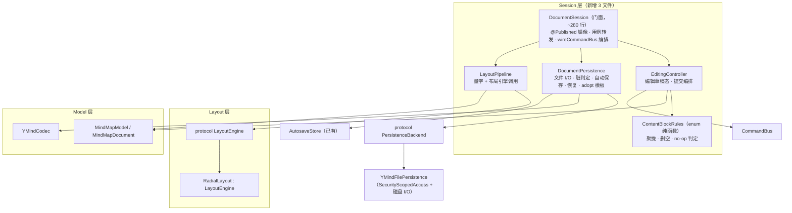
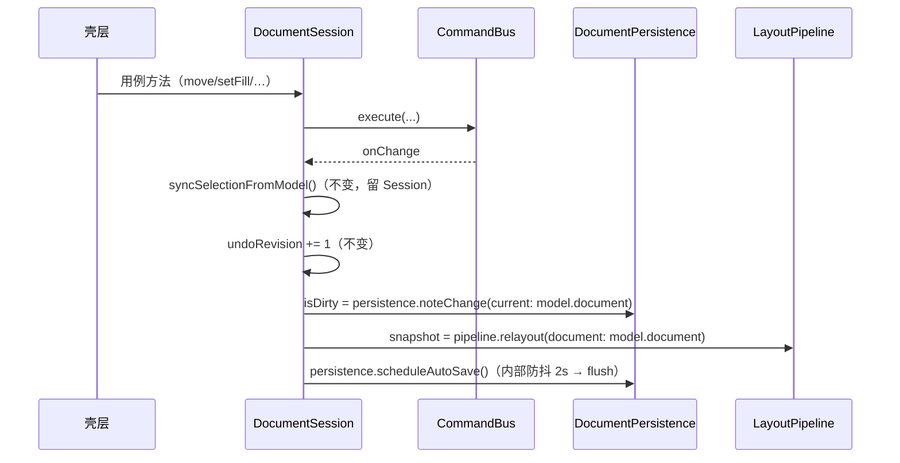
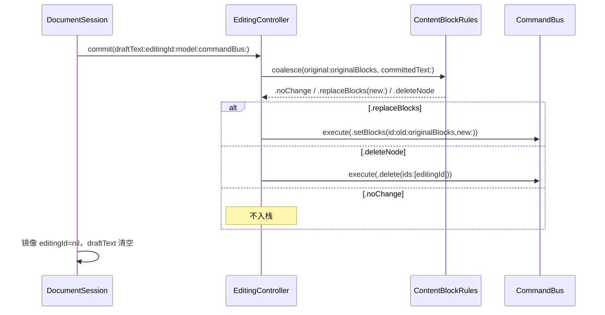
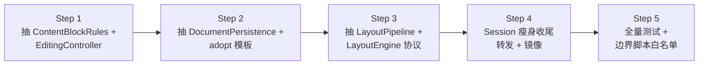

# DocumentSession 职责拆分重构 · 设计

**日期：** 2026-10-02
**状态：** 设计已定稿（用户逐节确认）
**范围：** `YMindApp/YMindApp/Session/` 层重构——解决 `DocumentSession` 门面职责偏多（SRP 违反），为「功能堆叠」（图标/备注/富文本等新块类型）与「多布局 / 云同步」铺路。
**对照：** `docs/架构现状.md` §8.4（薄弱点 1：DocumentSession 门面过重）、§8.3（LayoutEngine 协议）、§9（演进顺序）。

---

## 1. 背景与问题

`Session/DocumentSession.swift` 单文件 **658 行**，集 14 个关注点于一类：

1. 文件 I/O（`load`/`save`/`saveAs`）
2. 脏标记（`lastSavedDocument` 比较判定）
3. 选中镜像（`selectedIds`/`selectionAnchorId` + 各 select 方法）
4. 编辑草稿（`editingId`/`draftText`/`originalBlocks`/聚拢/删空/提交）
5. 剪贴板（`clipboard`/`cutSourceIds`/copy/cut/paste）
6. 搜索（`search` 态 + reveal）
7. 相机（`camera`/`canvasTool`/`centerCamera`）
8. 布局管线（`snapshot`/`relayout`）
9. 错误文案（`errorMessage`）
10. 导入预览（`importPreview`/`loadImported`/`cancelImport`）
11. 图片块选中（`selectedImageBlock` + 增删改）
12. 自动保存（防抖 2s）
13. 崩溃恢复（`recovery`/扫描/恢复/丢弃）
14. 用例门面 + 编排（`wireCommandBus`）

**后果**：后续功能继续堆 → 难测、难拆、难并行开发。五个文档生命周期方法（`newDocument`/`load`/`loadImported`/`restore`/`discardDraft`）存在 ~20 行 × 5 处重复状态重置序列。

## 2. 理论依据（SOLID × 设计模式）

| 原则 | 现状证据 | 解法 |
|---|---|---|
| **SRP** 单一职责 | 14 关注点挤在一类 | 按聚合拆对象，每对象一个职责 |
| **OCP** 开闭 | `commitEditingIfNeeded` 聚拢/删空/no-op 判定是硬编码 if/else 链——加 icon/note/richText 块类型就得改这段 | 规则抽成按 `ContentBlock.kind` 分发的纯函数集，新块类型 = 新分支 |
| **DIP** 依赖倒置 | Session 直接依赖具体 `RadialLayout`/`AutosaveStore`/`YMindCodec`（init 已注入，但类型未抽象） | 立 `LayoutEngine` / `PersistenceBackend` 协议，init 注入协议实现 |
| **门面模式** | Session 的 Facade 角色是**正确的** | 保持门面，内部改为组合 |
| **模板方法** | 五个生命周期方法重复状态重置 | 提取 `adopt` 模板 + `resetSessionState` 消重 |

## 3. 目标与非目标

### 目标（可验收）

1. `DocumentSession.swift` 从 658 行降到 **~280 行**，只剩：@Published 状态镜像、用例转发、编排（`wireCommandBus`）。
2. 拆出的每个对象独立文件 + 独立单测；`ContentBlockRules` 聚拢/删空规则**直测**。
3. 对外 API **逐字节不变** → 壳层零改动，现有 21 个测试文件全绿（行为零回归）。
4. 立好两个协议接缝：`LayoutEngine`（多布局）、`PersistenceBackend`（云同步）。

### 非目标（明确不做）

- 不拆选中/搜索/剪贴板/相机/画布工具（与 model 状态交织深，本次无触发点）。
- 不动 `ContentView` 的 `commandBus.execute` 直调（架构现状 §8.4 第 2 条，另笔债）。
- 不引入 SPM 模块化、不重写聚拢规则语义（只搬迁 + 函数化，行为不变）。
- 不为云同步实现 `CloudPersistence`，只立协议。

## 4. 组件架构



### 各对象边界（职责 / 依赖 / 对外形状）

| 对象 | 职责（SRP） | 依赖 | 独立可测点 |
|---|---|---|---|
| `ContentBlockRules` | 聚拢（首个非空块图/文判定）、删空三分支（有图只留图/纯文本删节点/根补未命名）、no-op 内容判定 | 无（纯函数） | M1-M4 聚拢、删空、no-op 直测 |
| `EditingController` | 编辑会话：`originalBlocks`/`originalEditingText` 基线、start/commit/cancel 编排、调 rules 后 execute 命令 | model、commandBus、ContentBlockRules | 提交路径编排 |
| `DocumentPersistence` | 文件 I/O（经 `PersistenceBackend`）、`lastSavedDocument` 脏判定、自动保存防抖、recovery 扫描/恢复/丢弃、**adopt 模板** | `PersistenceBackend`、YMindCodec、AutosaveStore | save/load/autosave/recovery 状态转移 |
| `LayoutPipeline` | 持 measure + layoutEngine，`relayout(document) -> LayoutSnapshot` | `LayoutEngine`、TextMeasure | 薄壳（行为已由 RadialLayoutTests 覆盖） |
| `DocumentSession` | @Published 镜像（editingId/draftText/snapshot/isDirty/…）、用例转发、wireCommandBus 编排 | 上述四对象 + model + commandBus | 现有 21 文件回归网 |

### 协议形态

```swift
// Layout/LayoutEngine.swift（协议放 Layout 层，与 RadialLayout 同层）
protocol LayoutEngine {
    func layout(document: MindMapDocument, measure: TextMeasure) -> LayoutSnapshot
}
extension RadialLayout: LayoutEngine {}

// Session/PersistenceBackend.swift（协议放 Session 层）
protocol PersistenceBackend {
    func loadData(from url: URL) throws -> Data
    func saveData(_ data: Data, to url: URL) throws
}
final class YMindFilePersistence: PersistenceBackend { /* 封装 SecurityScopedAccess */ }
```

`DocumentSession.init` 增 `layoutEngine` / `persistenceBackend` 注入参数（默认现有实现，测试注入 stub）——方案 C 的 DI 落点。

## 5. 数据流

### 5.1 改树编排（`wireCommandBus`）——职责分派，顺序不变

现状 `onChange` 四连：`syncSelection` + `undoRevision++` + `markDirtyAndRelayout` + `scheduleAutoSave`。重构后：



- `markDirtyAndRelayout` 拆成 `noteChange`（DP）+ `relayout`（LP）；对外 `markDirtyAndRelayout()` 作为兼容方法保留（内部转两处）。
- **不变量**：编排顺序不变（先同步选中 → 脏 → 布局 → 排自动保存），行为与现状逐帧一致。

### 5.2 编辑提交路径——规则抽纯函数



- **`ContentBlockRules.coalesce` 返回值集中三态**：`.noChange`（no-op 不入栈，按内容比较忽略块 id）· `.replaceBlocks` · `.deleteNode`。现状 `commitEditingIfNeeded` 的 if/else 链整段搬进规则，语义逐字节不变。
- **不变量**：Undo 基线仍是 `originalBlocks`（EditingController 持有）；删空三分支逻辑不变；`editingId == root` 时 `.deleteNode` 永不触发（根不可删，走 replaceBlocks 补未命名）。
- **draftText 归属**：对外 `@Published var draftText`（CommitTextView 双向绑定）留在 Session；`originalBlocks`/`originalEditingText`（内部基线）进 EditingController。

### 5.3 文档生命周期——adopt 模板消重

现状 `newDocument`/`load`/`loadImported`/`restore` 各 ~20 行重复重置。拆成两层模板：

| 方法 | DocumentPersistence 侧（adopt） | DocumentSession 侧（resetSessionState） |
|---|---|---|
| `newDocument` | 空文档 + fileURL=nil + isDirty=false + lastSavedDocument=新文档 + documentID=新 | 选中=根 + 编辑态清空 + camera 重置 + recovery=nil + importPreview=nil + errorMessage=nil |
| `load(url)` | 解码 + fileURL=url + isDirty=false + lastSaved=新 + ID=新 | 同上 |
| `loadImported(doc)` | 文档 + fileURL=nil + isDirty=true + **保留 lastSaved** + ID=新 | 同上 + importPreview=nil |
| `restore(offer)` | 副本 + fileURL=原URL + isDirty=true + **保留 lastSaved** + ID=保留原 + 删副本/清残留 | 同上 |

- **关键语义保留**：`loadImported`/`restore` **不更新 lastSavedDocument**（撤销回载入态时 isDirty 仍需 true）——由 DP 的 `adopt(...keepLastSaved:)` 参数显式表达，不靠「别忘设」。
- `commandBus.clearHistory()` + `undoRevision += 1` 属 Session 编排（命令栈归 Session），不在 DP。

## 6. 错误处理与边界

- **错误类型不变**：`DocumentSessionError.noFileURL`、`errorMessage` 文案不变。
- **依赖边界（check-boundaries.sh 白名单同步）**：新文件全在 Session 层，仍只 `Foundation/Combine/CoreGraphics`。`LayoutEngine` 协议放 Layout 层（纯协议，无新增 import）；`PersistenceBackend` 协议 + `YMindFilePersistence` 放 Session 层（封装 `SecurityScopedAccess`，无 AppKit/Metal）。**协议不放根目录**，规避根文件白名单例外。改完后同步 `scripts/check-boundaries.sh` 与架构现状 §5。

## 7. 测试策略

**回归网（不动）**：现有 21 个测试文件全绿即验收「行为零回归」。对外 API 不变，`DocumentSessionTests`/`ClipboardTests` 等继续直接 `session.xxx` 测，一条不改（除搬迁）。

**新增直测（拆出对象各自的 suite）**：

| 新 suite | 测什么 | 来源 |
|---|---|---|
| `ContentBlockRulesTests` | 聚拢 M1-M4、删空三分支、no-op 按内容忽略块 id 不入栈 | 从 `DocumentSessionTests` 现有聚拢用例**搬迁直测** |
| `EditingControllerTests` | start/commit/cancel 编排；commit 后 editingId 回落、originalBlocks 清空；Undo 基线正确 | 从 `DocumentSessionTests` 编辑用例搬迁 |
| `DocumentPersistenceTests` | save/load/saveAs round-trip、脏判定（noteChange）、自动保存防抖后清副本、recovery 扫描/恢复/丢弃、**adopt 模板语义**（loadImported/restore 保留 lastSaved → 撤销回载入态 isDirty 仍 true） | 现有持久化/恢复场景搬迁 + 补 adopt 语义直测 |
| `LayoutPipelineTests` | 薄壳：`relayout(document:)` 产出与 `RadialLayout.layout` 一致 | 复用 `RadialLayoutTests` + 一个一致性断言 |

**关键**：搬迁不是复制——原 `DocumentSessionTests` 里被搬走的用例**删除**（避免双份），其余保留。新增 suite 走 `-only-testing` 独立跑。

## 8. 迁移顺序（增量，每步绿可提交）



| 步骤 | 内容 | 验收 |
|---|---|---|
| **Step 1** | 抽 `ContentBlockRules`（纯函数）+ `EditingController`（编辑会话）；Session 的 `startEditing`/`commitEditingIfNeeded`/`cancelEditing` 改为委托 | 现有测试全绿 + `ContentBlockRulesTests`/`EditingControllerTests` 通过 |
| **Step 2** | 抽 `DocumentPersistence` + `PersistenceBackend` 协议 + `YMindFilePersistence`；`adopt` 模板消除 5 处重复重置 | 现有测试全绿 + `DocumentPersistenceTests`（含 adopt 语义）通过 |
| **Step 3** | 抽 `LayoutPipeline` + `LayoutEngine` 协议；`RadialLayout: LayoutEngine`；`relayout` 委托 | 现有测试全绿 + `LayoutPipelineTests` 通过 |
| **Step 4** | Session 只留 @Published 镜像 + 用例转发 + wireCommandBus 编排；行数 658 → ~280；`markDirtyAndRelayout()` 兼容方法保留 | 全量测试全绿；Session.swift 行数达标 |
| **Step 5** | 更新 `scripts/check-boundaries.sh` 白名单 + 架构现状 §5/§8 落档 | 构建边界校验通过；文档更新 |

- 每步独立提交（`refactor: ...`），可回滚、可独立 review；行为零回归由 Step 1 起持续保持。
- 协议在 Step 2/3 才引入（先拆对象、后抽象接口），避免一开始就猜接口。

## 9. 修订记录

| 日期 | 说明 |
|------|------|
| 2026-10-02 | 初稿：基于架构现状 §8.4 薄弱点 1 + CodeGraph 实况梳理；方案 C（结构拆分 + 规则函数化 + 协议化）；三节设计（组件架构 / 数据流与不变量 / 测试策略与迁移顺序）逐节经用户确认 |
