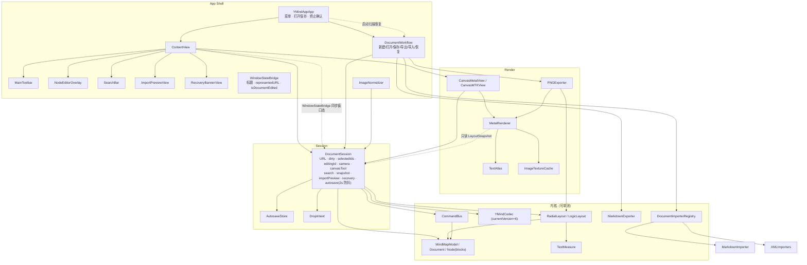
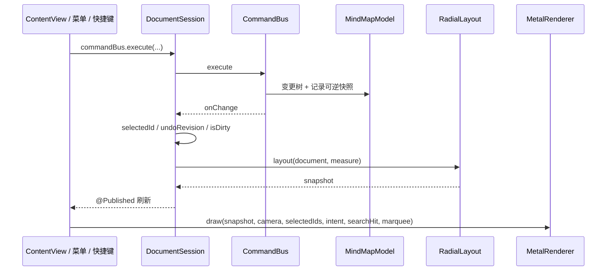
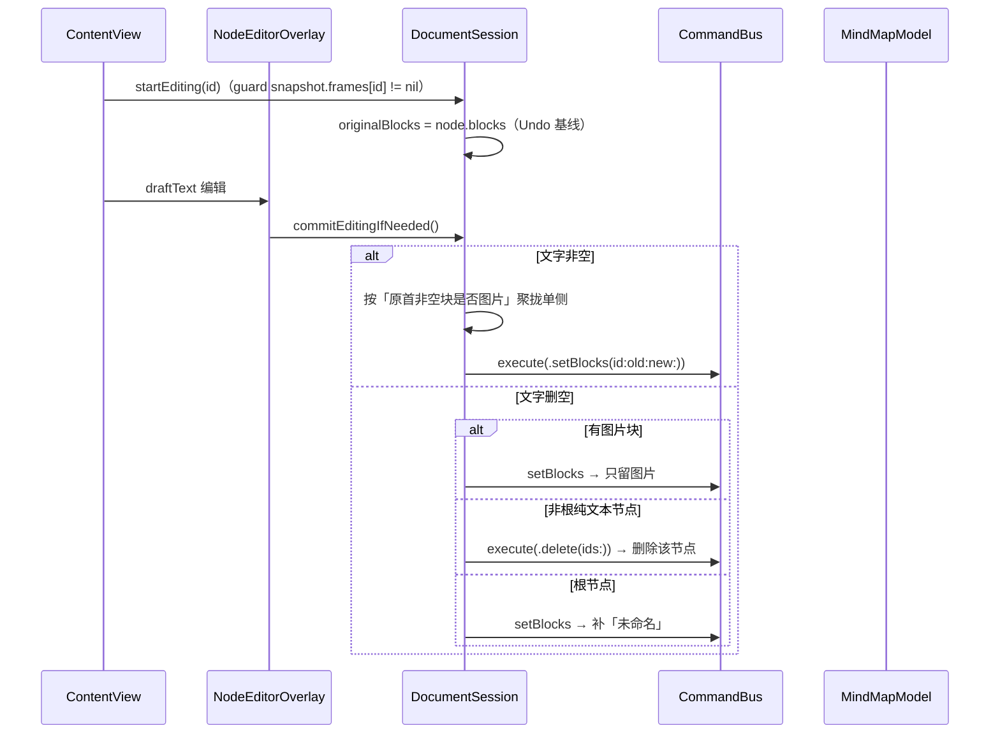
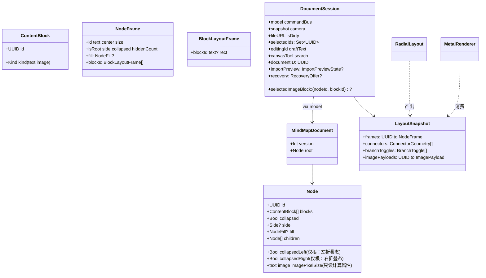
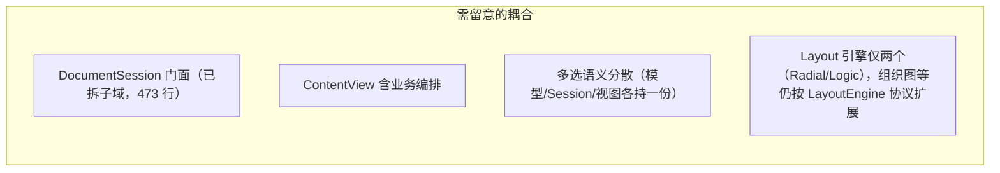
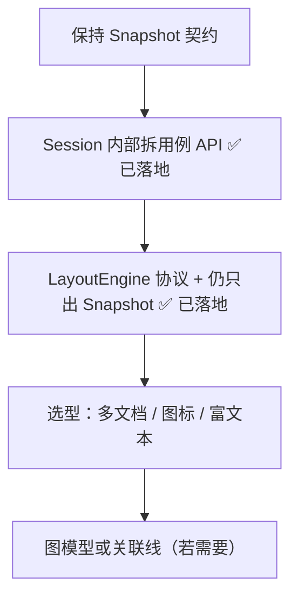

# YMind 当前工程架构说明

**状态：** 基于 `main` 已实现代码的实况梳理（非设计稿），随增量持续更新、始终保持最新  
**日期：** 2026-10-02  
**范围：** `YMindApp/` 原生 App（单窗口 macOS：中心辐射布局、Metal 画布、改树命令栈 Undo、浮层编辑、多选/框选/搬枝/剪贴板、排序/搜索/改侧、节点填色、图文内容流、Markdown/PNG 导出、导入 MD/OPML/FreeMind、自动保存/崩溃恢复、窗口态桥接）  
**对照：** `docs/superpowers/specs/2026-09-24-ymind-v1-architecture-design.md`、`docs/prds/prd-ymind-2026-09-24/prd.md`

**绘图约定：** 使用 Mermaid。

---

## 1. 一句话结论

当前是 **「分层内核 + DocumentSession 门面 + SwiftUI/Metal 薄壳」**：改树走命令、几何走 LayoutSnapshot、像素走 Metal，**主干扩展性够用**；多选/框选、搬枝、样式、图文内容流、导出、导入（注册表）、自动保存/崩溃恢复已按这套接口长出；Session 已内拆（编辑/持久化/布局子域）、Layout 已协议化（`LayoutEngine`），若要上多布局、跨枝关联线、多文档，还需要在 Model 等处继续做**有计划的接口化**，而不是推倒重来。

---

## 2. 目录与模块地图

```text
YMindApp/YMindApp/
├── Model/          树文档、内容块、编解码、Markdown 导出、文件名规整、导入注册表（无 UI）
├── Commands/       可逆命令栈（无 UI）
├── Layout/         量字 + 辐射/逻辑图 → LayoutSnapshot；LayoutEngine 协议（无 Metal）
├── Session/        DocumentSession 门面 + 编辑/持久化/布局子域 + 相机 / 放置意图 / 剪贴板 / 自动保存（应用态门面）
├── Render/         MTKView + MetalRenderer + 文字纹理 + 图片纹理缓存 + 命中 + 离屏 PNG 导出
├── App/            工具条、编辑浮层、搜索浮层、色板、图片归一器
├── ContentView.swift
└── YMindAppApp.swift   菜单、打开保存、终止确认、导出落地、DocumentWorkflow
```

| 层 | 职责 | 主要类型 |
|----|------|----------|
| Model | 单根树、内容块（text/image）、侧、折叠、填色、Markdown 导出（兄弟组递归判定）、文件名规整、导入（Markdown/OPML/FreeMind 注册表） | `Node`、`ContentBlock`、`Side`、`NodeFill`、`ImagePixelSize`、`MindMapDocument`、`MindMapModel`、`YMindCodec`、`MarkdownExporter`、`ExportNaming`、`DocumentImporter`、`DocumentImporterRegistry`、`MarkdownImporter`、`XMLImporters`（OPML/FreeMind） |
| Commands | 改树 + Undo（16 个命令，见 §6） | `MindMapCommand`、`CommandBus` |
| Layout | 文档 → 几何快照；`LayoutEngine` 协议抽象布局算法（`place` 排布），`EdgeStyleProvider` 产连线，`LayoutPipeline` 按有效排布分派引擎 | `TextMeasure`、`RadialLayout`、`LogicLayout`、`LayoutSupport`、`LayoutEngine`、`LayoutSnapshot`、`NodeFrame`、`BlockLayoutFrame`、`ConnectorGeometry`、`ImagePayload`、`EdgeStyleProvider`、`EdgeStyleRegistry`、`LayoutConstants`、`NodeSize` |
| Session | 文件、脏、选中（多选）、编辑草稿、剪贴板、搜索、画布工具、触发重布局、放置意图、导入预览态、自动保存与崩溃恢复；编辑 / 持久化 / 布局子域独立可测 | `DocumentSession`（门面）、`ContentBlockRules`、`EditingController`、`DocumentPersistence`、`PersistenceBackend`、`LayoutPipeline`、`Camera`、`DropIntent`、`Clipboard`、`ImportPreviewState`、`AutosaveStore`、`AutosaveMeta`、`RecoveryOffer` |
| Render | 只消费 Snapshot + Camera；命中与框选；离线 PNG 导出；图片纹理缓存 | `CanvasMetalView`、`MetalRenderer`、`TextAtlas`、`ImageTextureCache`、`CanvasHitTesting`、`NodeFillStyle`、`PNGExporter` |
| Shell | 菜单 / 工具条 / 浮层编辑 / 文档工作流 / 导入预览 / 恢复横幅 / 窗口态桥接 / 图片归一器 | `YMindAppApp`、`ContentView`、`MainToolbar`、`NodeEditorOverlay`、`SearchBar`、`FillSwatches`、`ImageNormalizer`、`DocumentWorkflow`、`ImportPreviewView`、`RecoveryBannerView`、`WindowStateBridge` |

### 2.1 工程代码量（2026-10-02 实况）

源码 49 个 Swift 文件 / **6,948 行**；单测 24 个文件 / 3,922 行；构建期边界校验脚本 `scripts/check-boundaries.sh` 72 行。

| 层 | 文件数 | 行数 | 说明 |
|----|-------:|-----:|------|
| Render | 7 | 2,265 | 占源码 33%；`MetalRenderer.swift` 单文件最重 |
| Session | 10 | 1,094 | `DocumentSession.swift` 473 行门面 + 5 个子域文件（编辑/持久化/布局/规则） |
| 根（ContentView + YMindAppApp） | 2 | 856 | 菜单 / 工作流 / 窗口态桥接 / 主视图 |
| Model | 13 | 1,096 | 纯 Foundation，可测核心（导入器占 4 文件） |
| App | 7 | 578 | 壳层浮层，业务最薄（含图片归一器） |
| Layout | 8 | 702 | 纯几何，无 Metal；含 `LayoutEngine` 协议 + `RadialLayout`/`LogicLayout` 双引擎 + `LayoutSupport` 共享辅助 |
| Commands | 2 | 357 | `CommandBus` |

单测覆盖：CommandBus、DocumentSession、ContentBlockRules、EditingController、DocumentPersistence、LayoutPipeline、命中、Model、Markdown 导出、布局、DropIntent、XML 导入器、自动保存、Markdown 导入、剪贴板、Codec、交互、PNG 导出、导入注册表、Camera、图片归一、图片纹理缓存、Markdown 文件夹包导出。Render 的 `encodeContent` / 工具模式与 `DocumentWorkflow` 入口（SavePanel/NSAlert）暂无单测覆盖（手测为主）。

---

## 3. 总体架构图



> **箭头图例（全文统一约定）：**
> - **实线实心 `-->`**：直接调用 / 同步依赖——沿实心箭头走一遍即一条操作的执行路径。
> - **虚线空心 `-.->`**：弱关联——只读消费 / 反向依赖 / 异步 / 副作用（如「渲染只读 Snapshot」「启动扫描恢复」）。
> - 无箭头连线（`---` / `-.-`）表示纯结构隶属，非调用。

---

## 4. 运行时数据流

### 4.1 改树（增删改折叠）



### 4.2 编辑文案（含聚拢规则与删空）



> **删空行为（用户拍板「一律允许空文字」）**：有图节点 → 只留图片；**非根纯文本节点 → 直接删除该节点**（走 `applyDelete`：`topLevelDeletableIds` 保根、removeMany、Undo 可恢复，不留下点不进去的空节点）；**根节点（不可删）→ 补「未命名」**。

### 4.3 相机（不入命令栈）

平移 / 滚轮缩放 / 适应画布只改 `DocumentSession.camera`，**不**触发 `CommandBus`，也**不**写入 `.ymind`。

### 4.4 渲染绘制顺序（`MetalRenderer.encodeContent`）

`边 → 节点底色 → 图片 → 文字 → 分叉控件 → 多选描边 → 剪切弱化 → 放置反馈 → 搜索命中 → 框选矩形`。在线 `draw(in:)` 与离屏 `renderImage` **共用 `encodeContent`**（导出缺省空 `branchToggles` 剔除 ± 分叉控件）。

---

## 5. 依赖规则（实况）

> **强制机制：** 本表已由 `scripts/check-boundaries.sh` 在构建时强制（build phase「依赖边界校验」，违规即红）。白名单与下表一致。新增依赖必须同步更新脚本白名单与本表。

| 层 | 允许 import（白名单，与脚本逐字一致） | 禁止 / 说明 |
|----|-----------------------------------------|-------------|
| Model / Commands | `Foundation` | 严禁 SwiftUI / Metal / AppKit；`XMLParser` 属 Foundation，导入器可用 |
| Layout | `Foundation` `AppKit` `CoreGraphics` `CoreText` | 量字需要字体；不碰 Metal |
| Session | `Foundation` `Combine` `CoreGraphics` | 门面编排，无 UI |
*| Render | `Foundation` `AppKit` `Combine` `CoreGraphics` `ImageIO` `Metal` `MetalKit` `SwiftUI` `simd` | 只吃 `LayoutSnapshot`，不懂树；ImageIO：ImageTextureCache 降采样解码；Combine：CanvasMTKView 命令式订阅 session 触发重绘（2026-10-03 画布性能 R5，规避 camera 高频发布的 SwiftUI 整树重布局） |
| App / Shell | `Foundation` `AppKit` `SwiftUI` `ImageIO` | 尽量不直接深改 Model（多数经 Session / Bus）；ImageIO：图片归一器 CGImageSource 解码 |

**根目录两个文件**（`ContentView.swift` / `YMindAppApp.swift`，属 App 层）：实际 import 还含 `UniformTypeIdentifiers`（`DocumentWorkflow` 的 NSOpenPanel/NSSavePanel 内容类型声明）。此模块为 SwiftUI/AppKit 伴生框架、纯 UTI 声明，无分层风险；`check-boundaries.sh` 只扫 6 个分层目录，不覆盖根目录文件，现状放行。

**边界亮点：** `MetalRenderer.draw(..., snapshot:camera:selectedIds:)` 不理解父子关系——换布局算法或换渲染后端时，Snapshot 契约是稳定接缝。`PNGExporter` 也走同一 `LayoutSnapshot` + `MetalRenderer.renderImage`，导出不碰 Model 的会话态。导入侧 `DocumentImporterRegistry`（Model，纯函数 `parse(Data)`）按扩展名路由，新增格式（XMind v1.1）注册即插，不碰 Session/Shell。

---

## 6. 关键类型契约（扩展时优先保住）



**文件格式：** `.ymind` = versioned JSON（`MindMapDocument.currentVersion == 7`）；`YMindCodec` 负责版本校验、v1→v2→v3→v4→v5→v6→v7 迁移与深层 `side` 消毒。v2 新增 `Node.fill`（节点填色）；v3 新增单图形态；v4 将 `text`/`image` 重构为 `ContentBlock[] blocks`（多图多段内容流，块级 UUID；`text`/`image`/`imagePixelSize` 变只读计算属性，旧文件解码时 fallback 合成块，保持「图上文下」视觉）；v5 新增文档属性 `layout: LayoutKind`（`.radial`/`.logic`，缺省 `.radial`，v4 及以下老文件零拒绝迁移）；**v6 根折叠由单值 `collapsed` 改为左右侧独立 `collapsedLeft`/`collapsedRight`**（v5 根 `collapsed=true` → 两侧独立 true 并清空遗留 `collapsed`；非根 `collapsedLeft`/`collapsedRight` 恒 false，sanitize 强制）；**v7 新增文档属性 `edgeStyle: EdgeStyle`（`.elbow`/`.curve`/`.brace`，缺省 `.elbow`，≤v6 老文件零拒绝迁移；未知未来 token 容错为 `.elbow`）**。encode 只写存储字段（`blocks` 为准）；`Node` 自定义 Codable 同时兼容 v1/v2/v3 的 `text`+`image` 形态。

**命令清单（17 个，全部经 `CommandBus` 可逆）：** `addChild` / `addSibling` / `delete` / `setBlocks` / `toggleCollapse` / `setCollapsed` / `moveToParent` / `insertSiblings` / `setSide` / `applyRootSide` / `pasteAsChild` / `setFill` / `appendImageBlock` / `replaceImageBlock` / `removeImageBlock` / `setLayout`（切换文档布局，no-op 不入栈，仿 `setFill`）/ `setEdgeStyle`（切换连线样式，no-op 不入栈，仿 `setLayout`）。

---

## 7. 核心功能域（当前状态）

### 7.1 树操作底座：搬枝 / 排序 / 改侧 / 多选 / 剪贴板

- **`DropIntent`**（`Session/DropIntent.swift`）：统一「成子 / 插前 / 插后 / 改侧」四类放置意图，纯函数 `resolveDropIntent` 按节点分区（非中心上/下 28% → before/after，中部 → child；中心左/右 1/3 → 改侧带，中部成子）。
- **Model**：`insertSiblings`（跨父连续块、中心下继承锚点 side）、`reparent`（整体搬枝、防搬自身/后代）、`setSide`（仅一级枝）、`applyRootSide`（提升或改侧）、`setCollapsed`/`toggleCollapse`。
- **多选**：`selectedIds: Set<UUID>` + `selectionAnchorId`；`selectOnly` / `toggleInSelection` / `selectSiblingRange` / `replaceSelection`。
- **剪贴板**：`Clipboard`（内部节点复制/剪切/粘贴）+ 系统图片粘贴（`appendPastedImage`）；复制用 `duplicate(_:)` **重生成节点 id 与块 id**（防 `imagePayloads`/纹理缓存/导出 `assets/<blockId>.png` 按块 id 寻址碰撞）。
- **Render**：放置反馈按意图（插入线 / 根镶边 / 中线引导）、剪切源弱化，全部走既有 `drawSolid` 管线，无新 shader。

### 7.2 节点样式：填色

- **Model**：`NodeFill`（5 个具名 token + lenient Codable，未知 token 降级为 `nil`）；`Node.fill: NodeFill?`；`NodeFrame.fill` 随 Layout 传递。
- **Command**：`setFill(ids:fill:)`——一步 Undo、no-op 不入栈、不改选中态。
- **Render**：`NodeFillStyle` 从系统语义色派生浅底 + 边框，根节点用深色变体；填色叠于选中描边 / 搜索高亮之下；沿用 `drawSolid` 管线，**无新 shader**。
- **Shell**：工具条色点组。

### 7.3 节点内容：图文内容流 v4（blocks）

- **存储**：`Node.blocks: [ContentBlock]`（`id: UUID` + `kind`：`.text(String)` / `.image(BlockImage{data,pixelSize})`），块级 UUID 持久化；`text`/`image`/`imagePixelSize` 为**只读计算属性**，读取方零改动。
- **块级命令**：`setBlocks(id:old:new:)`（编辑提交整块替换，old 须与当前一致防串改，old != new 才入栈）、`appendImageBlock`（粘贴/拖入追加末尾，redo 复用同 id）、`replaceImageBlock`（双击替换，块 id 不变）、`removeImageBlock`（⌫ 删块，Undo 按原下标恢复完整块）。
- **块级布局**：`TextMeasure.measure(for:isRoot:) -> BlockMeasure{size, blocks}` 按块序叠加（文本累行高、图片等比累图高、块间 `imageTextGap=6`，末块后无 gap）；`BlockLayoutFrame{blockId, text?, rect}`（文本块 vPad 内缩、图片块贴顶）。显示宽 = `min(像素宽, 300pt)`。
- **块级渲染**：`LayoutSnapshot.imagePayloads` 的 key 为**块 id**；`TextAtlas` 按块 id 缓存栅格 + `evictUnused(known:)` 防编辑泄漏；`MetalRenderer` drawText/drawImage 遍历块；`hitTestImageBlock` 返回 `(nodeId, blockId)`。
- **块级选中**：`selectedImageBlock: (nodeId, blockId)?`（会话态、不入命令栈、同时最多一个）；选中图片时 ⌫ 删块、Esc 先退图片选中；`syncSelectionFromModel` 统一清。

### 7.4 编辑与提交

- **`startEditing(_:)`**：`guard snapshot.frames[id] != nil`（未经布局的新节点无 frame，编辑静默不启动）；记 `originalBlocks` 作 Undo 基线。
- **`commitEditingIfNeeded()`** 聚拢规则：文本合并单块；按「原序列首个非空块是否图片」聚拢单侧——首非空为图 → `[images] + [text]`（图上文下），否则 `[text] + [images]`（文上图下）；no-op 按内容（忽略块 id）不入栈。
- **编辑态 ⌘V 图片**：`CommitTextView.paste(_:)` 拦截 png/tiff → `onPasteImage` 回调（先提交文字再追加图片块到末尾）；纯文本 → `super.paste`。系统 Edit▸Paste 菜单与 ⌘V 均经 first responder 的 `paste(_:)`，两条路径统一。
- **删空行为**：见 §4.2。

### 7.5 画布工具与相机

- **`CanvasTool`**（`Render/CanvasMetalView.swift`）：`select`（空白左拖 = 框选）/ `pan`（空白左拖 = 平移画布），会话态 `session.canvasTool` 不入 `.ymind`、不入命令栈；空格临时平移。
- **`CanvasPointerGesture`** 纯值状态机（`none / pan / marquee / pendingDrag / drag`）：框选带 `additive`（⇧ 加选）与 `tracking`（编辑态忽略拖拽）位。
- **命中**（`Render/CanvasHitTesting.swift`）：`marqueeIntersectingIds`、`worldRect(fromScreenRect:)`、`isClickLike`（4pt 阈值区分点空白 / 框选 / 搬枝）；命中顺序：分叉控件 → 节点 → 空白。
- **相机**：`Camera{translation, scale}`，`screenToWorld`/`worldToScreen`/`fit`；`displayScale`（`window?.backingScaleFactor`）驱动纹理采样，避免 Retina 模糊。

### 7.6 导出 Markdown + PNG

- **Markdown**（`Model/MarkdownExporter.swift`）：纯函数、无 UI。先序遍历整棵逻辑树（忽略折叠）；标题按「兄弟组」递归判定（组内任一有子 → 整组标题 `#`×depth，全叶子 → 整组列表项，符号按深度循环 `- / * / +`）；多行压空格、空行丢弃、空文「未命名」。
- **Markdown 含图**：`MarkdownOutput{text, images}`、`MarkdownImage{blockId, data}` → 导出为 `assets/<blockId>.png`；有图节点行内尾缀 ``；**有图 → 文件夹包（`N/N.md` + `assets/`），无图 → 单文件不变**。
- **PNG**（`Render/PNGExporter.swift`）：全展开整图离屏导出。复制文档 → 清空 `collapsed` → 重布局 → 按包围盒选 scale（上限 2400）→ `renderImage` 离屏光栅化 → PNG。纸面底色 `#e7e4dc`，固定浅色外观。
- **`ExportNaming.safeFilename`**：非法字符替换、空白折叠、48 字符截断。
- **沙盒修复**：有图时 SavePanel 改选**目录**（沙盒 `user-selected.read-write` 只授权所选文件，原实现在所选文件旁建 `assets/` 被拒）；选目录后沙盒授予目录写权。

### 7.7 导入 Markdown / OPML / FreeMind

- **注册表**（`Model/DocumentImporter.swift`）：`DocumentImporter` 协议（纯函数 `parse(Data) -> MindMapDocument`）+ `DocumentImporterRegistry`（`md|markdown`→Markdown、`opml`→OPML、`mm`→FreeMind，大小写不敏感）。`ImportError`：`unrecognizedOutline` / `invalidXML`。
- **`MarkdownImporter`**：标题 `#{1,6}` → 深度、跳级直连；列表项挂最近标题；首个标题 = 根；根直接子 side 交替均衡。
- **`XMLImporters`**（OPML/FreeMind）：共用 `XMLTreeBuilder`（`XMLParser` 委托），注释/属性忽略。
- **Session 预览态**：`importPreview` → `ImportPreviewView` 确认导入/取消；`loadImported(_:)` 复刻 `load(from:)` 骨架（清命令栈、undoRevision+1、fileURL=nil、isDirty=true、documentID 重置）；导入不改磁盘既有 `.ymind`。

### 7.8 自动保存 + 崩溃恢复

- **Session**（`Session/AutosaveStore.swift`）：`AutosaveMeta` + `AutosaveStore`（`Application Support/Unsaved/` 下写 `<docID>.ymind` + `.meta.json`；目录可注入测试）。`DocumentSession.documentID`（内存 UUID）+ Combine `debounce(2s)` 监听 `commandBus.onChange` 触发 `flushAutoSave()`；`save()/saveAs()` 成功后删副本。
- **Shell**：启动 `DocumentWorkflow.scanForRecovery` 扫描最新副本；`RecoveryBannerView` 「恢复更改」载入草稿 / 「忽略」`clearAll()` 载最近正式版；恢复/忽略均不入命令栈。
- **容错**：写副本失败静默降级；空白新文档不产生副本。

### 7.9 窗口态桥接 + 未保存确认

- **未保存确认统一入口** `DocumentWorkflow.confirmReplacement`：新建/打开/导入/关窗（`WindowStateBridge.windowShouldClose`）/退出（`applicationShouldTerminate`）都走它——三按钮 NSAlert（保存/取消/不保存）。
- **`WindowStateBridge`**（`YMindAppApp.swift`）：`NSViewRepresentable` 挂窗口，`Coordinator` 为 `NSWindowDelegate` 装饰者：同步 `windowTitle` / `representedURL` / `isDocumentEdited`，关窗前确认未保存。
- **`SecurityScopedAccess`**（`DocumentSession.swift`）：沙盒安全作用域读写封装（`startAccessingSecurityScopedResource` / 平衡释放）。

### 7.10 布局类型：辐射 / 逻辑图

- **`LayoutKind`**（`Model/MindMapDocument.swift`）：文档属性 `document.layout`（`.radial` 中心辐射 / `.logic` 逻辑图总分树），随 `.ymind` **v5** 持久化；v4 及以下无 `layout` 字段 → 解码缺省 `.radial`，**零拒绝迁移**（Codec v4→v5 迁移仅抬版本号，`sanitize` 重建文档时保留 `layout`）。
- **`LayoutEngine` 协议**（`Layout/LayoutEngine.swift`）：`static func place(document:measure:) -> (frames, branchToggles, imagePayloads)`；`RadialLayout` / `LogicLayout` 双实现排布，Session 只依赖协议。
- **`LayoutPipeline` 分派**（`Session/LayoutPipeline.swift`）：按有效排布（`EdgeStyleRegistry.provider(for: edgeStyle).requiresLogicArrangement ? .logic : document.layout`）分派 `.radial → RadialLayout`、`.logic → LogicLayout`；连线由 `provider.connectors(...)` 产 `ConnectorGeometry`；`DocumentSession.relayout()` 单点自动生效。
- **`LogicLayout`**（`Layout/LogicLayout.swift`，新引擎）：根在最左、层级向右层层展开；折线样式下 `ConnectorGeometry.path` 为「水平出 → 垂直拐 → 水平入」四点折线（辐射折中点、逻辑折子节点左缘）；全部节点统一 `.right` side（无左右分组语义）；`BranchToggle` 一律在**右侧**；折叠子树不占空间。
- **`LayoutSupport`**（`Layout/LayoutSupport.swift`，共享辅助）：`subtreeHeight(_:isRoot:measure:)` 测高、`centeredBlocks(from:)`、`countDescendants(_:)`、`collectImagePayloads(root:frames:)`、`makeToggle(node:frame:side:)` 等，Radial / Logic 两引擎共用，避免重复实现。
- **`setLayout` 命令**（Commands，第 16 个）：`setLayout(kind: LayoutKind)` 文档属性命令，no-op（目标同当前）不入栈，仿 `setFill`；Undo / Redo 对称还原 `document.layout`。
- **side 降级**（FR-L4）：逻辑图无左右语义——`DocumentSession.canSetSide` 在 `layout == .logic` 时为 false，⌘←/⌘→ 置灰、`DropIntent` 侧向放置禁用；切回辐射恢复左右分组完整。
- **PNG 分派**：`PNGExporter` 复制文档、清折叠后经 `LayoutPipeline().relayout` 离屏渲染，导出随当前连线样式与有效排布（FR-E5 / FR-L5）。

---

## 8. 扩展性评估

### 8.1 总评

| 维度 | 评分 | 说明 |
|------|------|------|
| 分层清晰度 | 高 | Model / Command / Layout / Render 边界与设计一致 |
| 可测性 | 高 | 内核单测扎实（含导入器/自动保存/会话）；Metal/菜单/SavePanel 入口偏手测 |
| 加同类命令（如改色） | 高 | 新 `MindMapCommand` + Bus 分支即可 |
| 加第二种布局 | 高 | `LayoutEngine` 协议已立（`LayoutPipeline` 注入），Snapshot 可复用；换实现即插（§9） |
| 多选 / 框选 | ✅ 已实现 | `selectedIds: Set<UUID>` + 锚点 + 框选命中（§7.1/7.5） |
| 手动改侧 / 搬枝 | ✅ 已实现 | `setSide` / `applyRootSide` / `insertSiblings`（§7.1） |
| 跨枝关联线 / 自由图 | 低～中 | 现模型是**树**；需边表或图模型，布局与命中都要扩 |
| 多文档 / DocumentGroup | 中 | Session 已封装单文档；上多文档要多 Session 实例 + 窗口策略 |
| 主题 / 样式系统 | 中 | 样式字段可进 Node；Render 已按 frame 绘制，要扩 `NodeFrame` |
| 导出 Markdown / PNG | ✅ 已实现 | `MarkdownExporter` / `PNGExporter`，纯函数 + 离屏渲染（§7.6） |
| 导入 MD/OPML/FreeMind | ✅ 已实现 | `DocumentImporterRegistry` 注册表 + 预览确认（§7.7）；XMind 注册即插 |

### 8.2 容易加上的功能（架构友好）

- 新可逆操作：重命名风格、批量设折叠、节点备注（纯文本字段）
- 布局常量 / 间距主题微调
- 只读演示模式（禁用 CommandBus）
- 更丰富的快捷键（仍走同一 `execute`）
- Codec `version` 升迁（加字段 + 迁移）

### 8.3 需要先「开刀接口」再加的功能

| 目标 | 建议改造 |
|------|----------|
| 多种布局（逻辑图、组织图） | ✅ 已实现（2026-10-02）：`protocol LayoutEngine { static func place(document:measure:) -> (frames, branchToggles, imagePayloads) }` + `LayoutPipeline` 注入，连线由 `EdgeStyleProvider` 产；换实现即插（§9） |
| 手动改侧 / 拖拽改层级 | ✅ 已实现（§7.1）：`setSide` / `applyRootSide` / `insertSiblings` + `DropIntent` |
| 多选 | ✅ 已实现（§7.1/7.5）：`selectedIds: Set<UUID>`、命令多目标、框选加选 |
| 节点样式（颜色、图标） | ✅ 填色已实现（§7.2）：`Node.fill` / `NodeFrame.fill`、Metal 画填充色；图标仍未做 |
| 富文本 | 编辑浮层换 `NSTextView` 属性串；量字与纹理策略变复杂——建议独立里程碑 |
| 关联线（非树边） | 新增 `links: [(from,to)]`；Layout 输出额外边；命中区分 |

### 8.4 当前结构上的薄弱点（强壮度风险）



1. **`DocumentSession` 门面过重 —— 已拆（2026-10-02）**  
   状态：**已拆**——DocumentSession 门面瘦身（473 行），编辑 / 持久化 / 布局子域独立可测，立 `LayoutEngine` / `PersistenceBackend` 协议。  
   **建议：** 新块类型走 `ContentBlockRules` 分支；多布局替换 `LayoutEngine`；云同步实现 `PersistenceBackend`。云同步接缝在 `DocumentPersistence` 层（`PersistenceBackend` 协议：readData/writeData，`YMindFilePersistence` 为本地实现）；`DocumentSession.init` 的 persistence 注入留待云同步任务再 additive 扩展（YAGNI）。

2. **`ContentView` 直接 `commandBus.execute` 并夹带「加完就编辑」**  
   业务散落在 View。  
   **建议：** 收敛为 `session.addChildAndEdit()` 等用例方法，View 只绑事件。

3. **布局与渲染的 Snapshot 字段偏「辐射布局专用」**  
   `side`、`hiddenCount` 仍可用，但若组织图要不同边几何，需扩展 `ConnectorGeometry`（或加 `EdgeStyleProvider`）而非改 Metal 懂业务。

4. **工程仍是单 target**  
   分层靠目录约定，编译器不强制。模块化（SPM）可后置，但目录纪律要守。

5. **渲染文字路径已踩过坐标系坑**  
   纹理栅格化 + UV 已用「AppKit 绘制 + 行翻转」稳住；后续改 TextAtlas 时保持回归截图/手测。

---

## 9. 推荐的演进顺序（在现架构上长出来）



1. **短线（✅ 已落地）：** Session 内部拆——编辑 / 持久化 / 布局子域独立（`ContentBlockRules` / `EditingController` / `DocumentPersistence` / `PersistenceBackend` / `LayoutPipeline`），DocumentSession 门面瘦身至 473 行；**ContentView 用例收敛（`addChildAndEdit` 等）与 Metal 回归手测清单仍待做**。  
2. **中线（✅ 已落地）：** `LayoutEngine` 协议 + `LayoutPipeline` 注入，仍只出 Snapshot；`RadialLayout` / `LogicLayout` 双引擎按 `document.layout` 分派（§7.10）。  
3. **长线：** 多文档 / DocumentGroup 或图标；最后再考虑非树边。

> 注：样式进 Model + Codec v2（填色）、多选/框选、搬枝、图文内容流、导出 Markdown/PNG、导入 MD/OPML/FreeMind、自动保存/崩溃恢复均已落地，见 §7。

---

## 10. 与设计稿的符合度

| 设计决议 | 实现实况 |
|----------|----------|
| 分层内核 + 薄壳 | 已落实 |
| 命令栈 Undo | `CommandBus` + 菜单 |
| `.ymind` JSON、不存相机 | 已落实 |
| Metal 只画 Snapshot | 已落实（在线 draw + 离屏 renderImage 共用 encodeContent） |
| 编辑用浮层 | `NodeEditorOverlay` |
| 单窗口自管文档 | `WindowGroup` + Session |
| 导出 Markdown / PNG | 已落实（§7.6）：`MarkdownExporter` 纯函数、`PNGExporter` 全展开离屏光栅化 |
| 框选 / 工具模式 | 已落实（§7.5）：`CanvasTool.select/.pan` + `CanvasPointerGesture` 状态机 |
| 导入 MD/OPML/FreeMind | 已落实（§7.7）：`DocumentImporterRegistry` 注册表 + 预览确认两步流程 |
| 自动保存 / 崩溃恢复 | 已落实（§7.8）：2s 防抖副本 + 启动扫描恢复横幅 |
| 节点填色 | 已落实（§7.2）：`Node.fill` / `NodeFrame.fill`、工具条色点 |
| 图文内容流（多图多段） | 已落实（§7.3）：`blocks: [ContentBlock]`、块级命令/布局/渲染/选中 |

偏差与打磨：文字纹理坐标系、fitContent 异步避免 SwiftUI publish 警告等，属于实现层修正，不破坏分层。

---

## 11. 小结（给产品 / 自己看的判断）

- **现在这套架构足以支撑「在树上继续加能力」**，MVP 验证目标已达成。  
- **够不够强壮，取决于扩展类型：**  
  - 命令、样式、导出、第二种布局（`LayoutEngine` 已立）→ 强壮、可加。  
  - 多选、自由图、协同 → 要演进模型，但**不必推翻 Metal / Session 主链路**。  
- **最大技术债**不是 Metal：Session 已内拆（编辑/持久化/布局子域）、Layout 已协议化（`LayoutEngine`，Radial / Logic 双引擎已落地，§7.10），剩 **View 用例收敛**（ContentView 仍直连 `commandBus.execute`，§9 短线）优先还，扩展成本最低。

---

## 修订记录

| 日期 | 说明 |
|------|------|
| 2026-10-05 | 新增连线样式（edge-style 产物）：§6 契约 `currentVersion 6→7`、命令 16→17（`setEdgeStyle`）、文件格式补 v7 `edgeStyle`；§2 Layout 补 `ConnectorGeometry`/`EdgeStyleProvider`/`EdgeStyleRegistry`；§7.10 `LayoutEngine` 改 `place`、`LayoutPipeline` 按有效排布 + Provider 产连线、PNG 走 Pipeline、L 形边描述、§8.3 协议签名 |
| 2026-10-03 | 画布平移/缩放卡顿修复（性能 R1-R5，`sample` 量化验证：1921 节点大文档平移 16fps→60fps 锁帧、缩放跨档帧 >100ms→17-34ms）：R1 文本/图片/分叉控件顶点批量合并为单 buffer（每帧 1921 次 makeBuffer→3 次）；R2 删 Render 层 `orderedFrames` uuidString 排序（每帧 3 次全量排序，pass 分层已定 z 序）；R4 `FrameDrawList` 视口剔除（逐帧工作 O(全图)→O(可见)）；R5 `session.camera` 去 @Published 改普通属性（手势零发布）+ `commitCamera` 低频已提交信号 + `zoomPercent` 镜像（工具栏缩放%不再逐帧驱动 SwiftUI 整树重布局，实测热点工具栏分段控件 sizeThatFits）；§5 Render 白名单补 `Combine` |
| 2026-10-02 | 新增布局类型（Task 5-9 产物）：§7.10 布局类型：辐射 / 逻辑图（`LogicLayout` / 共享 `LayoutSupport` / `LayoutPipeline` 按 `document.layout` 分派 / `document.layout` v5 持久化 / `setLayout` 命令 / side 降级 / PNG 分派）；§2 模块表补 `LogicLayout`·`LayoutSupport`，§2.1 代码量刷新（49 文件 6,948 行 / 单测 24 文件 3,922 行）；§3 图、§6 契约（`currentVersion == 5`、命令 15→16）、§8.4/§9/§11 布局多元化标记更新 |
| 2026-10-02 | 落档 DocumentSession 拆分（Task 1-4 产物）：§2 Session 增补 `ContentBlockRules`/`EditingController`/`DocumentPersistence`/`PersistenceBackend`/`LayoutPipeline`、Layout 增补 `LayoutEngine`；§2.1 代码量刷新（47 文件 6,701 行 / 单测 25 文件 3,754 行，DocumentSession 门面 473 行）；§8.1/§8.3 布局接口化标记已实现；§8.4 薄弱点 1 改「已拆」；§9 短线/中线标记落地 |
| 2026-10-01 | 重构 §7 为「核心功能域」当前状态（移除日期化「增量」分节）；§3 架构图补 `ImageNormalizer`/`ImageTextureCache`/`DropIntent`；§4 补编辑聚拢与删空行为图、渲染绘制顺序；§6 契约补 `BlockLayoutFrame`/`imagePayloads`/`selectedImageBlock`；§2.1 代码量刷新（41 文件 6,511 行 / 单测 21 文件 3,621 行）；§5 确认白名单含 ImageIO |
| 2026-10-01 | §18 补「删空文字行为」（有图只留图 / 非根纯文本删空删除节点 / 根补未命名）；§2.1 代码量刷新（41 文件 6,511 行 / 单测 21 文件 3,621 行） |
| 2026-10-01 | 增补 §18：节点图文内容流 v4（ContentBlock[] blocks / 块级命令栈 setBlocks·appendImageBlock·replaceImageBlock·removeImageBlock / 编辑态 ⌘V 图片粘贴修复 / 块级布局渲染命中 / selectedImageBlock / Markdown 按块 id 导出）；§6 契约刷新（`blocks`/`BlockLayoutFrame`/`currentVersion == 4`、命令 13→15、`selectedImageId`→`selectedImageBlock`）；§2 模块表补 `ContentBlock` |
| 2026-10-01 | 增补 §17：节点内嵌图片（Codec v3 / 归一器 / 图文同框 300pt / 纹理三纪律 / selectedImageId / Markdown 文件夹包）；§2 模块表补 `ImagePixelSize`·`ImageNormalizer`·`ImageTextureCache`；§2.1 代码量刷新（40 文件 6,167 行 / 单测 18 文件 2,930 行）；§6 契约补 `image`/`imagePixelSize`/`imageRect`/`imagePayloads`、`currentVersion == 3`、`setImage` 命令（12→13）；§5 白名单确认 App/Render 均已含 ImageIO；同步 codec-version / layout-snapshot 两技能 |
| 2026-10-01 | 全量实况刷新（CodeGraph 复核）：§2/§2.1 模块地图与代码量（32 文件 5,546 行 / 单测 16 文件）；§3 架构图补导入注册表/自动保存/窗口桥接；§5 补 `UniformTypeIdentifiers` 根文件放行说明 + 导入器接缝；§6 Session 契约补 `documentID`/`importPreview`/`recovery`；§9 设计稿符合度补导入；新增 §16（导入 MD/OPML/FreeMind + 未保存确认 + 窗口态桥接）；补登 Markdown 导出「兄弟组递归判定」语义与折叠图标语义修复 |
| 2026-09-30 | 移除 PDF 导出（产品拍板：仅保留 PNG/Markdown/.ymind）；删 §16 |
| 2026-09-30 | 增补 §16：PDF 矢量导出 + 导出专用紧凑布局（`PDFExporter`/`PDFCompactLayout` + 垂直镜像修复） |
| 2026-09-30 | 增补 §15：自动保存 + 崩溃恢复（Session `AutosaveStore`/`AutosaveMeta`/`RecoveryOffer` + Shell `RecoveryBannerView`） |
| 2026-09-28 | 增补 §13（工具模式/框选/文字清晰化）、§14（导出 Markdown/PNG + DocumentWorkflow）；新增 §2.1 工程代码量；§5 白名单与 `check-boundaries.sh` 对齐；§7 已实现项勾销；文档基线改 `main` |
| 2026-09-27 | 增补 §12：节点填色增量（Node.fill / NodeFrame.fill、Codec v2、setFill 命令、工具条色点） |
| 2026-09-26 | 增补 §11：同级排序 / 搜索 / 手动改侧 增量 |
| 2026-09-25 | 初稿：基于已实现代码 + Codegraph 梳理，含扩展性评估 |
