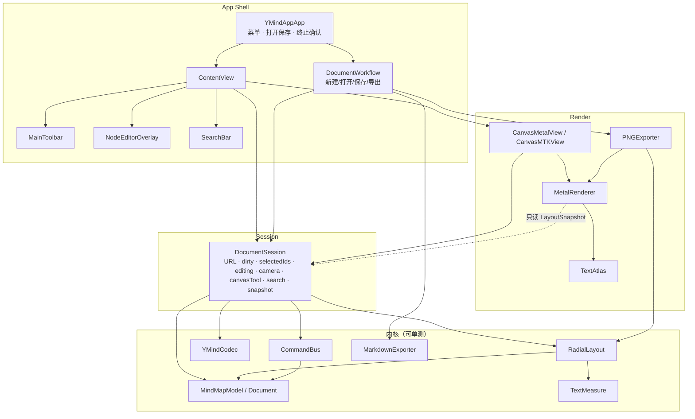
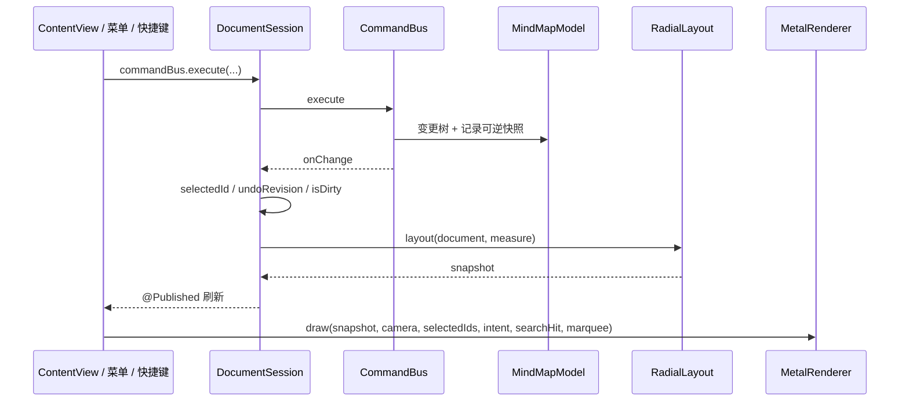
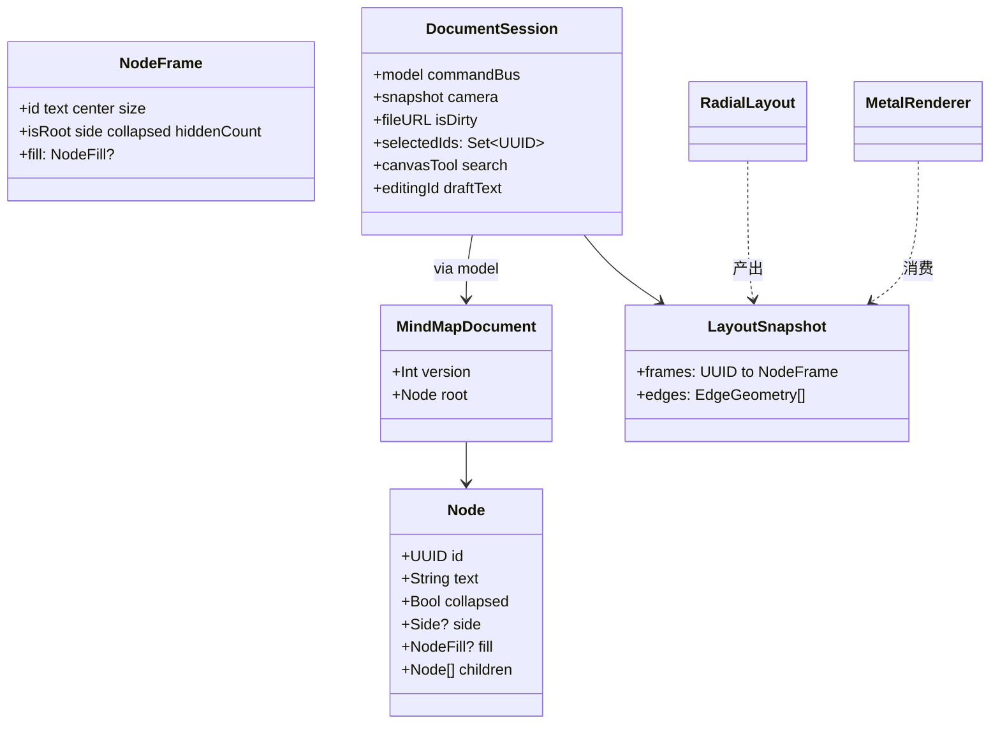
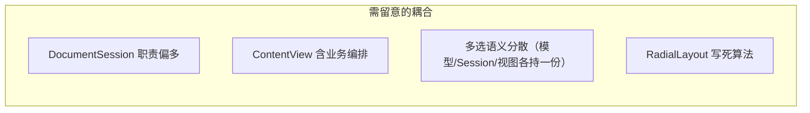
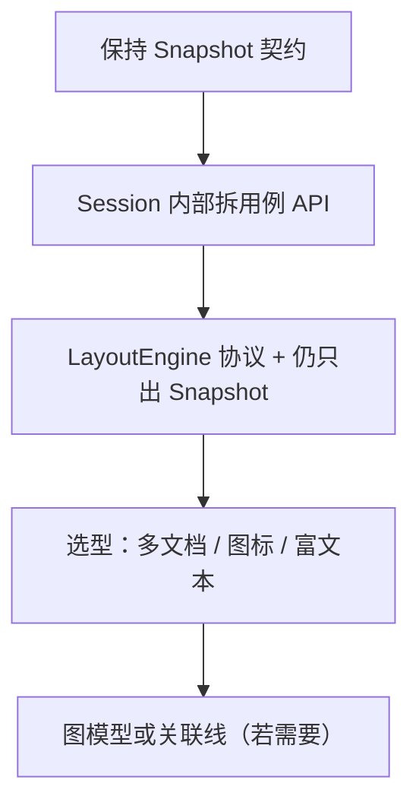

# YMind 当前工程架构说明

**状态：** 基于 `main` 已实现代码的实况梳理（非仅设计稿），随增量持续更新  
**日期：** 2026-09-28  
**范围：** `YMindApp/` 原生 App（MVP 已跑通：建树、中心辐射布局、Metal 文字、编辑、存盘 Undo；增量：搬枝 / 多选 / 剪贴板、排序 / 搜索 / 改侧、填色、框选与工具模式、Markdown/PNG 导出）  
**对照：** `docs/superpowers/specs/2026-09-24-ymind-v1-architecture-design.md`、`docs/prds/prd-ymind-2026-09-24/prd.md`

**绘图约定：** 使用 Mermaid。

---

## 1. 一句话结论

当前是 **「分层内核 + DocumentSession 门面 + SwiftUI/Metal 薄壳」**：改树走命令、几何走 LayoutSnapshot、像素走 Metal，**主干扩展性够用**；多选/框选、搬枝、样式、导出已按这套接口长出；若要上多布局、跨枝关联线、多文档，还需要在 Session / Layout / Model 三处做**有计划的接口化**，而不是推倒重来。

---

## 2. 目录与模块地图

```text
YMindApp/YMindApp/
├── Model/          树文档、编解码、Markdown 导出、文件名规整（无 UI）
├── Commands/       可逆命令栈（无 UI）
├── Layout/         量字 + 中心辐射 → LayoutSnapshot（无 Metal）
├── Session/        DocumentSession / Camera / 放置意图 / 剪贴板（应用态门面）
├── Render/         MTKView + MetalRenderer + 文字纹理 + 命中 + 离屏 PNG 导出
├── App/            工具条、编辑浮层、搜索浮层、色板
├── ContentView.swift
└── YMindAppApp.swift   菜单、打开保存、终止确认、导出落地、DocumentWorkflow
```

| 层 | 职责 | 主要类型 |
|----|------|----------|
| Model | 单根树、侧、折叠、填色、Markdown 导出、文件名规整、导入（Markdown/OPML/FreeMind） | `Node`、`Side`、`NodeFill`、`MindMapDocument`、`MindMapModel`、`YMindCodec`、`MarkdownExporter`、`ExportNaming`、`DocumentImporter`、`MarkdownImporter`、`XMLImporters`（OPML/FreeMind） |
| Commands | 改树 + Undo（12 个命令，见 §6） | `MindMapCommand`、`CommandBus` |
| Layout | 文档 → 几何快照 | `TextMeasure`、`RadialLayout`、`LayoutSnapshot`、`LayoutConstants`、`NodeSize` |
| Session | 文件、脏、选中（多选）、编辑草稿、剪贴板、搜索、画布工具、触发重布局、导入预览态、自动保存与崩溃恢复 | `DocumentSession`、`Camera`、`DropIntent`、`Clipboard`、`ImportPreviewState`、`AutosaveStore`、`AutosaveMeta`、`RecoveryOffer` |
| Render | 只消费 Snapshot + Camera；命中与框选；离线 PNG 导出、PDF 矢量导出 | `CanvasMetalView`、`MetalRenderer`、`TextAtlas`、`CanvasHitTesting`、`NodeFillStyle`、`PNGExporter`、`PDFExporter` |
| Shell | 菜单 / 工具条 / 浮层编辑 / 文档工作流 / 导入预览 / 恢复横幅 | `YMindAppApp`、`ContentView`、`MainToolbar`、`NodeEditorOverlay`、`SearchBar`、`FillSwatches`、`DocumentWorkflow`、`ImportPreviewView`、`RecoveryBannerView` |

### 2.1 工程代码量（2026-09-28 实况）

源码 31 个 Swift 文件 / **4,927 行**；单测 12 个文件 / 1,812 行；UI 测试 2 个文件 / 78 行；构建期边界校验脚本 `scripts/check-boundaries.sh` 70 行。

| 层 | 文件数 | 行数 | 说明 |
|----|-------:|-----:|------|
| Render | 6 | 1,892 | 占源码 38%；`MetalRenderer.swift` 单文件 889 行最重 |
| Model | 8 | 646 | 纯 Foundation，可测核心 |
| Session | 4 | 567 | `DocumentSession.swift` 414 行 |
| Layout | 5 | 423 | 纯几何，无 Metal |
| App | 4 | 390 | 壳层，业务最薄 |
| Commands | 2 | 317 | `CommandBus` 301 行 |
| 根（ContentView + YMindAppApp） | 2 | 692 | 菜单 / 工作流 / 主视图 |

单测覆盖：Model（311）、CommandBus（398）、Session（274）、命中（236）、布局（121）、放置意图（102）、交互（95）、剪贴板（70）、Markdown 导出（69）、Codec（68）、PNG 导出（37）、Camera（31）。Render 的 `encodeContent` / 工具模式与 `DocumentWorkflow` 入口暂无单测覆盖（手测为主）。

---

## 3. 总体架构图



---

## 4. 运行时数据流

### 4.1 改树（增删改折叠）



### 4.2 相机（不入命令栈）

平移 / 滚轮缩放 / 适应画布只改 `DocumentSession.camera`，**不**触发 `CommandBus`，也**不**写入 `.ymind`。

### 4.3 编辑文案

双击 → `startEditing` → 浮层改 `draftText` → 提交时 `SetText` 入命令栈 → 重布局 → 纹理缓存按脏键重建。

---

## 5. 依赖规则（实况）

> **强制机制（2026-09-27）：** 本表已由 `scripts/check-boundaries.sh` 在构建时强制（build phase「依赖边界校验」，违规即红）。白名单与下表一致。新增依赖必须同步更新脚本白名单与本表。

| 层 | 允许 import（白名单，与脚本逐字一致） | 禁止 / 说明 |
|----|-----------------------------------------|-------------|
| Model / Commands | `Foundation` | 严禁 SwiftUI / Metal / AppKit |
| Layout | `Foundation` `AppKit` `CoreGraphics` `CoreText` | 量字需要字体；不碰 Metal |
| Session | `Foundation` `Combine` `CoreGraphics` | 门面编排，无 UI |
| Render | `Foundation` `AppKit` `CoreGraphics` `Metal` `MetalKit` `SwiftUI` `simd` | 只吃 `LayoutSnapshot`，不懂树 |
| App / Shell | `Foundation` `AppKit` `SwiftUI` | 尽量不直接深改 Model（多数经 Session / Bus） |

**边界亮点：** `MetalRenderer.draw(..., snapshot:camera:selectedIds:)` 不理解父子关系——换布局算法或换渲染后端时，Snapshot 契约是稳定接缝。`PNGExporter` 也走同一 `LayoutSnapshot` + `MetalRenderer.renderImage`，导出不碰 Model 的会话态。

---

## 6. 关键类型契约（扩展时优先保住）



文件格式：`.ymind` = versioned JSON（`MindMapDocument.currentVersion == 2`）；`YMindCodec` 负责版本校验、v1→v2 迁移与深层 `side` 消毒。v2 新增 `Node.fill`（节点填色）。

**命令清单（12 个，全部经 `CommandBus` 可逆）：** `addChild` / `addSibling` / `delete` / `setText` / `toggleCollapse` / `setCollapsed` / `moveToParent` / `insertSiblings` / `setSide` / `applyRootSide` / `pasteAsChild` / `setFill`。

---

## 7. 扩展性评估

### 7.1 总评

| 维度 | 评分 | 说明 |
|------|------|------|
| 分层清晰度 | 高 | Model / Command / Layout / Render 边界与设计一致 |
| 可测性 | 中高 | 内核单测扎实（12 文件 1812 行）；Metal/菜单/导出入口偏手测 |
| 加同类命令（如改色） | 高 | 新 `MindMapCommand` + Bus 分支即可 |
| 加第二种布局 | 中 | 需抽出 `LayoutEngine` 协议；Snapshot 可复用 |
| 多选 / 框选 | ✅ 已实现 | `selectedIds: Set<UUID>` + 锚点 + 框选命中（§13） |
| 手动改侧 / 搬枝 | ✅ 已实现 | `setSide` / `applyRootSide` / `insertSiblings`（§11） |
| 跨枝关联线 / 自由图 | 低～中 | 现模型是**树**；需边表或图模型，布局与命中都要扩 |
| 多文档 / DocumentGroup | 中 | Session 已封装单文档；上多文档要多 Session 实例 + 窗口策略 |
| 主题 / 样式系统 | 中 | 样式字段可进 Node；Render 已按 frame 绘制，要扩 `NodeFrame` |
| 导出 Markdown / PNG | ✅ 已实现 | `MarkdownExporter` / `PNGExporter`，纯函数 + 离屏渲染（§14） |

### 7.2 容易加上的功能（架构友好）

- 新可逆操作：重命名风格、批量设折叠、节点备注（纯文本字段）
- 布局常量 / 间距主题微调
- 只读演示模式（禁用 CommandBus）
- 更丰富的快捷键（仍走同一 `execute`）
- Codec `version` 升迁（加字段 + 迁移）

### 7.3 需要先「开刀接口」再加的功能

| 目标 | 建议改造 |
|------|----------|
| 多种布局（逻辑图、组织图） | `protocol LayoutEngine { func layout(document:measure:) -> LayoutSnapshot }`；Session 持有当前 engine |
| 手动改侧 / 拖拽改层级 | ✅ 已实现（§11）：`setSide` / `applyRootSide` / `insertSiblings` + `DropIntent` 命中分区 |
| 多选 | ✅ 已实现（§11/§13）：`selectedIds: Set<UUID>`、命令多目标、框选加选 |
| 节点样式（颜色、图标） | ✅ 填色已实现（§12）：`Node.fill` / `NodeFrame.fill`、Metal 画填充色、Codec v2；图标仍未做 |
| 富文本 | 编辑浮层换 `NSTextView` 属性串；量字与纹理策略变复杂——建议独立里程碑 |
| 关联线（非树边） | 新增 `links: [(from,to)]`；Layout 输出额外边；命中区分 |

### 7.4 当前结构上的薄弱点（强壮度风险）



1. **`DocumentSession` 门面过重**  
   文件 I/O、脏标记、选中、编辑草稿、布局、相机、错误文案集于一类。后续功能继续堆会导致难测、难拆。  
   **建议：** 保持对外 API，内部拆 `EditingController` / `Persistence` / `LayoutPipeline`（仍由 Session 组合）。

2. **`ContentView` 直接 `commandBus.execute` 并夹带「加完就编辑」**  
   业务散落在 View。  
   **建议：** 收敛为 `session.addChildAndEdit()` 等用例方法，View 只绑事件。

3. **布局与渲染的 Snapshot 字段偏「辐射布局专用」**  
   `side`、`hiddenCount` 仍可用，但若组织图要不同边几何，需扩展 `EdgeGeometry` 而非改 Metal 懂业务。

4. **工程仍是单 target**  
   分层靠目录约定，编译器不强制。模块化（SPM）可后置，但目录纪律要守。

5. **渲染文字路径已踩过坐标系坑**  
   纹理栅格化 + UV 已用「AppKit 绘制 + 行翻转」稳住；后续改 TextAtlas 时保持回归截图/手测。

---

## 8. 推荐的演进顺序（在现架构上长出来）



1. **短线：** 把 ContentView 业务收进 Session；补 Metal 回归手测清单。  
2. **中线：** `LayoutEngine` 协议。  
3. **长线：** 多文档 / DocumentGroup 或图标；最后再考虑非树边。

> 注：样式进 Model + Codec v2（填色）、多选/框选、搬枝、导出 Markdown/PNG 均已落地，见 §11–§14。

---

## 9. 与设计稿的符合度

| 设计决议 | 实现实况 |
|----------|----------|
| 分层内核 + 薄壳 | 已落实 |
| 命令栈 Undo | `CommandBus` + 菜单 |
| `.ymind` JSON、不存相机 | 已落实 |
| Metal 只画 Snapshot | 已落实（在线 draw + 离屏 renderImage 共用 encodeContent） |
| 编辑用浮层 | `NodeEditorOverlay` |
| 单窗口自管文档 | `WindowGroup` + Session |
| 导出 Markdown / PNG | 已落实（§14）：`MarkdownExporter` 纯函数、`PNGExporter` 全展开离屏光栅化 |
| 框选 / 工具模式 | 已落实（§13）：`CanvasTool.select/.pan` + `CanvasPointerGesture` 状态机 |

偏差与打磨：文字纹理坐标系、fitContent 异步避免 SwiftUI publish 警告等，属于实现层修正，不破坏分层。

---

## 10. 小结（给产品 / 自己看的判断）

- **现在这套架构足以支撑「在树上继续加能力」**，MVP 验证目标已达成。  
- **够不够强壮，取决于扩展类型：**  
  - 命令、样式、导出、第二种布局（接口化后）→ 强壮、可加。  
  - 多选、自由图、协同 → 要演进模型，但**不必推翻 Metal / Session 主链路**。  
- **最大技术债**不是 Metal，而是 **Session / View 用例边界** 与 **Layout 单实现**；优先还这两笔，扩展成本最低。

---

## 11. 增量：同级排序 + 搜索定位 + 手动改侧（2026-09-26）

在既有搬枝 / 多选 / 剪贴板之上，一次落地三份 PRD（`docs/prds/prd-ymind-reorder|search|side-2026-09-25`），共用**同一个节点操作底座**：

- **`DropIntent`**（`Session/DropIntent.swift`）：统一「成子 / 插前 / 插后 / 改侧」四类放置意图，替换原 `dropTarget: UUID?`。纯函数 `resolveDropIntent` 按节点分区（非中心上/下 28% → before/after，中部 → child；中心左/右 1/3 → 改侧带，中部成子），空白过中线仅当被搬顶层全为一级枝才产生改侧意图。
- **Model**：`insertSiblings`（跨父连续块、中心下继承锚点 side）、`setSide`（仅一级枝）、`applyRootSide`（提升或改侧）、`searchMatches`（DFS 先序、大小写不敏感、含折叠子树）。
- **Command**：`insertSiblings` / `setSide` / `applyRootSide` 各为命令栈一步 Undo。
- **Session**：`SearchState`（open/query/matches/index）与 `revealSearchMatch`（展开祖先 → 选中 → 居中）；`Camera.center(on:viewport:)` 保持缩放居中。
- **Render**：放置反馈按意图（插入线 / 根镶边 / 中线引导）、搜索命中琥珀色高亮，全部走既有 `drawSolid` 管线，无新 shader。
- **Shell**：搜索浮层（`App/SearchBar.swift`）、工具条改侧按钮、⌘F/⌘G/⇧⌘G/⌘←/⌘→ 菜单快捷键。

分层纪律保持不变：Model/Command 仅 Foundation；Metal 只消费 Snapshot + 会话态；搜索与放置意图为会话态不入 `.ymind`。

---

## 12. 增量：节点填色（2026-09-27）

落地 `docs/prds/prd-ymind-style-2026-09-25/prd.md`，给节点加填色，贯通 Model → Command → Session → Render → 工具条：

- **Model**：`NodeFill`（5 个具名 token + lenient Codable，未知 token 降级为 `nil` 无填色）；`Node.fill: NodeFill?`（显式 init 默认 nil，零改动既有构造点）；`NodeFrame.fill` 随 Layout 传递。
- **Codec**：`currentVersion` 升到 2，`YMindCodec` 内置 v1→v2 迁移（旧文件无 `fill` 视为无填色），老文件不再被拒绝。
- **Command**：新增 `setFill(ids:fill:)`——一步 Undo、no-op 不入栈、不改选中态。
- **Session**：`session.setFill(ids:fill:)` 门面用例方法。
- **Render**：`NodeFillStyle` 从系统语义色（`systemRed` 等）派生浅底 + 边框，根节点用深色变体（`rootBackground(_:)`）；填色叠于选中描边 / 搜索高亮之下；文字色不变；沿用既有 `drawSolid` 管线，**无新 shader**。
- **Shell**：工具条色点组（激活态、无选中禁用）、`ContentView` 接线。

分层纪律不变：`NodeFillStyle` 仅 AppKit（已在白名单），无新层间 import；`fill` 随文档持久化、随复制粘贴保留。

---

## 13. 增量：画布工具模式 + 框选 + 文字清晰化（2026-09-27）

- **`CanvasTool`**（`Render/CanvasMetalView.swift`）：`select`（空白左拖 = 框选）/ `pan`（空白左拖 = 平移画布）两种工具模式，会话态 `session.canvasTool` 不入 `.ymind`、不入命令栈；手型模式用 `resetCursorRects` 显示手掌光标，空格可临时平移。
- **`CanvasPointerGesture`** 纯值状态机（`none / pan / marquee / pendingDrag / drag`）：框选带 `additive`（⇧ 加选）与 `tracking`（编辑态忽略拖拽）位；搬枝拖拽保持 `DropIntent`。
- **命中**（`Render/CanvasHitTesting.swift`）：`marqueeIntersectingIds`（世界矩形 ∩ 可见节点 frame，折叠隐藏天然不可选）、`marqueeRect` / `worldRect(fromScreenRect:)` / `isClickLike`（4pt 阈值区分「点空白 / 框选 / 搬枝拖拽」）；命中顺序：分叉控件 → 节点 → 空白。
- **Session**：`replaceSelection(ids:anchorId:)` / `selectSiblingRange` / `clearSelection` 与 `selectedIds: Set<UUID>` + `selectionAnchorId`。
- **Render**：`drawMarquee` 画在渲染顺序最上层；`MetalRenderer` 抽 `encodeContent` 为「在线 draw + 离屏 renderImage」共用绘制体（见 §14）。
- **文字清晰化**：`displayScale` 传参（`window?.backingScaleFactor`），纹理按屏幕缩放采样，避免 Retina 下文字模糊。

分层纪律不变：框选/工具模式为会话态（`session.canvasTool`）不入文档；命中仍只吃 `LayoutSnapshot` + `Camera`。

---

## 14. 增量：导出 Markdown + PNG（2026-09-28）

落地 `docs/superpowers/specs/…-export-*.md` 对应 PRD 的 FR-E2/E3/E4，导出入口统一收敛到 `DocumentWorkflow`（`YMindAppApp.swift`，已从 `ContentView` / App 菜单接线）：

- **Markdown**（`Model/MarkdownExporter.swift`）：纯函数、无 UI。先序遍历整棵逻辑树（**忽略折叠**），深度 `d → min(d, 6)` 个 `#`；多行文案压空格、空行丢弃、空文「未命名」；结尾补一个换行。与渲染无关，可单测。
- **PNG**（`Render/PNGExporter.swift`）：全展开整图离屏导出。复制文档 → 清空所有 `collapsed`（不改原文档、不入 Undo）→ `RadialLayout` + `TextMeasure` 重布局 → 按包围盒 + padding 选 scale（`min(2, maxDimension/长边)`，上限 2400）→ `MetalRenderer.renderImage` 离屏光栅化 → `NSBitmapImageRep` 编码 PNG。纸面底色对齐原型（`#e7e4dc`），固定浅色外观解析动态语义色，结果与系统外观无关。
- **`MetalRenderer.renderImage`**：与在线 `draw(in:)` **共用 `encodeContent`**；导出用 `LayoutSnapshot`（缺省 `branchToggles` 为空）剔除 ± 分叉控件与交互 UI。
- **`ExportNaming.safeFilename`**（`Model/ExportNaming.swift`）：非法字符（`\/:*?"<>|`）替换、空白折叠、48 字符截断，统一 `.md` / `.png` 文件名。
- **Shell**：`DocumentWorkflow`（new/open/save/saveAs/export + `confirmReplacement` 未保存确认）、File 菜单「导出 Markdown… / 导出 PNG…」、工具条导出按钮。
- **测试**：`MarkdownExporterTests`（69 行）、`PNGExporterTests`（37 行，走真 Metal 设备）；SavePanel 落地入口为手测。

分层纪律不变：`MarkdownExporter` / `ExportNaming` 在 Model（仅 Foundation）；`PNGExporter` 在 Render（AppKit/MetalKit 已在白名单），导出不碰 Model 会话态、不写回文档。

---

## 15. 增量：自动保存 + 崩溃恢复（2026-09-30）

落地 `docs/superpowers/specs/2026-09-30-ymind-import-export-design.md` addendum §4（FR-S1/S2）：文档变脏 2s 防抖写临时副本，崩溃重启后弹恢复横幅，防丢草稿。

- **Session**（`Session/AutosaveStore.swift`）：`AutosaveMeta`（documentID/originalURL/savedAt/changeCount/rootText 的 Codable 元信息）+ `AutosaveStore`（`Application Support/Unsaved/` 下写 `<docID>.ymind` + `.meta.json`、删、扫最新、清空、读回；目录可注入测试，仅 Foundation/Combine）。
- **DocumentSession**：`documentID`（内存 UUID，未命名文档亦有）+ Combine `debounce(2s)` 监听 `commandBus.onChange` 触发 `flushAutoSave()`；`save()/saveAs()` 成功后删副本；`newDocument()/load(from:)/loadImported(_:)` 重置 documentID、清旧副本、清 `recovery: RecoveryOffer?`；副本不经过命令栈、不入 Undo、不写回正式文档。
- **Shell**：启动时经 `DocumentWorkflow.scanForRecovery` 扫描最新副本；`RecoveryBannerView`（SwiftUI）展示文档名/时间/修改数，「恢复更改」载入草稿为未保存文档，「忽略」`clearAll()` 清空 `Unsaved/` 载最近正式版；恢复/忽略均不入命令栈。
- **容错**：写副本失败静默降级（不打扰编辑、下次不误报）；空白新文档不产生副本；只对已加载文档写。

分层纪律不变：`AutosaveMeta` / `AutosaveStore` / `RecoveryOffer` 在 Session（Foundation/Combine 已在白名单）；`RecoveryBannerView` 在 Shell（SwiftUI 已在白名单）；**§6 命令清单不变**（自动保存/恢复不新增命令）。

---

## 16. 增量：PDF 矢量导出 + 导出专用紧凑布局（2026-09-30）

落地 `docs/superpowers/specs/2026-09-30-ymind-import-export-design.md` §5（FR-E1）：多页矢量 PDF，范围=单选子树/无选中全文，页模式=按宽度分页（默认）/缩放单页。

- **`Render/PDFExporter.swift`**：`PDFPagination.compute`（横向 A4 842×595、margin 24；`paginateByWidth` 不缩放按纸宽切列切行、`fitSinglePage` 整树缩放居中）+ `subtreeDocument`（子树抽取，新根 isRoot=true，不改原文档）+ `data(document:scope:mode:)` CG PDF context 内存 consumer 逐页绘制。绘制顺序对齐 Metal（边 → 节点块 → 文字），纸色对齐 PNG（`#e7e4dc`）。
- **`Render/PDFCompactLayout.swift`**：**PDF 专用左→右分层 tidy 树**。画布仍用 `RadialLayout`；纸面导出用紧凑布局，避免大树辐射包围盒极窄极高（实测 2185 节点：宽 1925pt × 高 40808pt → A4 网格切分大量空白、结构被切碎）。规则：根最左列、按深度向右分层（x=累积层宽+36 间距）、层内节点纵向紧凑排布（后序子树跨度 + 父居中于子块，无重叠）、肘形边父右缘→子左缘；输出与 `RadialLayout` 同构（`LayoutSnapshot`），绘制层零改动；页序（列优先分页）≈ 根 → 叶，结构连续。
- **坐标系修复**：布局世界 y 向下增长（根 0、第一个子 y 最小），CG PDF 默认 y-up——`drawPage` 显式翻转 y（`scale(y:-1)` + 页顶对齐平移），`drawText` 配 `flipped:true`，否则导出整棵树垂直镜像、层级倒挂（用户实测 bug）。
- **Shell**：`DocumentWorkflow.exportPDF`（单选子树 / 无选中全文 / 多选禁用；SavePanel 附件页模式单选钮）。
- **测试**：`PDFPaginationTests`（切列/切行/缩放）、`PDFScopeTests`（子树抽取）、`PDFCompactLayoutTests`（层序/无重叠/父居中/边连接/宽树适配 A4/深树宽高比）、`PDFExporterRenderingTests`（PDF magic/页数/折叠子树含全/文本居中/垂直朝向镜像回归）。

分层纪律不变：`PDFExporter` / `PDFCompactLayout` 在 Render（AppKit/CoreGraphics 已在白名单）；导出不造命令、不入 Undo、不改原文档折叠态；`PDFCompactLayout` 仅 Foundation/CoreGraphics。

---

## 修订记录

| 日期 | 说明 |
|------|------|
| 2026-09-30 | 增补 §16：PDF 矢量导出 + 导出专用紧凑布局（`PDFExporter`/`PDFCompactLayout` + 垂直镜像修复） |
| 2026-09-30 | 增补 §15：自动保存 + 崩溃恢复（Session `AutosaveStore`/`AutosaveMeta`/`RecoveryOffer` + Shell `RecoveryBannerView`） |
| 2026-09-28 | 增补 §13（工具模式/框选/文字清晰化）、§14（导出 Markdown/PNG + DocumentWorkflow）；新增 §2.1 工程代码量；§5 白名单与 `check-boundaries.sh` 对齐；§7 已实现项勾销；文档基线改 `main` |
| 2026-09-27 | 增补 §12：节点填色增量（Node.fill / NodeFrame.fill、Codec v2、setFill 命令、工具条色点） |
| 2026-09-26 | 增补 §11：同级排序 / 搜索 / 手动改侧 增量 |
| 2026-09-25 | 初稿：基于已实现代码 + Codegraph 梳理，含扩展性评估 |
