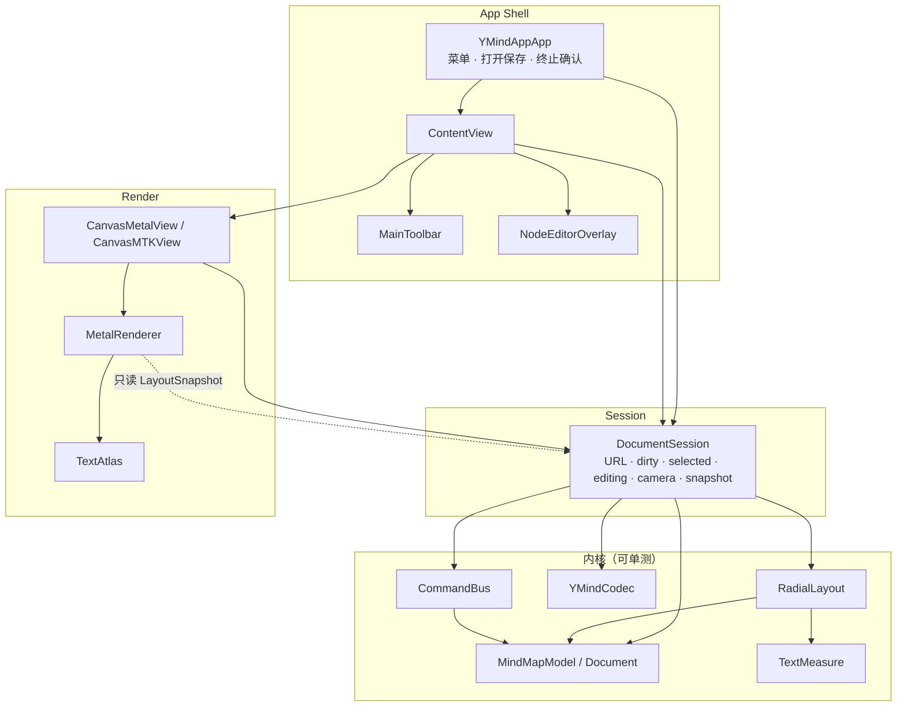
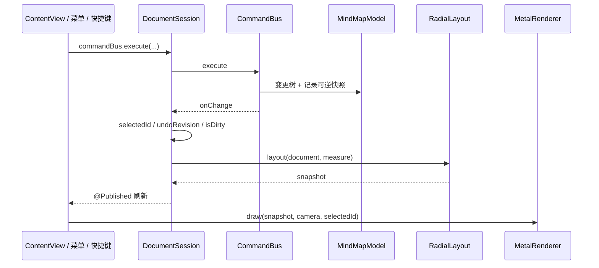
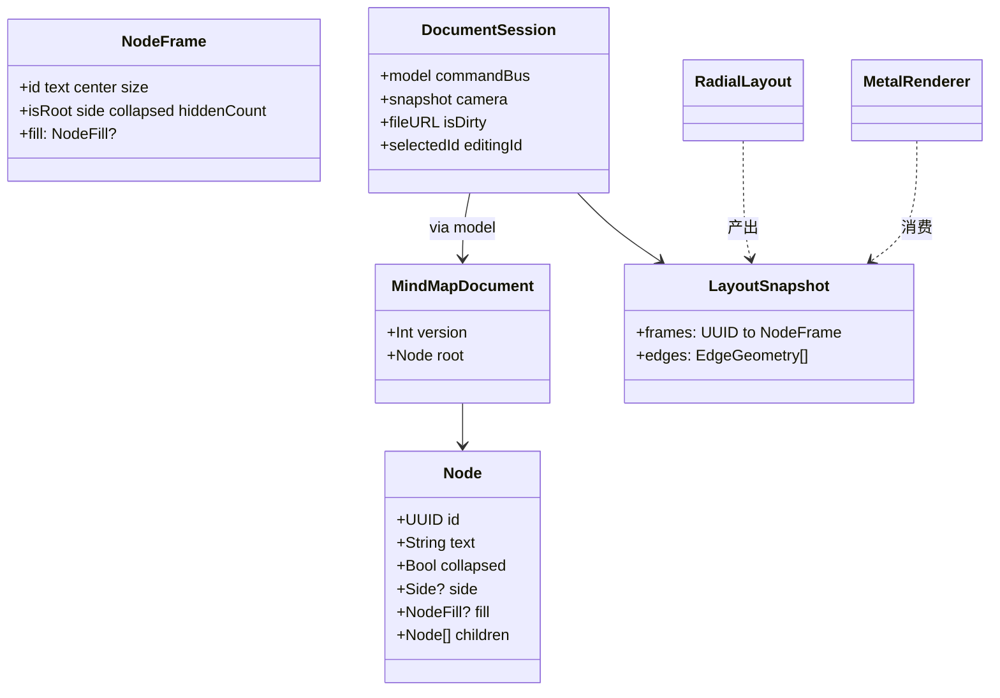
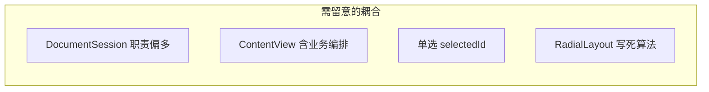
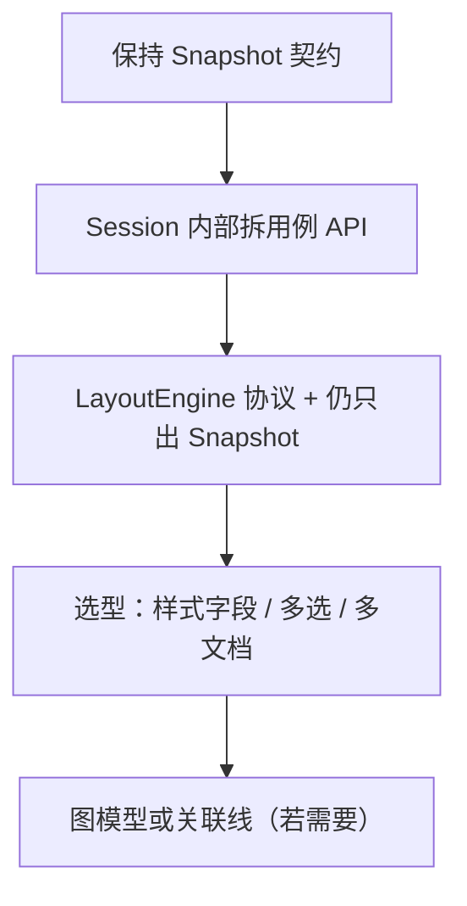

# YMind 当前工程架构说明

**状态：** 基于 `feat/ymind-v1` 已实现代码的实况梳理（非仅设计稿）  
**日期：** 2026-09-25  
**范围：** `YMindApp/` 原生 App（MVP 已跑通：建树、中心辐射布局、Metal 文字、编辑、存盘 Undo）  
**对照：** `docs/superpowers/specs/2026-09-24-ymind-v1-architecture-design.md`、`docs/prds/prd-ymind-2026-09-24/prd.md`

**绘图约定：** 使用 Mermaid。

---

## 1. 一句话结论

当前是 **「分层内核 + DocumentSession 门面 + SwiftUI/Metal 薄壳」**：改树走命令、几何走 LayoutSnapshot、像素走 Metal，**主干扩展性够用**；若要上多布局、多选、跨枝关联线、多文档，需要在 Session / Layout / Model 三处做**有计划的接口化**，而不是推倒重来。

---

## 2. 目录与模块地图

```text
YMindApp/YMindApp/
├── Model/          树文档、编解码（无 UI）
├── Commands/       可逆命令栈（无 UI）
├── Layout/         量字 + 中心辐射 → LayoutSnapshot（无 Metal）
├── Session/        DocumentSession / Camera（应用态门面）
├── Render/         MTKView + MetalRenderer + 文字纹理
├── App/            工具条、编辑浮层
├── ContentView.swift
└── YMindAppApp.swift   菜单、打开保存、终止确认
```

| 层 | 职责 | 主要类型 |
|----|------|----------|
| Model | 单根树、侧、折叠 | `Node`、`MindMapDocument`、`MindMapModel`、`YMindCodec` |
| Commands | 改树 + Undo | `MindMapCommand`、`CommandBus` |
| Layout | 文档 → 几何快照 | `TextMeasure`、`RadialLayout`、`LayoutSnapshot` |
| Session | 文件、脏、选中、编辑草稿、触发重布局 | `DocumentSession`、`Camera` |
| Render | 只消费 Snapshot + Camera | `CanvasMetalView`、`MetalRenderer`、`TextAtlas` |
| Shell | 菜单 / 工具条 / 浮层编辑 | `YMindAppApp`、`ContentView`、`MainToolbar`、`NodeEditorOverlay` |

---

## 3. 总体架构图



---

## 4. 运行时数据流

### 4.1 改树（增删改折叠）



### 4.2 相机（不入命令栈）

平移 / 滚轮缩放 / 适应画布只改 `DocumentSession.camera`，**不**触发 `CommandBus`，也**不**写入 `.ymind`。

### 4.3 编辑文案

双击 → `startEditing` → 浮层改 `draftText` → 提交时 `SetText` 入命令栈 → 重布局 → 纹理缓存按脏键重建。

---

## 5. 依赖规则（实况）

> **强制机制（2026-09-27）：** 本表已由 `scripts/check-boundaries.sh` 在构建时强制（build phase「依赖边界校验」，违规即红）。白名单与下表一致。新增依赖必须同步更新脚本白名单与本表。

| 从 → 到 | 允许？ | 说明 |
|---------|--------|------|
| Model / Commands → SwiftUI / Metal | 否 | 保持可测 |
| Layout → Model + AppKit/CoreText | 是 | 量字需要字体 |
| Layout → Metal | 否 | |
| Metal → Model | 否 | 只吃 `LayoutSnapshot` |
| Session → 上述全部 | 是 | 门面编排 |
| Shell → Session | 是 | 尽量不直接深改 Model（多数经 Session / Bus） |

**边界亮点：** `MetalRenderer.draw(..., snapshot:camera:selectedId:)` 不理解父子关系——换布局算法或换渲染后端时，Snapshot 契约是稳定接缝。

---

## 6. 关键类型契约（扩展时优先保住）



文件格式：`.ymind` = versioned JSON（`MindMapDocument.currentVersion == 2`）；`YMindCodec` 负责版本校验、v1→v2 迁移与深层 `side` 消毒。v2 新增 `Node.fill`（节点填色）。

---

## 7. 扩展性评估

### 7.1 总评

| 维度 | 评分 | 说明 |
|------|------|------|
| 分层清晰度 | 高 | Model / Command / Layout / Render 边界与设计一致 |
| 可测性 | 中高 | 内核单测扎实；Metal/菜单偏手测 |
| 加同类命令（如改色） | 高 | 新 `MindMapCommand` + Bus 分支即可 |
| 加第二种布局 | 中 | 需抽出 `LayoutEngine` 协议；Snapshot 可复用 |
| 多选 / 框选 | 中低 | `selectedId: UUID?` 要升为 `Set`；工具条与命令语义要改 |
| 跨枝关联线 / 自由图 | 低～中 | 现模型是**树**；需边表或图模型，布局与命中都要扩 |
| 多文档 / DocumentGroup | 中 | Session 已封装单文档；上多文档要多 Session 实例 + 窗口策略 |
| 主题 / 样式系统 | 中 | 样式字段可进 Node；Render 已按 frame 绘制，要扩 `NodeFrame` |
| 导出 PNG | 高 | 对 Snapshot + 离屏 Metal/位图即可，不碰 Model |

### 7.2 容易加上的功能（架构友好）

- 新可逆操作：重命名风格、批量设折叠、节点备注（纯文本字段）
- 布局常量 / 间距主题微调
- 导出图片、只读演示模式（禁用 CommandBus）
- 更丰富的快捷键（仍走同一 `execute`）
- Codec `version` 升迁（加字段 + 迁移）

### 7.3 需要先「开刀接口」再加的功能

| 目标 | 建议改造 |
|------|----------|
| 多种布局（逻辑图、组织图） | `protocol LayoutEngine { func layout(document:measure:) -> LayoutSnapshot }`；Session 持有当前 engine |
| 手动改侧 / 拖拽改层级 | 新命令 + Model 树重挂；命中增加 drop-target |
| 多选 | `selection: Set<UUID>`；命令支持多目标；工具条状态机 |
| 节点样式（颜色、图标） | ✅ 已实现（填色增量，见 §12）：`Node.fill` / `NodeFrame.fill`、Metal 画填充色、Codec v2；图标仍未做 |
| 富文本 | 编辑浮层换 `NSTextView` 属性串；量字与纹理策略变复杂——建议独立里程碑 |
| 关联线（非树边） | 新增 `links: [(from,to)]`；Layout 输出额外边；命中区分 |

### 7.4 当前结构上的薄弱点（强壮度风险）



1. **`DocumentSession` 门面过重**  
   文件 I/O、脏标记、选中、编辑草稿、布局、相机、错误文案集于一类。后续功能继续堆会导致难测、难拆。  
   **建议：** 保持对外 API，内部拆 `EditingController` / `Persistence` / `LayoutPipeline`（仍由 Session 组合）。

2. **`ContentView` 直接 `commandBus.execute` 并夹带「加完就编辑」**  
   业务散落在 View。  
   **建议：** 收敛为 `session.addChildAndEdit()` 等用例方法，View 只绑事件。

3. **布局与渲染的 Snapshot 字段偏「辐射布局专用」**  
   `side`、`hiddenCount` 仍可用，但若组织图要不同边几何，需扩展 `EdgeGeometry` 而非改 Metal 懂业务。

4. **工程仍是单 target**  
   分层靠目录约定，编译器不强制。模块化（SPM）可后置，但目录纪律要守。

5. **渲染文字路径已踩过坐标系坑**  
   纹理栅格化 + UV 已用「AppKit 绘制 + 行翻转」稳住；后续改 TextAtlas 时保持回归截图/手测。

---

## 8. 推荐的演进顺序（在现架构上长出来）



1. **短线：** 把 ContentView 业务收进 Session；补 Metal 回归手测清单。  
2. **中线：** `LayoutEngine` 协议；样式进 Model + Codec v2。  
3. **长线：** 多选或 DocumentGroup；最后再考虑非树边。

---

## 9. 与设计稿的符合度

| 设计决议 | 实现实况 |
|----------|----------|
| 分层内核 + 薄壳 | 已落实 |
| 命令栈 Undo | `CommandBus` + 菜单 |
| `.ymind` JSON、不存相机 | 已落实 |
| Metal 只画 Snapshot | 已落实 |
| 编辑用浮层 | `NodeEditorOverlay` |
| 单窗口自管文档 | `WindowGroup` + Session |

偏差与打磨：文字纹理坐标系、fitContent 异步避免 SwiftUI publish 警告等，属于实现层修正，不破坏分层。

---

## 10. 小结（给产品 / 自己看的判断）

- **现在这套架构足以支撑「在树上继续加能力」**，MVP 验证目标已达成。  
- **够不够强壮，取决于扩展类型：**  
  - 命令、样式、导出、第二种布局（接口化后）→ 强壮、可加。  
  - 多选、自由图、协同 → 要演进模型，但**不必推翻 Metal / Session 主链路**。  
- **最大技术债**不是 Metal，而是 **Session / View 用例边界** 与 **Layout 单实现**；优先还这两笔，扩展成本最低。

---

## 11. 增量：同级排序 + 搜索定位 + 手动改侧（2026-09-26）

在既有搬枝 / 多选 / 剪贴板之上，一次落地三份 PRD（`docs/prds/prd-ymind-reorder|search|side-2026-09-25`），共用**同一个节点操作底座**：

- **`DropIntent`**（`Session/DropIntent.swift`）：统一「成子 / 插前 / 插后 / 改侧」四类放置意图，替换原 `dropTarget: UUID?`。纯函数 `resolveDropIntent` 按节点分区（非中心上/下 28% → before/after，中部 → child；中心左/右 1/3 → 改侧带，中部成子），空白过中线仅当被搬顶层全为一级枝才产生改侧意图。
- **Model**：`insertSiblings`（跨父连续块、中心下继承锚点 side）、`setSide`（仅一级枝）、`applyRootSide`（提升或改侧）、`searchMatches`（DFS 先序、大小写不敏感、含折叠子树）。
- **Command**：`insertSiblings` / `setSide` / `applyRootSide` 各为命令栈一步 Undo。
- **Session**：`SearchState`（open/query/matches/index）与 `revealSearchMatch`（展开祖先 → 选中 → 居中）；`Camera.center(on:viewport:)` 保持缩放居中。
- **Render**：放置反馈按意图（插入线 / 根镶边 / 中线引导）、搜索命中琥珀色高亮，全部走既有 `drawSolid` 管线，无新 shader。
- **Shell**：搜索浮层（`App/SearchBar.swift`）、工具条改侧按钮、⌘F/⌘G/⇧⌘G/⌘←/⌘→ 菜单快捷键。

分层纪律保持不变：Model/Command 仅 Foundation；Metal 只消费 Snapshot + 会话态；搜索与放置意图为会话态不入 `.ymind`。

---

## 12. 增量：节点填色（2026-09-27）

落地 `docs/prds/prd-ymind-node-fill-2026-09-27`，给节点加填色，贯通 Model → Command → Session → Render → 工具条：

- **Model**：`NodeFill`（token + lenient Codable，未知 token 降级为 `none`）；`Node.fill: NodeFill?`（显式 init 默认 nil，零改动既有构造点）；`NodeFrame.fill` 随 Layout 传递。
- **Codec**：`currentVersion` 升到 2，`YMindCodec` 内置 v1→v2 迁移（旧文件无 `fill` 视为无填色），老文件不再被拒绝。
- **Command**：新增 `setFill(ids:fill:)`——一步 Undo、no-op 不入栈、不改选中态。
- **Session**：`session.setFill(ids:fill:)` 门面用例方法。
- **Render**：`NodeFillStyle` 从系统语义色（`systemRed` 等）派生浅底 + 边框，根节点用深色变体（`rootBackground(_:)`）；填色叠于选中描边 / 搜索高亮之下；文字色不变；沿用既有 `drawSolid` 管线，**无新 shader**。
- **Shell**：工具条色点组（激活态、无选中禁用）、`ContentView` 接线。

分层纪律不变：`NodeFillStyle` 仅 AppKit（已在白名单），无新层间 import；`fill` 随文档持久化、随复制粘贴保留。

---

## 修订记录

| 日期 | 说明 |
|------|------|
| 2026-09-27 | 增补 §12：节点填色增量（Node.fill / NodeFrame.fill、Codec v2、setFill 命令、工具条色点） |
| 2026-09-26 | 增补 §11：同级排序 / 搜索 / 手动改侧 增量 |
| 2026-09-25 | 初稿：基于已实现代码 + Codegraph 梳理，含扩展性评估 |
