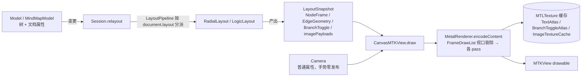
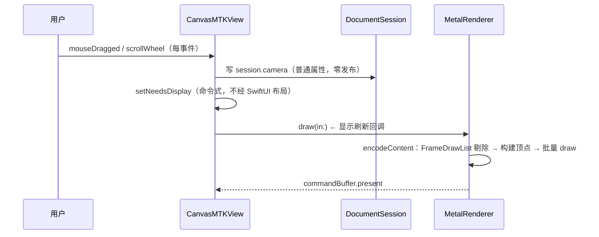

# Linva 渲染流程与丝滑方案

**状态：** 方案已落地（2026-10-03 性能修复，`sample` 量化验证）；遗留项「缩放跨档平滑化」附设计待排期
**日期：** 2026-10-03
**覆盖：** `Render/` 全链路 + `Session/` 相机与重绘接缝
**关联：** `docs/架构现状.md` §5 依赖规则（Render 白名单已含 `Combine`）、skill `linva-layout-snapshot`、`linva-render-text`

本文回答两个问题：

1. **当前渲染流程是什么样**：从鼠标/滚轮事件到像素上屏，一帧是怎么走完的。
2. **怎么做到丝滑**：为什么"实时渲染"仍会卡、根因在哪、我们用哪些机制优雅地解决（含量化前后对比），以及剩下的缩放跨档平滑化怎么做。

---

## 1. 渲染架构总览（分层与数据流）

Linva 的核心分层：**CPU 算几何（Layout）→ 产出 `LayoutSnapshot` → Metal 只消费 Snapshot 画像素**。



**三条不变式（违反即破坏分层）：**

1. **Metal 不理解树**：`MetalRenderer.draw(snapshot:camera:...)` 只吃 `LayoutSnapshot` + `Camera`，不允许 Render 访问 `MindMapModel`/`Node`。
2. **数据流单向**：`Model 变更 → Session.relayout() → snapshot → Render.draw()`。Layout 只读 Model，Render 只读 Snapshot。
3. **`LayoutSnapshot` 是稳定接缝**：换布局算法或渲染后端，只要 Snapshot 契约不变，Render 无需改动。

---

## 2. 逐帧渲染路径（一次平移/缩放发生了什么）

### 2.1 事件 → 重绘触发链



**关键设计：相机与 SwiftUI 解耦**。`session.camera` 是**普通属性**，手势期间每帧写入**不发布**任何 SwiftUI 通知。画布重绘完全由 `CanvasMTKView` 命令式驱动（手势路径直接 `setNeedsDisplay`；非手势相机变化经 `commitCamera` 低频发布 `cameraCommittedRevision`，视图订阅后重绘）。SwiftUI 只负责壳层（窗口、工具栏、浮层），不参与画布逐帧更新。

### 2.2 一帧内 `encodeContent` 做什么

绘制顺序（z 序由 **pass 分层**决定，pass 内部顺序无关紧要）：

| 顺序 | pass | 数据来源 | 性能措施 |
|---|---|---|---|
| 1 | 边 | `EdgeGeometry` | 任一端点可见才画（`visibleIds` 过滤） |
| 2 | 节点底色 | `NodeFrame.rect + fill` | 只遍历可见帧 |
| 3 | 图片 | `imagePayloads` | 只遍历可见帧；纹理缓存按显示尺寸降采样 |
| 4 | 文字 | `NodeFrame.blocks` | 只遍历可见帧；单 buffer 分段 draw |
| 5 | 分叉控件 | `BranchToggle` | 目标节点可见才画 |
| 6 | 多选描边 / 剪切弱化 / 放置反馈 / 搜索命中 / 框选 | 选中集 / intent / marquee | 天然小集合，无需剔除 |

**每帧的几何/纹理/绘制工作 = O(可见帧)，不是 O(全图)**——这是丝滑的根基（见 §4「视口剔除」）。仅保留一次 O(全图) 的轻量遍历（`FrameDrawList.make` 收集可见集 + 全量块 id，纯 Set 操作，μs 级）。

---

## 3. 为什么"实时渲染"还会卡（根因，量化验证）

用户的第一直觉是"我们都是实时渲染的，为什么会卡？"。答案是：**渲染本身确实是实时的，但"渲染一帧"这件事被做贵了**——每帧在主线程上重复做了大量不必要的 CPU 工作，超 16.7ms（60Hz）预算就丢帧。

验证方法（`xcrun sample`，1ms 采样 20s）：临时给 `CanvasMTKView` 加环境变量驱动的自动驾驶钩子（内存构建 **1921 节点**大文档 + 自动平移/缩放 + 帧间隔日志），测完删除。修复前基线：

| 场景 | 帧率 | 主线程热点（样本数） |
|---|---|---|
| 平移 | **16 FPS**（62ms/帧），>100ms 帧占 57% | 每帧 3 次全量排序 **1188**；每文本块 `device.makeBuffer` **~750**；主线程 40% 时间在 `draw` 路径 |
| 缩放 | **8 FPS**，>100ms 帧占 55% | 跨 bucket 全量重栅格 `makeBitmap→flipVertically` **4509**、CoreText **518**；`encodeContent` 8509（平移才 2695） |

### 根因清单

| 根因 | 机制 | 为什么卡 |
|---|---|---|
| **每帧每块一个 `MTLBuffer`** | `drawText`/`drawImage`/`drawBranchToggles` 对**每个**文本块/图片/控件调用一次 `device.makeBuffer(bytes:)` + 一次 draw call | 1921 节点 = 每帧 **1921 次 GPU buffer 分配/上传** + 1921 个 draw call（metal 反模式表第一条：避免每帧分配） |
| **每帧 3 次全量排序** | `orderedFrames` 按 `uuidString` 排序，`fillVertices`/`drawText`/`drawImage` 各排一次 | O(n log n) × 3，字符串比较 + 分配 churn；**z 序由 pass 分层决定，排序纯浪费** |
| **缩放跨档全量重栅格** | `rasterBucket` 只有 1.0/1.5/2.0 三档；跨档时一帧内同步跑 Core Text 栅格化全部文本 + 重解码全部可见图片 | 几百次 Core Text 布局 + 纹理上传挤进一帧 → 明显顿一下 |
| **无视口剔除** | 文字/底色/边/控件遍历**全部**节点（只有图片有剔除） | 每帧 CPU/GPU 开销 ∝ 全图节点数，而非可见数 |
| **相机发布驱动 SwiftUI 整树重布局**（藏得最深） | `session.camera` 是 `@Published`，每帧发布 → `ContentView` `@ObservedObject` 整棵 body 重求值 → `.toolbar` 重提供 → **工具栏分段控件被反复 `sizeThatFits`** | 实测每次相机发布 **~10ms** 纯 SwiftUI 布局开销（热点 `StackLayout`→`SystemSegmentedControl`），60 事件/s 即吃满主线程 |

> **为什么最后一条最容易被忽略**：它不在 Metal 路径里，也不出现在"渲染代码"里——是 SwiftUI 观察者联动把相机更新放大成整树布局。只有采样到主线程才看得见（`__CFRunLoopDoObservers` → `NSHostingView.beginTransaction` → `AG::Subgraph::update` 12691 样本，占主线程 63%）。

---

## 4. 丝滑方案（已落地）

核心思路一句话：**让逐帧工作只跟"看得见的内容"和"确实变了的东西"相关**——消除每帧分配、消除无用排序、做视口剔除、把相机更新从 SwiftUI 观察流中摘出来。

| 问题 | 方案 | 收益 |
|---|---|---|
| 每帧 1921 次 buffer 分配 | 全部文本/图片/控件 quad 合并进**一个顶点数组 → 单块 buffer**，按纹理分段 draw（`quads: [(offset, count, texture)]`） | 每帧分配 1921 次 → **3 次**（文本/图片/控件各一） |
| 每帧 3 次全量排序 | 删 `orderedFrames`，直接用 `snapshot.frames.values` | 排序样本 **1188 → 0**（pass 分层已定 z 序） |
| 逐帧 O(全图) | 新增 `FrameDrawList`：一次遍历收集可见帧 + 全量块 id，边/底色/文字/图片/控件全部消费可见列表 | `encodeContent` 样本 **2695 → ~135**；1921 节点下渲染路径几乎免费 |
| 相机发布 → SwiftUI 整树布局 | ① `session.camera` 去 `@Published`（手势零发布）② 新增 `commitCamera` 低频已提交信号 + `cameraCommittedRevision` ③ `zoomPercent` 镜像（工具栏缩放%只在提交边界更新）④ `CanvasMetalView` 不再观察 session，`CanvasMTKView` 命令式订阅 `objectWillChange` + `$cameraCommittedRevision` 触发重绘 | SwiftUI 布局 churn **归零**；`ZoomPercentLabel` 自观察镜像，输出不变则差分判定无布局失效 |

### 4.1 相机更新的两种通道（解耦机制细节）

```text
手势路径（高频，零发布）：
  mouseDragged / scrollWheel
    → var camera = session.camera; camera.xxx = ...; session.camera = camera   // 普通属性
    → setNeedsDisplay(bounds)                                                  // 命令式重绘
    → （手势结束 mouseUp / otherMouseUp / 滚动停止 150ms 防抖）session.syncZoomPercent()

非手势路径（低频，一次发布）：
  工具栏缩放/适应、加载、居中、新建文档
    → session.commitCamera(newValue)   // camera = newValue; cameraCommittedRevision += 1; syncZoomPercent()
    → CanvasMTKView 订阅 $cameraCommittedRevision → handleSessionChange() + setNeedsDisplay
```

配套的驱逐纪律：`FrameDrawList` 同时收集**全量**文本/图片块 id（`allTextBlockIds`/`allImageBlockIds`），驱逐用全量集而非可见集——**屏幕外节点纹理保留，平移回视不重建**（否则剔除会和纹理缓存打架，形成抖动）。

### 4.2 修复后量化结果（同 1921 节点、同采样方法）

| 场景 | 修复前 | 修复后 |
|---|---|---|
| 平移 | 16 FPS（62ms/帧） | **60 FPS 锁帧**（16.7ms），3441 帧无退化 |
| 缩放 | 8 FPS，>100ms 帧占 55% | **83% 帧 60 FPS**；跨 bucket 帧 17–34ms（可见文字重栅格）；初始加载帧 1016ms 除外 |
| 主线程 | 40% 在渲染路径 + 63% 在 SwiftUI 布局 | 渲染路径 ~21 样本，SwiftUI 布局 churn 0 |
| 内存 | 峰值 1.2G（全量栅格+顶点churn） | 稳态 147M |

冒烟验证：真实 CGEvent 滚轮缩放 115%→400%、中键拖拽节点位移、画布渲染正常；测试全绿（`TEST SUCCEEDED`）。

---

## 5. 遗留项：缩放跨档平滑化（设计方案）

**现状**：缩放 83% 帧锁 60fps，但跨 `rasterBucket` 边界（1.0/1.5/2.0）时，可见文字全部同步重栅格，单帧 17–34ms（约 2–3 个掉帧）。原因是文字纹理按「显示像素尺寸 × scale 桶」缓存，桶变即全量重建。

**方案 A（推荐）：旧档纹理继续采样 + 新档延迟重建**

- 跨桶时**不立即**重栅格：继续用旧桶纹理上屏（`rasterBucket` 之上再加一层「生效桶」，只在松手/滚动停止后升档）。
- 新桶纹理在**空闲时**（滚动停止后的 debounce）批量生成，生成完原子切换。
- 效果：缩放全程平滑，代价是跨档瞬间文字轻微模糊（放大时），松手后清晰。
- 复杂度：改 `TextAtlas`/`ImageTextureCache` 的 key 策略 + 渲染器持有「当前生效桶」，涉及 `linva-render-text` 纹理纪律，需目测缩放清晰度。

**方案 B（最简）：交互期间用最近档采样**

- 缩放进行中始终用最近一个已生成的桶（保持当前行为），但把「重栅格」从主线程同步改为**下一 runloop 分帧**（一帧只栅格 N 个块，摊到多帧）。
- 效果：无模糊，跨档瞬间 2–3 帧轻微掉帧被摊平成每帧几毫秒的增量。
- 复杂度：低，只改 `TextAtlas` 的生成时机（引入队列），不动缓存 key。

**权衡**

| 维度 | A 旧档+延迟重建 | B 分帧重栅格 |
|---|---|---|
| 缩放全程帧率 | 满帧无掉帧 | 跨档期每帧 +N ms（N 可调） |
| 视觉 | 放大瞬时轻微模糊，松手即清晰 | 无模糊 |
| 复杂度 | 中（缓存策略 + 生效桶状态机） | 低（生成队列） |
| 风险 | 纹理纪律三（驱逐）交互变复杂 | 队列生命周期/取消时机 |

> 建议：先上 B（低风险、无视觉回归），若跨档掉帧仍可感知再上 A。此两项均**不影响已落地的平移丝滑**（平移在同一桶内，纹理全命中）。

---

## 6. 架构纪律（为什么这样改是"优雅"的）

1. **渲染与 SwiftUI 观察解耦**：画布是"高频、命令式"的世界（每帧重绘），壳层是"低频、声明式"的世界（状态变化才更新）。两者通过 `session` 的**低频已提交信号**（`cameraCommittedRevision`、`zoomPercent` 镜像、`fitVersion`）接缝，互不拖累。
2. **逐帧零分配目标**：一帧内唯一的 GPU 资源分配是 3 块顶点 buffer（文本/图片/控件）。Metal 原则「避免每帧分配、复用资源」在此落地为「合并 + 单 buffer 分段 draw」。
3. **剔除与缓存的协同**：视口剔除必须搭配「全量驱逐集」，否则缓存抖动会抵消剔除收益。这是 `FrameDrawList` 同时收集可见集 + 全量集的直接原因。
4. **依赖白名单同步**：Render 层新增 `Combine`（命令式订阅）已同步 `scripts/check-boundaries.sh` 与 `docs/架构现状.md` §5，构建护栏不破。
5. **验证即证据**：性能改动一律用 `sample` + 帧间隔日志量化前后对比（本方案基线/结果数据见 §3/§4.2），不凭手感。

---

## 修订记录

| 日期 | 说明 |
|---|---|
| 2026-10-03 | 初稿：渲染流程全景 + 逐帧路径 + 根因清单（sample 量化）+ 已落地丝滑方案 + 缩放跨档平滑化遗留设计 |
